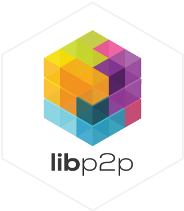
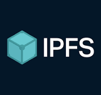
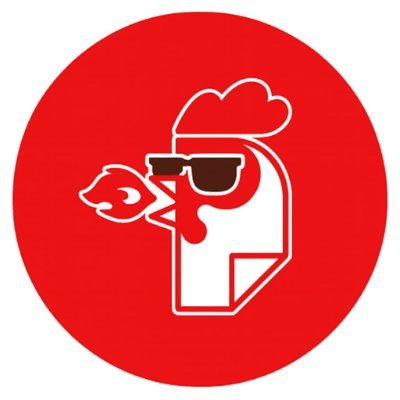

# Simple Todo - A Local-First Peer-to-Peer Demo App (in Svelte)

[](https://github.com/NiKrause/simple-todo/actions)
[](https://github.com/NiKrause/simple-todo)
[](https://dweb.link/ipns/k51qzi5uqu5dg7m2i3qftmdjl4t8jh74xzyz1ovsrkgdcdyn1ftaum3laom7qs)
[](./LICENSE)

<div align="center" style="width: 100%;">
  <a href="https://libp2p.io/" target="_blank"></a>
  <a href="https://ipfs.tech/" target="_blank"></a>
  <a href="https://helia.io/" target="_blank"></a>
  <a href="https://orbitdb.org/" target="_blank"></a>
  <a href="https://filecoin.io/" target="_blank"></a>
  <a href="https://storacha.network/" target="_blank"></a>
</div>
A basic decentralized, local-first, peer-to-peer todo application built with `libp2p`, `IPFS`, and `OrbitDB`. This app demonstrates how modern Web3 technologies can create truly decentralized applications that work entirely in the browser.

> **Unstoppable** - This application demonstrates technology that continues operating even when cloud providers fail, governments attempt censorship, or software vendors shut down their services. Your data and functionality remain under your control, distributed across a resilient peer-to-peer network or self-hosted signaling or relay nodes. Imagine traditional software which was sold on a compact disc in the past - once installed it could never be stopped. A USP which should convince every client around the globe.

---

- **Progressive Web App**: If webservers are down, this app can be started as PWA from desktops and mobile devices
- **Direct P2P Connections**: WebRTC connections between all devices
- **Relay/Signaling Network**: Signaling for peer discovery with optional relay functionality when direct peer-to-peer is unavailable
- **OrbitDB/IPFS Pinning** Peers and Relays integrate a Helia/OrbitDB node which pin db data on demand or by default (can be customized)
- **Local OrbitDB Storage**: Each device maintains offline-capable via the browsers indexdb
- **Multi-Transport Support**: WebSocket, WebTransport, and WebRTC protocols
- **Storacha/Filecoin Integration with UCAN-Auth:** Backup & restore todo lists via Storacha gateway to Filecoin decentralized storage

## 🚀 Live Demo

- **HTTP**: https://simple-todo.le-space.de
- **IPFS (dweb.link)**: https://dweb.link/ipns/k51qzi5uqu5dg7m2i3qftmdjl4t8jh74xzyz1ovsrkgdcdyn1ftaum3laom7qs
- **IPFS (le-space)**: https://ipfs.le-space.de/ipns/k51qzi5uqu5dg7m2i3qftmdjl4t8jh74xzyz1ovsrkgdcdyn1ftaum3laom7qs

## 🏗️ Network Architecture


## 🎯 What is this?

This is a **browser only** local-first peer-to-peer todo application that operates without any traditional server infrastructure. It connects directly to other browsers and mobile devices through peer-to-peer connections, creating a truly decentralized experience.

### Key Features

- ✅ **No Server Required** - Runs entirely in your browser
- ✅ **Local Data** - data is stored in your browsers level storage and replicated via OrbitBB and IPFS
- ✅ **Peer-to-Peer Communication** - Browsers connect directly via WebRTC (with help of signaling nodes)
- ✅ **Real-time Synchronization** - Changes appear instantly across all peers
- ✅ **Dynamic Identity** - Fresh peer ID generated on each load

## 🌉 P2P Relay Server

This project includes an enhanced P2P relay server that facilitates peer discovery and connectivity for the simple-todo application. The relay server provides:

### Features

- **Circuit Relay v2** - Helps peers connect through NAT and firewalls
- **WebRTC Signaling** - Enables direct peer-to-peer connections
- **OrbitDB Pinning** - Automatically pins and syncs OrbitDB databases
- **HTTP API** - Management and monitoring endpoints
- **Multi-Transport Support** - WebSocket, TCP, WebRTC, and WebRTC Direct
- **Metrics & Monitoring** - Prometheus-compatible metrics and health checks
- **Production Ready** - DoS protection, rate limiting, and secure configuration

### Quick Start

#### Using Docker Compose (Recommended)

```bash
# Run both the app and relay together
docker-compose up --build

# Access the app at http://localhost:5173
# Access relay API at http://localhost:3000
```

#### Manual Setup

```bash
# Install relay dependencies
cd relay
npm install

# Start the relay server
npm start

# Or with verbose logging
npm run start:verbose
```

### Configuration

The relay server can be configured using environment variables:

```bash
# Port Configuration
RELAY_WS_PORT=4001          # WebSocket port for browsers
RELAY_TCP_PORT=4002          # TCP port for native libp2p nodes
RELAY_WEBRTC_PORT=4003       # WebRTC port
RELAY_WEBRTC_DIRECT_PORT=4006 # WebRTC Direct port
HTTP_PORT=3000               # HTTP API port

# Storage
DATASTORE_PATH=./relay-datastore

# Networking
PUBSUB_TOPICS=todo._peer-discovery._p2p._pubsub

# Security (Production)
API_PASSWORD=your_secure_password_here
RELAY_PRIV_KEY=your_hex_private_key_here

# Debugging
ENABLE_DATASTORE_DIAGNOSTICS=true
STRUCTURED_LOGS=true
```

### HTTP API Endpoints

The relay provides several HTTP API endpoints for monitoring and management:

- `GET /health` - Health check and system status
- `GET /multiaddrs` - Get relay multiaddresses for peer connection
- `GET /peers` - List connected peers
- `GET /metrics` - Prometheus metrics (public endpoint)
- `POST /test-pubsub` - Test pubsub messaging
- `GET /pinning/stats` - OrbitDB pinning statistics
- `GET /pinning/databases` - List pinned databases
- `POST /pinning/sync` - Manually sync a database

### Docker Support

The relay comes with full Docker support including:

- Multi-stage Dockerfile for optimal image size
- Docker Compose configuration with app integration
- Health checks and automatic restarts
- Volume mounts for persistent data
- Network isolation and port mapping

## 🎯 How to Test

1. **Open Two Browser Windows** - You need at least two browser instances, a mobile or ask another distant person to open the app
2. **Load the Same URL** - all app users should load the same app URL
3. **Accept Consent** - Check all consent boxes in both browsers
4. **Wait for Connection** - The app will automatically discover and connect peers
5. **Add Todos** - Create todos in one browser and watch them appear in the other

## 📚 Documentation

For comprehensive guides on how this app works, implementation details, and reusable components:

**[📖 Tutorial](./docs/TUTORIAL.md)**

The tutorial covers:

- Step-by-Step implementation guide
- Architecture overview
- Testing procedures
- Troubleshooting guide
- Security considerations

**[🔧 AI-Friendly Component Reference](./docs/)**

This codebase contains reusable components for building decentralized P2P applications. Key components for AI analysis and reuse:

- **[ConsentModal.svelte](./src/lib/ConsentModal.svelte)** - A comprehensive privacy consent component that manages user preferences for data storage (persistent vs session), network connectivity, and P2P connections. Features configurable checkboxes, storage toggles, and handles GDPR-style consent flow for decentralized applications.

- **[StorachaIntegration.svelte](./src/lib/StorachaIntegration.svelte)** - Complete Web3 storage integration component providing UCAN-based authentication, space management, and backup/restore functionality for OrbitDB databases to Storacha/Filecoin. Includes progress tracking, error handling, and space usage monitoring.

- **[storacha-backup.js](./src/lib/storacha-backup.js)** - Core backup/restore utility module that bridges OrbitDB with Storacha cloud storage. Provides functions for client initialization, space management, database backup/restore operations, and UCAN delegation handling for decentralized storage workflows.

- **[p2p.js](./src/lib/p2p.js)** - Core P2P network initialization module that handles libp2p node creation, Helia (IPFS) setup, and OrbitDB database initialization. Manages user consent preferences for storage persistence, network connectivity, and peer connections. Includes comprehensive error handling, mobile-aware storage fallbacks, and initialization state management.

- **[db-actions.js](./src/lib/db-actions.js)** - Database operations module providing CRUD functionality for OrbitDB-based todo management. Features reactive Svelte stores, real-time database synchronization, event listeners for database changes, and comprehensive todo lifecycle management (add, delete, toggle completion, assignment).

- **[libp2p-config.js](./src/lib/libp2p-config.js)** - LibP2P network configuration module with environment-aware relay selection, multi-transport support (WebRTC, WebSockets, Circuit Relay), peer discovery via gossipsub, and configurable network preferences. Supports both development and production relay configurations with comprehensive connection management.

These components demonstrate patterns for: P2P consent management, Web3 storage integration, OrbitDB backup strategies, UCAN authentication flows, libp2p network configuration, decentralized database operations, and privacy-compliant P2P initialization.

## 🛠️ Quick Start

```bash
# Clone repository
git clone https://github.com/NiKrause/simple-todo.git
# checkout simple-todo branch
git checkout simple-todo

# run (like this you don't need to cut and past anything)
./tutorial-01.js
```

## 🔧 Technologies Used

- **libp2p** - Peer-to-peer networking stack
- **IPFS** - Distributed file system (via Helia)
- **OrbitDB** - Decentralized database
- **Svelte** - Frontend framework
- **WebRTC** - Direct browser-to-browser communication

## ⚠️ Important Notes

- This is a **demo application** for educational purposes
- Data is stored in a **global unencrypted database** visible to all users
- **No privacy protection** - all data is publicly visible
- **Not suitable for production use** without additional security measures

## 📄 License

This project is open source and available under the [LICENSE](./LICENSE) file.

---
