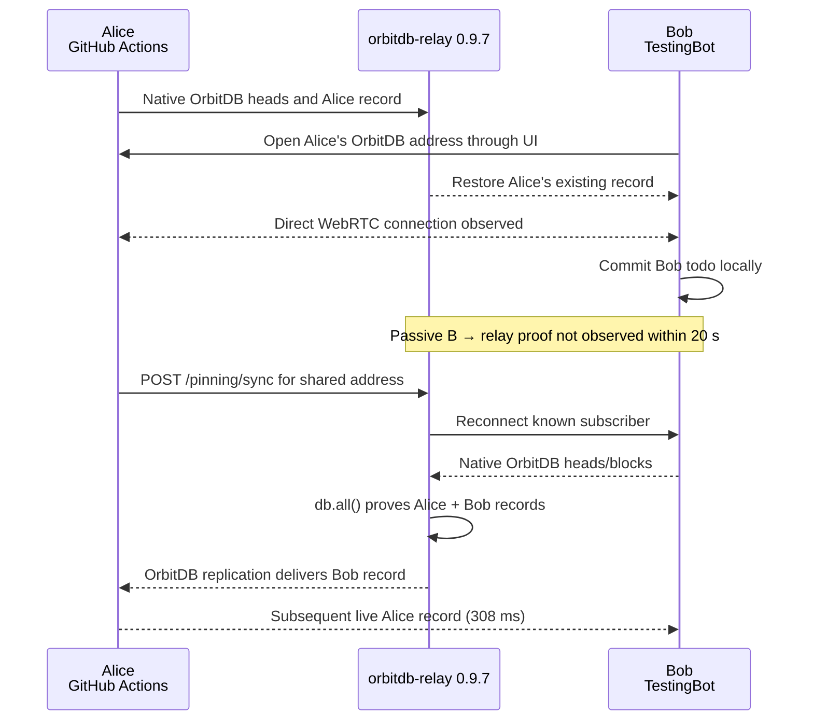

# Cross-network OrbitDB replication milestone

The `collab01` branch has a reproducible cross-provider end-to-end test with one Chromium browser on GitHub Actions and one Chrome browser on TestingBot. The coordinator drives browser actions only; it does not transfer OrbitDB entries, heads, or IPFS blocks.

## Milestone evidence

- Successful workflow: [GitHub Actions run 29195669726](https://github.com/NiKrause/simple-todo/actions/runs/29195669726)
- Screenshots and result JSON: [workflow artifacts](https://github.com/NiKrause/simple-todo/actions/runs/29195669726#artifacts)
- Remote browser recording: [TestingBot session](https://testingbot.com/tests/2a4087656245-0c4cf0f26207-c9091e932269-178386533272-28577715?auth=38a54161dc583385aaec6430722149f5)
- App: `https://collab01.le-space.de`
- Branch commit: `b3420e3f65853b9d8bd6ed88963eac035df80d82`
- Relay: `orbitdb-relay@0.9.7`, peer `16Uiu2HAmLVRzWHngBH5DPNadsZcL1NK8nyee5oMQSU6Jw5y1WJ4n`
- Shared database: `/orbitdb/zdpuB2DUk6VsV6CPRr7Q8qbvqAb8crT4KubQc8sT5vCCvaTe1`

## What the run proves

1. Alice and Bob start with separate identities and separate default OrbitDB addresses.
2. Bob opens Alice's address through the `collab01` UI; both report the same active address.
3. Alice's existing record reaches the relay and is restored by Bob.
4. A direct browser-to-browser WebRTC connection is observed.
5. Bob writes locally.
6. Bob's record is not observed passively on the relay during the 20-second observation window.
7. The test calls the relay's explicit `POST /pinning/sync` recovery path.
8. `orbitdb-relay@0.9.7` reconnects the known native OrbitDB subscriber, then `db.all()` proves two records and Bob's exact record as `lastRecord`.
9. Alice observes Bob's record after recovery (`39,554 ms`, including the passive wait).
10. A subsequent live Alice-to-Bob record replicates in `308 ms`.

The result is therefore **bidirectional replication with explicit relay recovery**, not proof of fully passive bidirectional convergence.

## Observed sequence

## Test boundaries

- The coordinator exchanges only control state such as Alice's database address and step readiness.
- Todos are created through the deployed application UI.
- Relay proof requires the exact expected todo text; a positive entry count alone cannot pass the assertion.
- Success artifacts contain screenshots for both browsers and the structured result.
- The workflow starts only after site publication and custom-domain linking complete.

## Remaining work

- Make Bob's new head reach the relay passively and reliably, without the explicit recovery request.
- Run repeated cross-provider samples and quantify flakiness.
- Add a scheduled run after the passive path is stable.
- Expand browser, operating-system, and region coverage separately from the tutorial-critical test.
