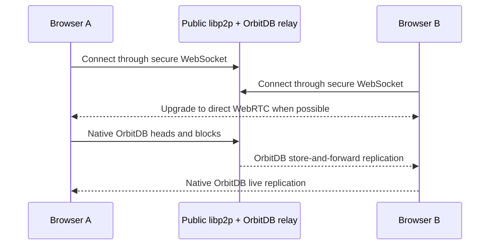

# Building a simple Local-First Peer-to-Peer Todo App with libp2p, IPFS, and OrbitDB

## Table of Contents

1. [Introduction](#introduction)
2. [Key Technologies Explained](#key-technologies-explained)
3. [How the App Works](#how-the-app-works)
4. [Prerequisites](#prerequisites)
5. [Project Setup](#project-setup)
6. [Architecture Overview](#architecture-overview)
7. [Step-by-Step Implementation](#step-by-step-implementation)
8. [Testing the Application](#testing-the-application)
9. [Understanding the Relay Node](#understanding-the-relay-node)
10. [Security and Privacy Considerations](#security-and-privacy-considerations)
11. [Advanced Features](#advanced-features)
12. [Troubleshooting](#troubleshooting)
13. [Conclusion](#conclusion)

## Introduction

This tutorial will guide you through building a decentralized, local-first, peer-to-peer todo application that demonstrates the power of modern Web3 technologies. The app is built using **libp2p** for peer-to-peer networking, **IPFS** for distributed storage, and **OrbitDB** for decentralized database management.

### What is this app?

This is a **client side only** todo application that operates entirely in your browser without any traditional server infrastructure. It connects directly to other browsers or mobile devices, creating a real-time peer-to-peer experience. Signaling nodes connect browser peers which then upgrade to WebRTC. The signaling or relay nodes are also providing storage for cases when two peers aren't online at the same time. Once the browsers are communicating peer-to-peer the signaling/relay node can be switched off!

**Key Characteristics:**

- **No Server Required**: Runs entirely in your browser
- **Peer-to-Peer Communication**: Browsers connect & communicate directly via WebRTC (via a signaling nodes)
- **Relay Node**: A relay server helps peers discover each other and acts as a data pinner
- **Dynamic Identity**: Each time you load the app, a new peer ID is generated

### Important Testing Requirements

To test this application, you need to:

1. **Open Two Browser Windows**: You need at least two browser instances
2. **Same URL**: Both browsers should load the same application URL
3. **Relay Server**: A relay node must be running for peer discovery (in dev mode only - not included in this repo)
4. **Accept Consent**: Check all consent boxes in both browsers before testing

## Key Technologies Explained

### **libp2p**

- A modular networking stack for peer-to-peer applications
- Handles peer discovery, connection management, and data transport
- Supports multiple transport protocols (WebRTC, WebSockets, Webtransport, Circuit Relay,...)
- Enables direct browser-to-browser communication
- Provides pubsub (publish/subscribe) for peer discovery

### **IPFS (InterPlanetary File System)**

- A distributed file system for storing and sharing data
- Provides content-addressed storage (data is identified by its hash)
- Enables decentralized data distribution
- In this app, IPFS is used through Helia (the new JavaScript former js-ipfs implementation)
- Handles data pinning and replication

### **OrbitDB**

- A decentralized database built on top of IPFS
- Provides different database types (key-value, document, feed, etc.)
- Handles data replication and synchronization between peers
- Manages access control and permissions
- Supports real-time updates across all connected peers

## How the App Works

### Data Flow Architecture



The application does not define a separate todo-entry or identity transport protocol. Todos, identities, heads, and blocks are handled by OrbitDB, Helia/IPFS, and libp2p. The relay may retain an internal peer hint for a database topic and reconnect that peer during an explicit recovery sync, but the data still travels through OrbitDB's native heads and block exchange.

### Core Process Flow

1. **Initialization**: Each browser creates a libp2p node with a unique peer ID
2. **Discovery**: Peers discover each other through pubsub and relay nodes
3. **Connection**: Direct WebRTC connections are established between peers or alternatively via relay connections of firewall doesn't allow it
4. **Database Sync**: OrbitDB automatically synchronizes data across all connected peers
5. **Real-time Updates**: Changes in one browser immediately appear in others

### Identity Management

- **Dynamic Peer IDs**: Each app load generates a new peer ID
- **No Persistence**: Peer identity is not stored between sessions
- **Anonymous**: No user authentication or registration required (data is stored in your browser)
- **Temporary**: All data exists only while peers are connected

## Prerequisites

- A modern browser (Chrome, Firefox, Safari, Edge)
- Basic knowledge of JavaScript and Svelte
- Two browser windows/tabs for testing
- Node.js (v18 or higher) for relay node setup

## Project Setup

### Dependencies

The project uses these key dependencies:

```json
{
	"dependencies": {
		"@chainsafe/libp2p-gossipsub": "^14.1.1",
		"@chainsafe/libp2p-noise": "^16.1.4",
		"@chainsafe/libp2p-yamux": "^7.0.4",
		"@libp2p/autonat": "^2.0.37",
		"@libp2p/bootstrap": "^11.0.46",
		"@libp2p/circuit-relay-v2": "^3.2.23",
		"@libp2p/crypto": "^5.1.7",
		"@libp2p/dcutr": "^2.0.37",
		"@libp2p/identify": "^3.0.38",
		"@libp2p/pubsub-peer-discovery": "^11.0.2",
		"@libp2p/webrtc": "^5.2.23",
		"@libp2p/websockets": "^9.2.18",
		"@orbitdb/core": "^3.0.2",
		"helia": "^5.5.0",
		"libp2p": "^2.9.0"
	}
}
```

### Project Structure

```
simple-todo/
├── src/
│   ├── lib/
│   │   ├── p2p.js              # P2P network initialization
│   │   ├── db-actions.js        # Database operations
│   │   ├── libp2p-config.js    # libp2p configuration
│   │   ├── utils.js            # Utility functions
│   │   └── ConsentModal.svelte # Consent modal component
│   └── routes/
│       └── +page.svelte        # Main application UI
├── package.json
└── README.md
```

## Architecture Overview

### Core Components

1. **P2P Network Layer** (`src/lib/p2p.js`)
   - Handles peer discovery and connections
   - Manages libp2p node lifecycle
   - Coordinates with Helia (IPFS) & OrbitDB

2. **Database Actions** (`src/lib/db-actions.js`)
   - CRUD operations for todos
   - Event listeners for data changes
   - Store management for Svelte

3. **Configuration** (`src/lib/libp2p-config.js`)
   - libp2p transport configuration
   - Relay node settings
   - Peer discovery setup

4. **UI Components** (`src/routes/+page.svelte`, `src/lib/ConsentModal.svelte`)
   - User interface for todo management
   - Consent modal for user awareness
   - Real-time peer status display

### Step 4: Peer Discovery and Connection

The app uses several mechanisms for peer discovery:

```javascript
// Handle peer discovery events
node.addEventListener('peer:discovery', async (event) => {
	const { id: peerId, multiaddrs } = event.detail;
	const peerIdStr = peerId?.toString();

	console.log(
		' Peer discovered:',
		formatPeerId(peerIdStr),
		'Addresses:',
		multiaddrs.map((ma) => ma.toString())
	);

	// Skip if we've already discovered this peer
	if (currentPeers.some((peer) => peer.peerId === peerIdStr)) {
		console.log('⏭️ Peer already discovered, skipping:', formatPeerId(peerIdStr));
		return;
	}

	// Extract transport protocols from multiaddrs
	const detectedTransports = extractTransportsFromMultiaddrs(multiaddrs);

	// Store peer info for later use
	discoveredPeersInfo.set(peerIdStr, {
		peerId: peerIdStr,
		transports: detectedTransports,
		multiaddrs: multiaddrs
	});

	// Attempt to connect to discovered peer
	try {
		console.log(' Attempting to dial discovered peer:', formatPeerId(peerIdStr));
		const connection = await node.dial(peerId);
		if (connection) {
			console.log('✅ Successfully connected to peer:', formatPeerId(peerIdStr));
		}
	} catch (error) {
		console.warn(
			'❌ Failed to connect to discovered peer:',
			formatPeerId(peerIdStr),
			'Error:',
			error.message
		);
		discoveredPeersInfo.delete(peerIdStr);
	}
});

// Handle successful peer connections
node.addEventListener('peer:connect', (event) => {
	const peerId = event.detail;
	const peerIdStr = peerId?.toString();

	console.log('🔗 Peer connected:', formatPeerId(peerIdStr));

	// Add to connected peers store
	const storedPeerInfo = discoveredPeersInfo.get(peerIdStr);
	if (storedPeerInfo) {
		const peerObject = createPeerObject(peerIdStr, storedPeerInfo.transports);
		discoveredPeersStore.update((peers) => [...peers, peerObject]);
		discoveredPeersInfo.delete(peerIdStr);
	}
});

// Handle peer disconnections
node.addEventListener('peer:disconnect', (event) => {
	const { id: peerId } = event.detail;
	const peerIdStr = peerId?.toString();

	console.log('🔌 Peer disconnected:', formatPeerId(peerIdStr));

	// Remove from connected peers store
	discoveredPeersStore.update((peers) => peers.filter((peer) => peer.peerId !== peerIdStr));
});
```

### Step 5: Data Synchronization

OrbitDB handles automatic data synchronization:

```javascript
// Set up database event listeners
function setupDatabaseListeners(todoDB) {
	if (!todoDB) return;

	// Listen for new entries being added
	todoDB.events.on('join', async (address, entry, heads) => {
		console.log(' New entry added:', entry);
		await loadTodos();
	});

	// Listen for entries being updated
	todoDB.events.on('update', async (address, entry, heads) => {
		console.log('🔄 Entry updated:', entry);
		await loadTodos();
	});
}

// Load all todos from the database
async function loadTodos() {
	const todoDB = get(todoDBStore);
	if (!todoDB) return;

	try {
		const allTodos = await todoDB.all();

		// Convert to array format
		const todosArray = allTodos.map((todo, index) => {
			return {
				id: todo.hash,
				key: todo.key,
				...todo.value
			};
		});

		// Sort by creation date (newest first)
		const sortedTodos = todosArray.sort((a, b) => {
			const dateA = new Date(a.createdAt || 0);
			const dateB = new Date(b.createdAt || 0);
			return dateB - dateA;
		});

		todosStore.set(sortedTodos);
		console.log('📋 Loaded todos:', sortedTodos.length);
	} catch (error) {
		console.error('❌ Error loading todos:', error);
	}
}
```

## Testing the Application

### Prerequisites for Testing

1. **Open Two Browser Windows**: You need at least two browser instances
2. **Same URL**: Both browsers should load the same application URL
3. **Relay Server**: A relay node must be running for peer discovery
4. **Network Access**: Both browsers need internet access for relay connection

### Testing Steps

1. **Load the App**: Open the application in two different browsers
2. **Accept Consent**: Check all consent boxes in both browsers:
   - "I understand that this todo application is a demo app and will connect to a relay node"
   - "I understand that the relay may store the entered data, making it visible to other users"
   - "I understand that this todo application works with one global unencrypted database which is visible to others testing this app simultaneously"
   - "I understand that I need to open a second browser or mobile device with the same web address to test the replication functionality"
3. **Wait for Connection**: The app will automatically discover and connect peers
4. **Add Todos**: Create todos in one browser
5. **Observe Replication**: Watch as todos appear in the other browser
6. **Test Collaboration**: Edit todos from either browser

### What You Should See

- **Connected Peers**: Both browsers should show each other as connected peers
- **Real-time Updates**: Todos added in one browser appear in the other
- **Peer IDs**: Each browser has a unique peer ID (changes on each reload)
- **Transport Types**: Shows connection types (WebRTC, Relay, etc.)
- **Todo Count**: Displays the number of todos in the database

### Expected Behavior

1. **Initial Load**: Each browser generates a unique peer ID
2. **Discovery**: Peers discover each other through the relay node
3. **Connection**: Direct WebRTC connections are established
4. **Data Sync**: Existing todos are loaded and synchronized
5. **Real-time Updates**: Changes propagate immediately across all peers

## Understanding the Relay Node

The relay node serves multiple purposes:

1. **Peer Discovery**: Helps peers find each other initially
2. **Data Pinning**: Stores and serves data when peers are offline
3. **NAT Traversal**: Enables connections through firewalls
4. **Persistence**: Ensures data availability even when original peers are offline

### Relay Configuration

```javascript
// Development relay (local)
const RELAY_BOOTSTRAP_ADDR_DEV =
	'/ip4/127.0.0.1/tcp/4001/ws/p2p/12D3KooWAJjbRkp8FPF5MKgMU53aUTxWkqvDrs4zc1VMbwRwfsbE';

// Production relay (remote)
const RELAY_BOOTSTRAP_ADDR_PROD =
	'/dns4/91-99-67-170.k51qzi5uqu5dl6dk0zoaocksijnghdrkxir5m4yfcodish4df6re6v3wbl6njf.libp2p.direct/tcp/4002/wss/p2p/12D3KooWPJYEZSwfmRL9SHehYAeQKEbCvzFu7vtKWb6jQfMSMb8W';

// Determine which relay to use
const isDevelopment = import.meta.env.DEV || import.meta.env.VITE_NODE_ENV === 'development';
const RELAY_BOOTSTRAP_ADDR = isDevelopment ? RELAY_BOOTSTRAP_ADDR_DEV : RELAY_BOOTSTRAP_ADDR_PROD;
```

### Relay Node Functions

- **Bootstrap**: Provides initial peer discovery
- **Circuit Relay**: Enables connections through NAT/firewalls
- **Data Storage**: Pins and serves data for offline peers
- **PubSub**: Facilitates peer discovery through topic broadcasting

## Security and Privacy Considerations

### Current Implementation Limitations

- **No Privacy**: No privacy protection for entered data

### Important Warnings

The consent modal clearly explains these limitations:

- Data is stored on relay servers and visible to others
- No privacy protection for entered data
- Global unencrypted database shared by all users
- Demo purposes only - not for production use

### Production Considerations

For production use, consider implementing:

1. **Encryption**: Encrypt data before storing in OrbitDB
2. **Authentication**: Implement user authentication
3. **Access Control**: Use OrbitDB access controllers for permissions
4. **Private Networks**: Create private peer networks
5. **Data Privacy**: Implement data anonymization or deletion

## Troubleshooting

### Common Issues

#### 1. Peers Not Connecting

**Symptoms:**

- No peers appear in the "Connected Peers" section
- Console shows connection errors

**Solutions:**

- Check if relay server is running and accessible
- Ensure both browsers are on the same network (when relay is in your network)
- Check browser console for connection errors
- Verify corporate, mobile provider, hotel firewalls settings of allow WebRTC connections
- Use a different relay
- Use different transport

**Debug Steps:**

```javascript
// Check relay connection
console.log('Relay address:', RELAY_BOOTSTRAP_ADDR);

// Check peer discovery
node.addEventListener('peer:discovery', (event) => {
	console.log('Discovery event:', event.detail);
});

// Check connection attempts
node.addEventListener('peer:connect', (event) => {
	console.log('Connect event:', event.detail);
});
```

#### 2. Data Not Syncing

**Symptoms:**

- Todos added in one browser don't appear in others
- Database shows empty or inconsistent state

**Solutions:**

- Verify OrbitDB is properly initialized
- Check database access controller settings
- Ensure peers are successfully connected
- Check for database permission errors

**Debug Steps:**

```javascript
// Check database state
const todoDB = get(todoDBStore);
console.log('Database address:', todoDB.address);
console.log('Database type:', todoDB.type);
console.log('Access controller:', todoDB.access);

// Check database events
todoDB.events.on('join', (address, entry, heads) => {
	console.log('Join event:', { address, entry, heads });
});

todoDB.events.on('update', (address, entry, heads) => {
	console.log('Update event:', { address, entry, heads });
});
```

#### 3. Performance Issues

**Symptoms:**

- Slow peer discovery
- Delayed data synchronization
- High memory usage

**Solutions:**

- Reduce pubsub interval for faster discovery
- Optimize database queries
- Monitor memory usage
- Check network connectivity

**Optimization Tips:**

```javascript
// Faster peer discovery
pubsubPeerDiscovery({
	interval: 2000, // Reduce from 5000ms
	topics: PUBSUB_TOPICS,
	listenOnly: false,
	emitSelf: true
});

// Optimize database loading
async function loadTodos() {
	const allTodos = await todoDB.all();
	// Process in chunks for large datasets
	const chunkSize = 100;
	for (let i = 0; i < allTodos.length; i += chunkSize) {
		const chunk = allTodos.slice(i, i + chunkSize);
		// Process chunk
	}
}
```

### Debug Information

The app provides extensive console logging:

- **Peer Discovery**: ` Peer discovered: [peerId]`
- **Connection Status**: `🔗 Peer connected: [peerId]`
- **Database Operations**: `✅ Todo added: [todoId]`
- **Error Messages**: `❌ Error: [error details]`

### Browser Console Commands

Use these commands in the browser console for debugging:

```javascript
// Check current peers
console.log('Connected peers:', $discoveredPeersStore);

// Check database state
console.log('Todos:', $todosStore);

// Check peer ID
console.log('My peer ID:', $peerIdStore);

// Force database reload
await loadTodos();

// Delete database (for testing)
await deleteCurrentDatabase();
```

## Conclusion

This peer-to-peer todo app demonstrates the power of decentralized technologies. Key takeaways:

### What We've Built

1. **True Decentralization**: No central server required
2. **Direct Communication**: Browsers connect peer-to-peer
3. **Shared State**: Global database synchronized across peers
4. **Relay Infrastructure**: Enables discovery and persistence
5. **Dynamic Identity**: Fresh peer IDs on each load

### Key Learning Points

1. **libp2p**: Enables peer-to-peer networking in the browser
2. **IPFS**: Provides distributed storage and content addressing
3. **OrbitDB**: Manages decentralized database with automatic sync
4. **WebRTC**: Enables direct browser-to-browser connections
5. **Circuit Relay**: Enables connections through NAT/firewalls

### Next Steps

For production applications, consider:

1. **Security**: Implement encryption and authentication
2. **Privacy**: Add data privacy controls
3. **Scalability**: Optimize for larger peer networks
4. **User Experience**: Improve UI/UX for better usability
5. **Monitoring**: Add comprehensive logging and analytics

### Educational Value

This app serves as an excellent example of how modern Web3 technologies can create truly decentralized applications that work entirely in the browser while maintaining data consistency across multiple participants.

Remember that this is a demo application with intentional limitations for educational purposes. Production applications would need proper encryption, authentication, and privacy controls.

---

**Note**: This tutorial covers the complete implementation of a peer-to-peer todo application. The app demonstrates core Web3 concepts while remaining accessible to developers new to decentralized technologies.
