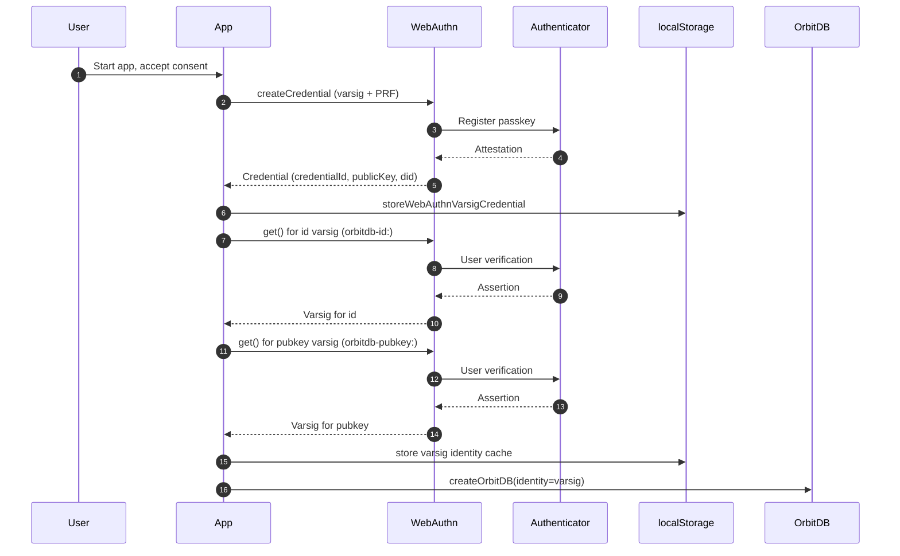
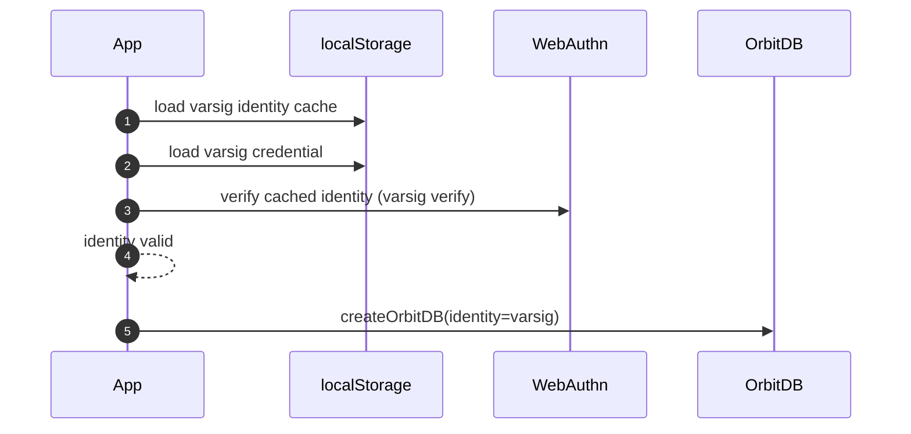
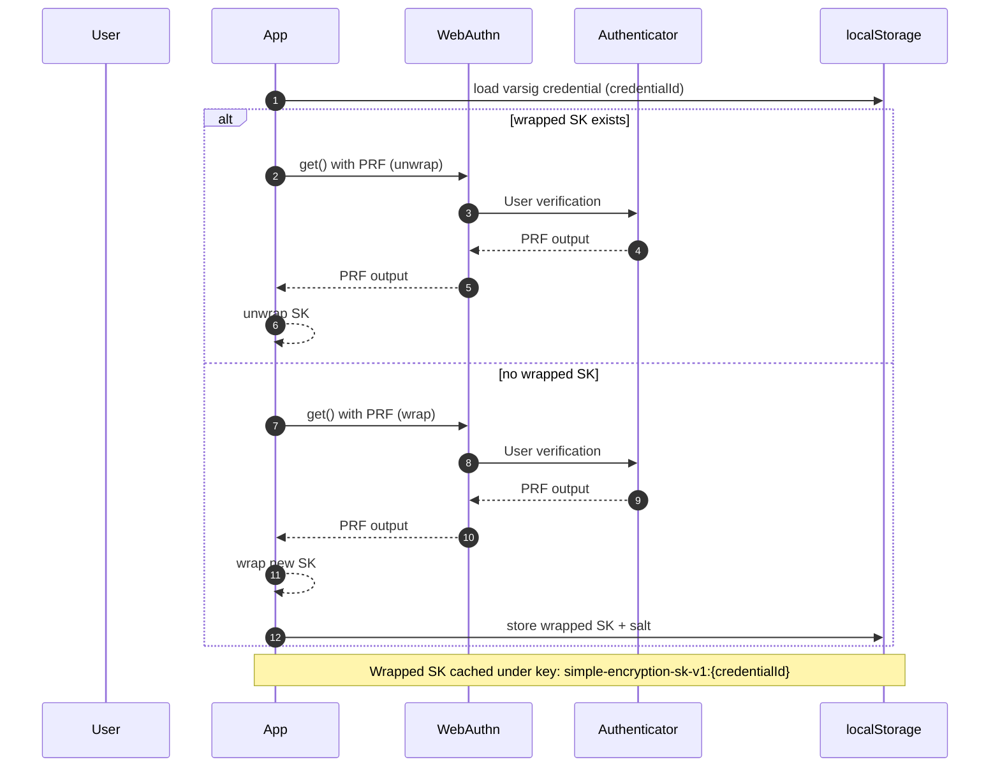
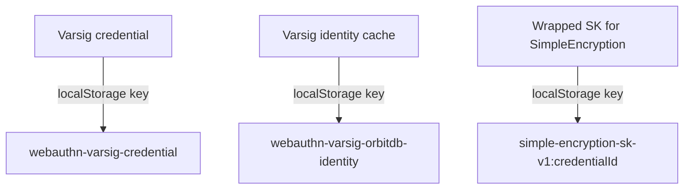

# WebAuthn Varsig Integration Changes

Date: 2026-01-29
Branch: varsic

This document summarizes the changes made to align Simple Todo with the WebAuthn varsig OrbitDB example, and to tighten identity handling.

## Goals
- Prefer WebAuthn varsig identities (hardware-backed signing per write).
- Cache varsig identity to avoid re-signing on every app start.
- Provide identity storage for OrbitDB identities (Helia blockstore).
- Add identity management methods (addIdentity) to the identities object.
- Keep varsig strict: fail initialization if OrbitDB does not use the varsig identity.
- Add explicit UI choice for WebAuthn vs password for encryption.
- Use WebAuthn PRF-derived key for SimpleEncryption when available; fall back to password.

## Key Changes

### Varsig identity caching
- Added `src/lib/identity/varsig-identity.js`.
- Cache key now matches the example:
  - `webauthn-varsig-orbitdb-identity`
- Cached identity is verified before reuse.

### OrbitDB identity wiring
- `src/lib/p2p.js` now:
  - uses cached varsig identity
  - supplies an identity storage adapter to `createWebAuthnVarsigIdentitiesWithStorage`
  - supports `addIdentity`
  - asserts that OrbitDB identity matches the varsig identity, and throws on mismatch

### Identity storage adapter
- Implemented `createIpfsIdentityStorage` (Helia blockstore-backed), mirroring the example.

### Encryption flow updates
- Replication encryption removed; only data encryption is used.
- Added WebAuthn PRF-derived secret key support for SimpleEncryption.
- Added UI toggle to explicitly choose WebAuthn vs password.
- Registry now stores encryption method (`webauthn-prf` or `password`).

## Notable Behavior
- Varsig signs per write, so multiple passkey prompts on startup are expected (identity creation, registry updates, default list creation).
- If OrbitDB identity is not varsig, initialization now fails with a clear error.

## Files Touched (main)
- `src/lib/identity/varsig-identity.js`
- `src/lib/identity/webauthn-identity.js`
- `src/lib/p2p.js`
- `src/lib/encryption/webauthn-encryption.js`
- `src/lib/components/encryption/EncryptionSettings.svelte`
- `src/lib/handlers/encryption-handlers.js`
- `src/lib/database/database-manager.js`
- `src/lib/encryption-migration.js`
- `src/lib/encryption/encryption-detector.js`
- `src/lib/todo-list-manager.js`

## Next Checks
- Verify varsig identity remains active after init:
  - `orbitdb.identity.type === 'webauthn-varsig'`
  - `orbitdb.identity.id` matches `did:key:...`
- Validate passkey prompts occur on DB writes (expected for varsig).

## Varsig PRF Bridge (SimpleEncryption)

We now reuse the **varsig passkey credential** to unlock a PRF-derived secret key for SimpleEncryption. This avoids creating a second WebAuthn credential for the keystore flow when varsig is active.

### What the bridge does
- Uses the **varsig credentialId** to call WebAuthn `navigator.credentials.get()` with the **PRF extension**.
- Derives an AES key from PRF output and uses it to **wrap/unwrap** a randomly generated secret key (sk).
- Stores the wrapped key (ciphertext + iv + salt) in localStorage, keyed by credentialId.

### Why it is "custom"
The upstream varsig credential creation does not request PRF during registration, and the keystore flow uses a different credential format. The bridge stitches these pieces together by:
- using varsig credentialId for PRF assertions
- using the existing PRF wrap/unwrap helpers
- keeping SimpleEncryption independent of keystore identities

If PRF is unavailable for the varsig credential, the app falls back to password encryption.

## Sequence Diagrams

### Varsig identity creation (fresh browser)

### Varsig identity reuse (subsequent runs)

### SimpleEncryption PRF (varsig credential bridge)

### Where credentials are stored

