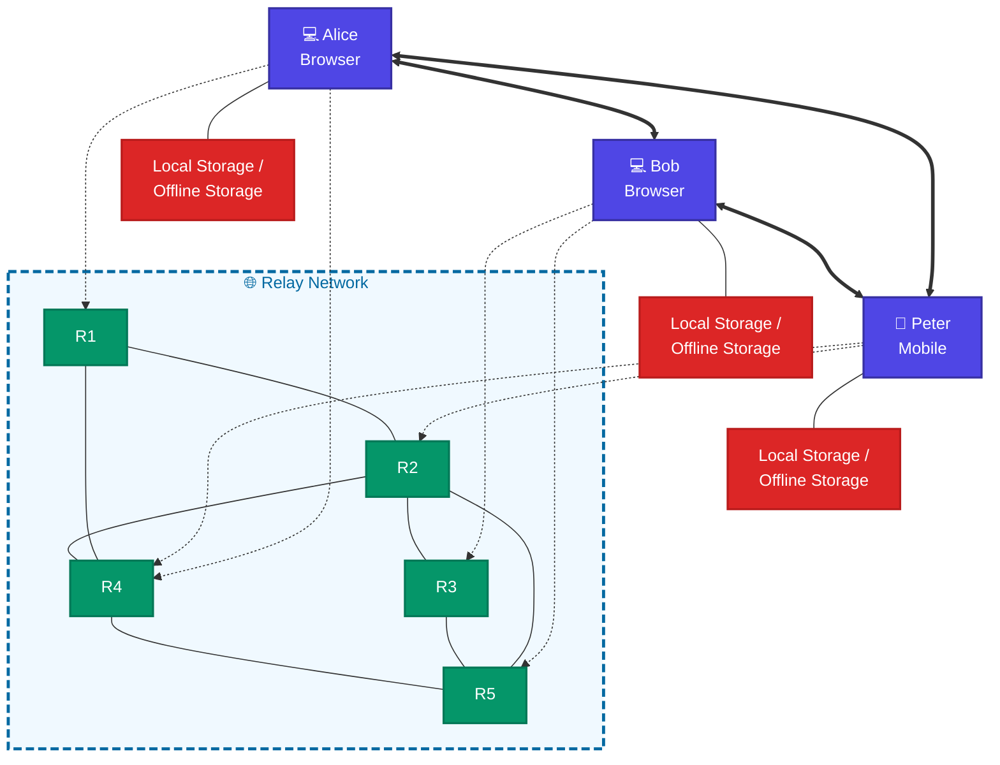

# Local-First Peer-To-Peer Web Application Network
## with Libp2p, Helia and OrbitDB

## Legend

| Connection Type | Representation | Protocols |
|----------------|----------------|-----------|
| **P2P Connection** | `<===>` (solid bidirectional) | WebRTC |
| **Signaling/Relay Connection** | `-.->` (dotted arrow) | WebSocket, WebTransport, WebRTC |
| **Relay Network** | `---` (solid line) | TCP/IP, QUIC |
| **Local Storage** | `---` (solid line) | Direct connection |

## Connection Protocols

- **Direct P2P**: libp2p/WebRTC (browsers), WebRTC (mobile)
- **Relay connections**: WebRTC, WebTransport, WebSocket
- **Relay network**: TCP/IP, QUIC

## Data Flow

- Each device maintains local storage with OrbitDB
- OrbitDB changes replicate across connected peers in real-time
- Relay/Signaling nodes facilitate NAT traversal, peer discovery and IPFS pinning

## Network Architecture Features

### 🔗 **Peer-to-Peer Connectivity**
- **Alice ↔ Bob**: Direct WebRTC P2P connection
- **Alice ↔ Peter**: Direct WebRTC P2P connection  
- **Peter ↔ Bob**: Direct WebRTC P2P connection

### 🌐 **Relay Network Infrastructure**
- **5 interconnected relay nodes** (R1-R5)
- **Signaling support** for NAT traversal and connection discovery
- **IPFS/OrbitDB pinning capabilities** for data persistence
- **Multiple transport protocols** for device connectivity

### 💾 **Local-First Storage**
- **Each device** maintains complete local data replica
- **Offline-capable** operation with sync when reconnected  
- **Real-time synchronization** across all connected peers

### 📱 **Multi-Platform Support**
- **Browser clients** (Alice & Bob): Full WebRTC P2P + relay fallback
- **Mobile clients** (Peter): WebRTC P2P + multiple transport options

## Technology Stack

- **🔗 Libp2p**: Peer-to-peer networking foundation
- **🌍 Helia**: IPFS implementation for JavaScript  
- **📊 OrbitDB**: Distributed database built on IPFS
- **🔄 WebRTC**: Direct peer-to-peer communication
- **🌐 WebSocket/WebTransport**: Relay communication protocols
