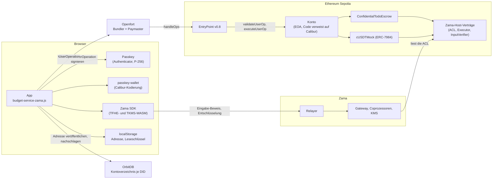
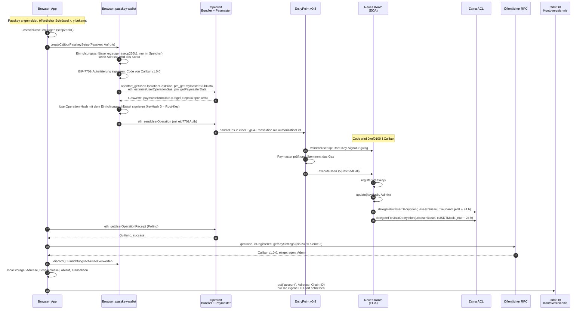
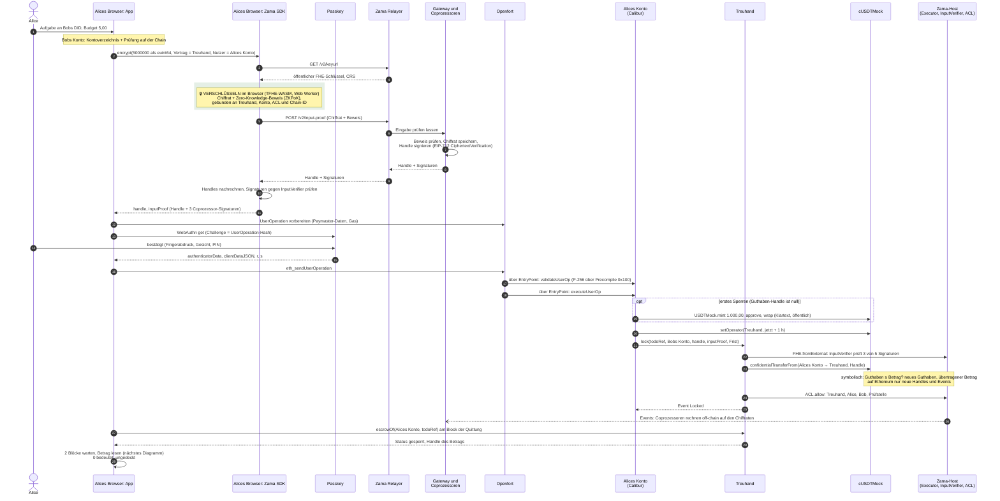
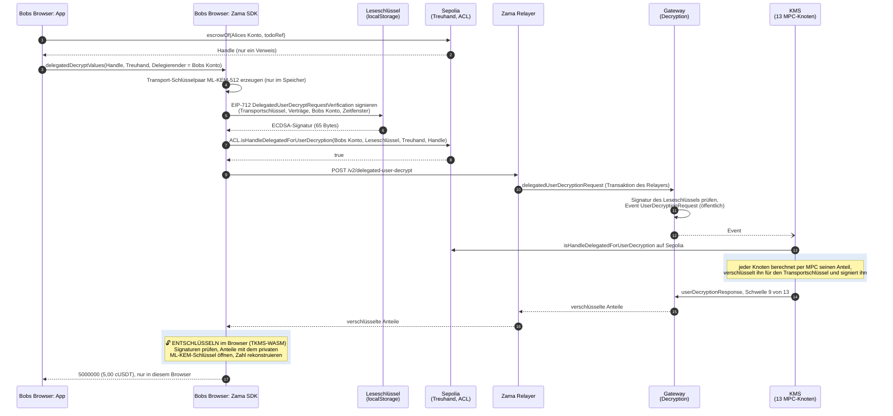
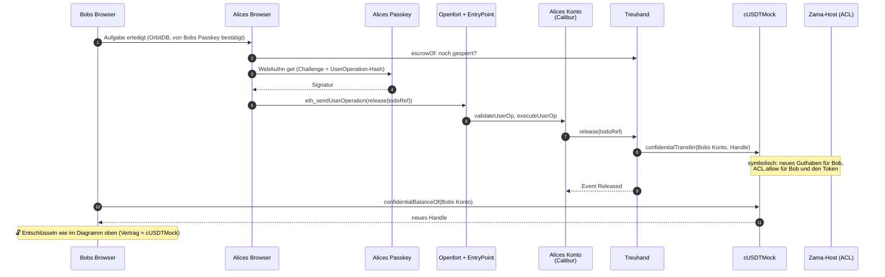

# Ein Passkey als Konto: Calibur, Openfort und Zama

Diese Seite erklärt, wie die App von `escrow01` mit einem Passkey auf Sepolia bezahlt: welches Konto
der Passkey steuert (Calibur), wer das Gas bezahlt (Openfort), wo ein Betrag verschlüsselt und wo er
entschlüsselt wird (Zama) und woran die App erkennt, welches Konto zu welcher DID gehört. Sie
beschreibt den Stand vom 2026-09-17 im Branch `escrow01`, gebaut mit `VITE_BUDGET_SERVICE=zama`, und
belegt ihre Aussagen [am Ende](#quellen). Was die Treuhand selbst tut, steht in
[escrow.de.md](escrow.de.md), Zamas Protokoll im Einzelnen in
[zama-confidential-transactions.de.md](zama-confidential-transactions.de.md), Risiken und Vertrauen in
[security.de.md](security.de.md).

Status: Am 2026-09-17 lief der ganze Ablauf in zwei Browsern mit virtuellen Passkeys auf Sepolia
durch, von der Kontoeinrichtung bis zu Bobs Guthaben ([Messwerte](#gemessen-am-2026-09-17)). Ohne die
Einstellungen aus [Konfiguration](#konfiguration) arbeitet die App weiter mit der Attrappe im
Arbeitsspeicher; auch die Tests laufen gegen sie.

| Baustein              | Version und Adresse                                                                                                                           |
| --------------------- | --------------------------------------------------------------------------------------------------------------------------------------------- |
| Kontovertrag          | Calibur v1.0.0 von Uniswap, `0x000000009B1D0aF20D8C6d0A44e162d11F9b8f00` (Sepolia und Mainnet)                                                |
| ERC-4337              | EntryPoint v0.8, `0x4337084D9E255Ff0702461CF8895CE9E3b5Ff108`                                                                                 |
| Bundler und Paymaster | Openfort, `https://api.openfort.io/rpc/11155111`; Paymaster-Vertrag `0x8888fee873e7035789db91c16b5dddbad7214cda`                              |
| Wallet-Code           | `@le-space/passkey-wallet`, unveröffentlicht, als Tarball in [`vendor/`](../vendor) (Commit `cde6878`)                                        |
| Passkey-Schlüssel     | `@le-space/orbitdb-identity-provider-webauthn-did` `0.5.5-p256.8366ed8`, Tarball in [`vendor/`](../vendor), mit `getP256CredentialDescriptor` |
| Zama-Client           | `@zama-fhe/sdk` 3.6.0 auf `@fhevm/sdk` 0.13.2                                                                                                 |

Jeder Abschnitt hat eine einfache und eine technische Erklärung.

- [Überblick](#überblick-einfach)
- [Was Calibur ist](#calibur-einfach)
- [Konto einrichten](#einrichtung-einfach)
- [Mit dem Passkey signieren](#signieren-einfach)
- [Budget sperren: wo verschlüsselt wird](#sperren-einfach)
- [Betrag lesen: wo entschlüsselt wird](#lesen-einfach)
- [Freigabe und Auszahlung](#freigabe-einfach)
- [Welches Konto zu welcher DID gehört](#kontozuordnung-einfach)
- [Was wo gespeichert ist](#was-wo-gespeichert-ist)
- [Grenzen](#grenzen-einfach)
- [Konfiguration](#konfiguration)
- [Gemessen am 2026-09-17](#gemessen-am-2026-09-17)
- [Offene Punkte](#offene-punkte)

## Überblick

### Überblick: einfach

Ein Passkey erledigt in der App drei Dinge:

1. **Er ist die Identität.** Aus seinem öffentlichen Schlüssel entsteht die DID, unter der man in
   OrbitDB schreibt und an die andere Aufgaben delegieren.
2. **Er steuert ein Konto auf Sepolia.** Beim ersten Start richtet die App im Hintergrund ein Konto
   ein, dessen Admin-Schlüssel der Passkey ist. Das Konto braucht kein ETH: Openfort bezahlt das Gas.
3. **Er bestätigt jede Zahlung.** Sperren und Freigeben fragen den Passkey je genau einmal.

Beträge zu lesen braucht den Passkey nicht. Dafür hält der Browser einen Leseschlüssel, der 24 Stunden
lang die Beträge dieses Kontos entschlüsseln lassen darf, aber kein Geld bewegen kann.

### Überblick: technisch



Die Schlüssel, die dabei vorkommen:

| Schlüssel             | Art                     | Wo er liegt                                                          | Was er darf                                                                 | Wie lange                                                       |
| --------------------- | ----------------------- | -------------------------------------------------------------------- | --------------------------------------------------------------------------- | --------------------------------------------------------------- |
| Passkey               | P-256                   | im Authenticator (Gerät oder synchronisierender Passwortmanager)     | Admin des Kontos: jede Zahlung, Schlüssel eintragen und widerrufen          | bis er im Konto widerrufen wird                                 |
| Einrichtungsschlüssel | secp256k1               | nur im Arbeitsspeicher, während der Einrichtung                      | Root-Key des Kontos, für immer ([Grenzen](#grenzen-technisch))              | die App verwirft ihn nach der Einrichtung                       |
| Leseschlüssel         | secp256k1               | `localStorage` im Klartext, unter `simpleTodo.chainAccount.v1.<DID>` | Zama-Entschlüsselung dessen, was das Konto in Treuhand und Token lesen darf | 24 Stunden (ACL-Delegation), dann mit einem Passkey-Schritt neu |
| Transportschlüssel    | ML-KEM-512              | Arbeitsspeicher der Seite                                            | öffnet die Antwortanteile des KMS                                           | solange die Seite offen ist                                     |
| Openfort-Schlüssel    | publishable `pk_test_…` | im ausgelieferten JavaScript                                         | UserOperations nach Openforts Regel sponsern lassen                         | bis er rotiert wird                                             |

## Was Calibur ist

### Calibur: einfach

Ein gewöhnliches Ethereum-Konto gehört genau einem privaten Schlüssel. Wer ihn hat, hat das Konto;
einen zweiten Schlüssel oder einen Passkey kennt es nicht. Seit EIP-7702 kann ein Konto erklären:
„Für mich gilt der Code dieses Vertrags.“ Die Adresse bleibt dieselbe, und das Konto folgt von da an
den Regeln des Vertrags.

Calibur ist ein solches Regelwerk, veröffentlicht von Uniswap. Ein Konto mit Calibur kann weitere
Schlüssel eintragen, darunter Passkeys, mehrere Aufrufe in einem Schritt ausführen und das Gas von
jemand anderem bezahlen lassen. Jedes Konto hält seine Schlüssel in seinem eigenen Speicher. Der
Calibur-Vertrag selbst hält nichts und lässt sich nicht nachträglich ändern.

### Calibur: technisch

- **Delegation nach EIP-7702.** Eine Transaktion vom Typ 4 trägt eine Autorisierung, die der
  Kontoschlüssel signiert hat (Chain-ID, Code-Adresse, Nonce). Danach ist der Code des Kontos der
  Verweis `0xef0100 ‖ Calibur-Adresse`, und ein Aufruf an das Konto führt Caliburs Code im Speicher
  des Kontos aus. Nach der Einrichtung am 2026-09-17 lieferte `eth_getCode` für beide Konten
  `0xef0100000000009b1d0af20d8c6d0a44e162d11f9b8f00`. Calibur ist nicht upgradebar; ein anderes
  Regelwerk bekäme das Konto nur durch eine neue Autorisierung.
- **Schlüssel.** `Key { KeyType keyType; bytes publicKey }`. Ein Passkey ist `keyType` `WebAuthnP256`
  (1) mit `publicKey = abi.encode(uint256 x, uint256 y)`. Calibur speichert ihn unter
  `keyHash = keccak256(abi.encode(keyType, keccak256(publicKey)))` (`KeyLib.hash`).
- **Einstellungen je Schlüssel.** Ein `uint256`: in den unteren 20 Bytes ein optionaler Hook-Vertrag,
  darüber 5 Bytes Ablaufzeitpunkt, ab Bit 200 das Admin-Recht. Nur ein Admin-Schlüssel oder der
  Root-Key darf Aufrufe an das Konto selbst richten (`OnlyAdminCanSelfCall`), also Schlüssel
  eintragen, ändern oder widerrufen. Die App trägt den Passkey als Admin ein, ohne Ablauf und ohne
  Hook.
- **Verwaltung.** `register(Key)`, `update(keyHash, Settings)` und `revoke(keyHash)` sind `onlyThis`:
  Sie laufen nur als Aufruf des Kontos an sich selbst, also innerhalb eines Stapels, den ein
  berechtigter Schlüssel signiert hat.
- **Root-Key.** Die Adresse des Kontos selbst gilt immer als Schlüssel (`KeyLib.isRootKey`,
  Platzhalter-Hash `bytes32(0)`); er lässt sich weder eintragen noch widerrufen, siehe
  [Grenzen](#grenzen-technisch).
- **ERC-4337.** Calibur ist ein Konto für EntryPoint v0.7 und v0.8. `validateUserOp` zerlegt die
  Signatur in `(keyHash, signature, hookData)`, lädt den Schlüssel, prüft die Signatur über den
  UserOperation-Hash und meldet den Ablauf des Schlüssels als `validUntil`. `executeUserOp`
  dekodiert einen `BatchedCall` (Aufrufe und `revertOnFailure`) und führt jeden Aufruf als das Konto
  aus. Die App setzt `revertOnFailure`, damit ein fehlschlagender Aufruf den ganzen Stapel
  zurücknimmt.
- **Andere Wege.** `execute(SignedBatchedCall, bytes)` nimmt einen signierten Stapel von jedem
  Absender an, ohne Bundler; `isValidSignature` (ERC-1271) erwartet für andere Schlüssel als den
  Root-Key die ERC-7739-Form. Die App nutzt beides nicht.
- **Versionen und Audits.** Uniswap nennt den Tag v1.0.0 vom 2025-05-19 den eingefrorenen Stand nach
  den Audit-Korrekturen; die README des Repositorys verlinkt Audits von Cantina (04/2025) und
  OpenZeppelin (05/2025). Am 2026-07-02 erschien v1.1.0 unter der Adresse
  `0x000000005c84F8Fd50b21CAC312528A64437030e`, auch auf Sepolia, und seitdem führt die README nur
  noch diese Adresse. v1.1.0 härtet: Ein nicht eingetragener Schlüssel ergibt eine ungültige Signatur
  statt eines Reverts; nur Admin-Schlüssel dürfen den EntryPoint aufrufen (laut dem Kommentar zu
  dieser Änderung konnte ein Schlüssel ohne Admin-Recht zuvor das Depot des Kontos dort abziehen);
  `register` prüft die Länge des öffentlichen Schlüssels und lehnt EntryPoint und SenderCreator als
  Schlüssel ab; `update` lehnt reservierte Bits und Hooks ohne Code ab. `KeyLib.hash`, das Admin-Bit und der Speicherort nach
  ERC-7201 sind gleich geblieben. Ein Audit für v1.1.0 verlinkt das Repository nicht. Die App nutzt
  v1.0.0 ([Offene Punkte](#offene-punkte)).

## Konto einrichten

### Einrichtung: einfach

Sobald ein Passkey angemeldet ist, richtet die App im Hintergrund ein Konto ein, ohne nachzufragen.
Sie erzeugt dafür einen Wegwerf-Schlüssel, der das neue Konto genau einmal benutzt: Er stellt es auf
Calibur um, trägt den Passkey als Admin ein und erlaubt dem Leseschlüssel des Browsers, 24 Stunden
lang Beträge zu entschlüsseln. Danach vergisst die App den Wegwerf-Schlüssel. Openfort bezahlt das
Gas. Das dauert etwa 20 Sekunden, dann steht die Adresse im Tab „Konto“. Die App veröffentlicht sie
unter der DID in OrbitDB, damit andere diesem Konto Budgets zuweisen können.

### Einrichtung: technisch



1. **Wann.** [`+page.svelte`](../src/routes/+page.svelte) ruft `prepareBudgetAccount` einmal je DID auf,
   sobald die Passkey-Sitzung und OrbitDB laufen. `ensureAccount` in
   [`budget-service-zama.js`](../src/lib/budget-service-zama.js) nimmt zuerst ein Konto, das dieser
   Browser kennt; sonst sucht es 3 Sekunden lang ein Konto, das dieselbe DID bereits veröffentlicht
   hat (ein zweites Gerät mit demselben synchronisierten Passkey), und prüft es auf der Chain; erst
   dann richtet es ein neues ein.
2. **Die UserOperation.** Absender ist die Adresse des Einrichtungsschlüssels. Sie führt die
   Autorisierung als `eip7702Auth` mit, ihr `initCode` beginnt mit der Markierung `0x7702`, und der
   Bundler setzt die Autorisierung in die `authorizationList` einer Typ-4-Transaktion. Die Signatur
   ist `abi.encode(bytes32(0), ECDSA-Signatur, "")`: Hash 0 steht für den Root-Key, und den erkennt
   Calibur an der Adresse des Kontos.
3. **Der Stapel.** `register` und `update` mit Bit 200, dann je ein
   `ACL.delegateForUserDecryption(Leseschlüssel, Vertrag, Ablauf)` für die Treuhand und für
   cUSDTMock. Der Ablauf ist der Zeitstempel des letzten Blocks plus 24 Stunden.
4. **Die Prüfung danach.** `createAccount` in [`sepolia-chain.js`](../src/lib/chain/sepolia-chain.js)
   verlangt `success` in der Quittung und liest über einen öffentlichen RPC, dass das Konto auf
   Calibur v1.0.0 zeigt und der Passkey dort als Admin eingetragen ist. Öffentliche RPCs stehen hinter
   Lastverteilern, und der antwortende Knoten kann einen Block zurückliegen; die App fragt deshalb bis
   zu 30 Sekunden lang erneut. Am 2026-09-17 meldete ein Lauf ohne dieses Nachfragen ein korrekt
   eingerichtetes Konto als fehlgeschlagen.
5. **Speichern und veröffentlichen.** `discard()` verwirft den Einrichtungsschlüssel. Der Datensatz in
   `localStorage` hält Adresse, Leseschlüssel, Ablauf, Einrichtungstransaktion und Zeitpunkt; das
   Kontoverzeichnis erhält die Adresse ([Kontozuordnung](#kontozuordnung-technisch)).
6. **Ein zweites Gerät** mit demselben Passkey findet das veröffentlichte Konto und übernimmt es, hat
   aber keinen Leseschlüssel. Die App fordert dann einen neuen an, mit einem Passkey-Schritt.

Am 2026-09-17 bündelte Openfort die Einrichtung beider Konten in eine Transaktion
([`0xe66c…a165`](https://sepolia.etherscan.io/tx/0xe66c286f10f4715cc4eebfc0b3cc42700a402ec2718a84638e7707aaedd9a165)):
Typ 4, zwei Autorisierungen, 799.333 Gas, 13 Logs, darunter je Konto `Registered`,
`KeySettingsUpdated` und zweimal `DelegatedForUserDecryption`.

## Mit dem Passkey signieren

### Signieren: einfach

Jede Zahlung ist eine „UserOperation“: ein Paket von Aufrufen, das das Konto ausführen soll. Die App
berechnet den Fingerabdruck dieses Pakets und lässt ihn vom Passkey unterschreiben; das ist die eine
Bestätigung mit Fingerabdruck, Gesicht oder PIN. Auf der Chain prüft Calibur die Unterschrift mit dem
öffentlichen Schlüssel, der im Konto eingetragen ist. Passt sie nicht, führt das Konto nichts aus.

### Signieren: technisch

1. **Hash.** Für EntryPoint v0.8 ist der UserOperation-Hash ein EIP-712-Hash: Domain `ERC4337`,
   Version `1`, Chain-ID und EntryPoint-Adresse, Typ `PackedUserOperation` mit `sender`, `nonce`,
   `initCode`, `callData`, `accountGasLimits`, `preVerificationGas`, `gasFees` und
   `paymasterAndData`.
2. **WebAuthn.** `navigator.credentials.get` mit dem Hash als Challenge und
   `userVerification: 'required'`. Solange der Passkey fragt, zeigt die App „Passkey bestätigen …“
   (`withPasskeyPrompt` in [`delegated-write-auth.js`](../src/lib/delegated-write-auth.js)). Der
   Provider wandelt die DER-Signatur in `r` und `s` mit niedrigem `s`.
3. **Signatur für Calibur.** `abi.encode(keyHash, abi.encode(WebAuthnAuth), hookData)`, wobei
   `WebAuthnAuth` `authenticatorData`, `clientDataJSON`, die Positionen von `"challenge"` und `"type"`
   darin sowie `r` und `s` enthält.
4. **Prüfung auf der Chain** (`KeyLib.verify` → `WebAuthn.verify` aus webauthn-sol): `s` höchstens
   n/2; `clientDataJSON` enthält `"type":"webauthn.get"` und `"challenge":"<base64url des Hashes>"`;
   das Flag für Nutzerpräsenz (UP) ist gesetzt; dann
   `sha256(authenticatorData ‖ sha256(clientDataJSON))` und die P-256-Prüfung. Calibur übergibt
   `requireUV: false`: Ob der Nutzer verifiziert wurde, verlangt nur die App. Origin und `rpIdHash`
   prüft die Chain nicht.
5. **P-256.** webauthn-sol ruft zuerst den Precompile an Adresse `0x100` (RIP-7212, als EIP-7951 im
   Ethereum-Upgrade Fusaka) und fällt sonst auf eine Solidity-Implementierung (FreshCryptoLib)
   zurück. Am 2026-09-17 beantwortete Sepolia einen Aufruf an `0x100` mit einer gültigen Signatur mit
   `1` und mit einer verfälschten mit einer leeren Antwort, der Precompile ist dort also aktiv. Die
   Tests des Wallet-Pakets maßen auf einem Sepolia-Fork 81.000 Gas für die Prüfung mit Precompile und
   370.000 ohne; `toCaliburPasskeyAccount` setzt `verificationGasLimit` auf mindestens 800.000.

## Budget sperren: wo verschlüsselt wird

### Sperren: einfach

Alice gibt 5,00 ein. Ihr Browser verschlüsselt die Zahl, bevor sie irgendwohin geht, und legt einen
Beweis bei, dass er weiß, was er verschlüsselt hat. Zamas Coprozessoren prüfen den Beweis und
bestätigen die verschlüsselte Eingabe für genau diese Treuhand und genau Alices Konto. Dann bestätigt
Alice einmal mit dem Passkey, und ihr Konto führt in einem Schritt aus: beim ersten Mal 1.000,00
Test-cUSDT holen, der Treuhand eine Stunde lang das Abbuchen erlauben und das Budget sperren.
Ethereum rechnet dabei nur mit Verweisen auf verschlüsselte Werte; die eigentliche verschlüsselte
Rechnung erledigen Zamas Coprozessoren. Zum Schluss liest Alices Browser den gesperrten Betrag
zurück. Kommt 0 an, war das Guthaben zu klein, und die App sagt das.

### Sperren: technisch



1. **Verschlüsseln** passiert nur im Browser: `encryptAmount` in `sepolia-chain.js` ruft
   `sdk.encrypt({ values: [{ type: 'euint64', value }], contractAddress: Treuhand, userAddress: Konto })`
   ([`zama-client.js`](../src/lib/chain/zama-client.js)). Das SDK lädt Schlüssel und CRS, erzeugt im
   TFHE-WASM das Chiffrat mit Beweis und lässt ihn über `POST /v2/input-proof` von den Coprozessoren
   prüfen und signieren. Die Einzelschritte stehen in
   [Verschlüsselte Eingabe](zama-confidential-transactions.de.md#verschlüsselte-eingabe-technisch). In
   der gebauten App rechnet das SDK in einem eigenen Web Worker (`offloadEncrypt`); unter dem
   Vite-Dev-Server rechnet es auf dem Thread der Seite, und die Seite stand in Messungen am 2026-09-17
   dabei 9 bis 11 Sekunden still.
2. **Warum das Konto der Nutzer ist.** Die Treuhand gibt ihr eigenes `msg.sender` als Nutzer an
   `FHE.fromExternal` weiter, und `msg.sender` von `lock` ist das Calibur-Konto, denn der Aufruf kommt
   aus `executeUserOp`. Ein Beweis für eine andere Adresse scheitert mit `InvalidSigner`.
3. **Die Aufrufe** stellt `lock` in `budget-service-zama.js` zusammen: beim ersten Sperren (das
   Guthaben-Handle ist noch null) `USDTMock.mint(Konto, 1.000.000.000)`, `approve` und
   `cUSDTMock.wrap`, dann immer `setOperator(Treuhand, jetzt + 1 h)` und
   `lock(todoRef, Bobs Konto, handle, inputProof, Frist)`. Die Frist ist ohne Angabe 30 Tage, höchstens
   365 Tage. Alles ist eine UserOperation mit `revertOnFailure`: Scheitert die Sperre, gibt es auch
   kein Aufladen und keine Operator-Freigabe.
4. **Auf der Chain** folgt die Sperre dem Ablauf in [Sperren](escrow.de.md#sperren-technisch). Das
   Startguthaben ist öffentlich (die Beträge von `mint`, `approve` und `wrap` stehen im Klartext in
   den Calldata und Events), der gesperrte Betrag nicht. Weil das Verpacken in derselben UserOperation
   steht wie die erste Sperre, ist aber öffentlich erkennbar, dass diese höchstens 1.000,00 beträgt.
5. **Zurücklesen.** Die App liest `escrowOf` am Block der Quittung, damit ein zurückliegender Knoten
   keinen fehlenden Vorgang meldet, verlangt den Status gesperrt, wartet zwei Blöcke und entschlüsselt
   den Betrag. Eine Überweisung von zu kleinem Guthaben revertiert nicht, sondern bewegt eine
   verschlüsselte 0 ([Ungedeckte Sperre](escrow.de.md#ungedeckte-sperre-technisch)); dann meldet die
   App `insufficient-balance` mit dem Hash der Sperre.

## Betrag lesen: wo entschlüsselt wird

### Lesen: einfach

Auf der Chain steht nie eine Zahl, nur ein Verweis auf einen verschlüsselten Wert. Um sie zu sehen,
fragt der Browser Zamas Schlüsselverwalter. Er erzeugt dafür einen frischen Transportschlüssel und
unterschreibt die Anfrage mit dem Leseschlüssel. Jeder der 13 Schlüsselverwalter prüft auf der Chain,
ob das Konto den Betrag lesen darf und ob der Leseschlüssel dafür freigeschaltet ist. Dann schickt er
seinen Teil der Antwort so verschlüsselt zurück, dass nur der Transportschlüssel ihn öffnet. Erst der
Browser setzt die Teile zur Zahl zusammen; weder der Relayer noch ein einzelner Schlüsselverwalter
sieht sie.

Lesen dürfen einen gesperrten Betrag der Ersteller, der Begünstigte und die Prüfstelle; ein Guthaben
liest nur, wem es gehört.

### Lesen: technisch



1. **Das Handle** liest die App per `eth_call`: `escrowOf` für einen gesperrten Betrag,
   `confidentialBalanceOf` für ein Guthaben. Ein Guthaben-Handle aus lauter Nullen ist nie geschrieben
   worden; die App zeigt dann 0,00 ohne Anfrage.
2. **Der Leseschlüssel signiert**, nicht der Passkey: Zama v0.13 auf Sepolia nimmt für die
   Entschlüsselungserlaubnis nur ECDSA-Signaturen mit 65 Bytes an, und die Signatur eines
   Calibur-Kontos wäre ein ERC-1271-Nachweis ([Passkey-Wallet](security.de.md#passkey-wallet-technisch)).
   Das Konto hat den Leseschlüssel deshalb mit `ACL.delegateForUserDecryption` je Vertrag
   freigeschaltet, bei der Einrichtung für 24 Stunden.
3. **Transportschlüssel.** Das SDK erzeugt das ML-KEM-Schlüsselpaar im TKMS-WASM. Die App gibt dem SDK
   `MemoryStorage`, so bleibt es im Arbeitsspeicher der Seite.
4. **Relayer, Gateway, KMS.** Vor der Anfrage prüft `@zama-fhe/sdk`, dass die Delegation noch aktiv
   ist. Dann `POST /v2/delegated-user-decrypt`: Der Relayer ruft `delegatedUserDecryptionRequest` am
   Gateway-Vertrag `Decryption` auf, der die EIP-712-Signatur des Leseschlüssels prüft, die ACL aber
   nicht, und `UserDecryptionRequest` emittiert. Die KMS-Connectoren lesen den Delegierenden aus der
   Calldata und prüfen `ACL.isHandleDelegatedForUserDecryption` auf Sepolia. Die Knoten antworten wie
   bei jeder Nutzer-Entschlüsselung über `userDecryptionResponse`, mit Anteilen, die per Signcryption an
   den öffentlichen ML-KEM-Schlüssel gebunden sind. Einzelheiten und Schwellen stehen in
   [Nutzer-Entschlüsselung](zama-confidential-transactions.de.md#nutzer-entschlüsselung-technisch) und
   [Relayer, Gateway und KMS](zama-confidential-transactions.de.md#relayer-gateway-und-kms-technisch).
5. **Was öffentlich wird.** Auf Sepolia verknüpft das Event `DelegatedForUserDecryption` Konto und
   Leseschlüssel. Auf der Gateway-Chain nennt `UserDecryptionRequest` die Handles, die Adresse des
   Leseschlüssels und den Transportschlüssel, die Calldata der Anfrage auch das Konto. Der Klartext
   steht nirgends außer im Arbeitsspeicher des Browsers, der entschlüsselt hat.
6. **Ist der Leseschlüssel abgelaufen**, zeigt die App „Lesezugriff abgelaufen.“ und die Schaltfläche
   „Mit Passkey verlängern“: eine UserOperation mit zwei neuen Delegationen an einen neuen
   Leseschlüssel, ein Passkey-Schritt (`renewReadKey`). Neu ist der Schlüssel jedes Mal, weil die ACL
   dieselbe Delegation nur einmal pro Block annimmt und ein alter Schlüssel seine Erneuerung nicht
   überdauern soll.
7. **Die Prüfansicht** listet auf Sepolia für jede Identität die `Locked`-Events der Treuhand,
   höchstens 50. Beträge entschlüsselt sie nur, wenn das Konto dieser Sitzung die eingetragene
   Prüfstelle ist; sonst zeigt sie „•••“. Die eingetragene Prüfstelle ist ein Entwicklungsschlüssel
   ohne Passkey, in der App erscheinen dort also immer „•••“.

## Freigabe und Auszahlung

### Freigabe: einfach

Bob hakt die Aufgabe ab; das bestätigt sein Passkey für OrbitDB, nicht für die Chain. Alice sieht es
und gibt frei: ein Passkey-Schritt, eine UserOperation mit einem einzigen Aufruf. Die Treuhand bucht
den verschlüsselten Betrag auf Bobs Konto um. Bob sieht danach sein Guthaben, wieder im eigenen
Browser entschlüsselt.

### Freigabe: technisch



`release` in `budget-service-zama.js` verlangt, dass unter Alices Konto ein gesperrter Vorgang zu
diesem `todoRef` besteht, und sendet dann den einen Aufruf. Was die Treuhand und der Token dabei tun,
steht in [Freigabe](escrow.de.md#freigabe-technisch). Bobs Browser liest sein Guthaben, sobald die
Liste die Auszahlung meldet, und 15 Sekunden später noch einmal: Direkt nach der Quittung kann ein
öffentlicher Knoten noch das alte Handle liefern.

## Welches Konto zu welcher DID gehört

### Kontozuordnung: einfach

Alice delegiert an Bobs DID, die Treuhand zahlt aber an eine Adresse. Aus der DID lässt sich die
Adresse nicht berechnen, denn Bobs Konto ist die Adresse eines Wegwerf-Schlüssels. Deshalb
veröffentlicht jede App ihre Adresse in einer kleinen OrbitDB-Datenbank, in die nur die eigene DID
schreiben kann. Alices App liest dort Bobs Adresse und prüft zusätzlich auf der Chain, dass Bobs
Passkey in diesem Konto Admin ist. Erst wenn beides stimmt, sperrt sie; sonst meldet sie „Die
delegierte Person hat noch kein Konto für Budgets“, bevor der Passkey gefragt wird.

### Kontozuordnung: technisch

- **Das Verzeichnis** ([`account-directory.js`](../src/lib/chain/account-directory.js)): eine
  Keyvalue-Datenbank namens `simple-todo-escrow01-account-v1` mit
  `IPFSAccessController({ write: [did] })`. Ihre Adresse folgt aus Name und Zugriffsregel, also kann
  jeder Bobs Verzeichnis öffnen, ohne die Adresse zu kennen, und OrbitDB nimmt nur Einträge an, die
  Bobs Identität signiert hat. Der Eintrag `account` ist `{ address, chainId, publishedAt }`. Alice
  wartet bis zu 20 Sekunden auf die Replikation.
- **Die Prüfung auf der Chain** (`isPasskeyAccount` in `sepolia-chain.js`): den P-256-Schlüssel aus
  der DID lesen ([`did-key.js`](../src/lib/chain/did-key.js); `did:key` mit Multicodec `0x1200`, vom
  Identity-Provider unkomprimiert geschrieben, komprimiert ebenfalls lesbar), daraus den `keyHash`
  bilden und verlangen, dass das Konto auf Calibur v1.0.0 zeigt, der Schlüssel eingetragen ist und
  Admin-Recht hat.
- **Warum beides.** Einen öffentlichen Schlüssel einzutragen braucht keinen privaten. Mallory könnte
  Bobs Passkey in ihr eigenes Konto eintragen, das sie über dessen Root-Key weiter kontrolliert; die
  Prüfung auf der Chain allein würde ihr Konto akzeptieren. Unter Bobs DID veröffentlichen kann sie es
  nicht. Der Eintrag im Verzeichnis sagt „Bob nennt diese Adresse“, die Chain sagt „Bobs Passkey ist
  dort Admin“.

## Was wo gespeichert ist

| Daten                                                              | Ort                                                 | Wer es sehen kann                 |
| ------------------------------------------------------------------ | --------------------------------------------------- | --------------------------------- |
| privater Schlüssel des Passkeys                                    | Authenticator                                       | niemand                           |
| Adresse, Leseschlüssel (privat, Klartext), Ablauf, Einrichtungs-Tx | `localStorage` des Browsers                         | wer an dieses Browserprofil kommt |
| Adresse je DID                                                     | OrbitDB-Kontoverzeichnis                            | jeder, der die Datenbank öffnet   |
| Budget-Status, `todoRef`, Transaktions-Hashes, kein Betrag         | OrbitDB-Liste der Aufgabe                           | wer die Liste lesen kann          |
| Handles gesperrter Beträge und Guthaben                            | Speicher von Treuhand und Token auf Sepolia         | alle                              |
| Chiffrate                                                          | Zamas Coprozessoren, auf dem Gateway committet      | die Betreiber, nur verschlüsselt  |
| FHE-Entschlüsselungsschlüssel                                      | KMS, als Anteile auf 13 Knoten                      | kein einzelner Knoten             |
| Verknüpfung Konto und Leseschlüssel                                | Event `DelegatedForUserDecryption` auf Sepolia      | alle                              |
| Entschlüsselungsanfragen                                           | Gateway-Chain                                       | alle                              |
| Startguthaben 1.000,00                                             | Calldata und Events von `mint`, `approve`, `wrap`   | alle                              |
| Klartext eines Betrags                                             | Arbeitsspeicher des Browsers, der entschlüsselt hat | die Person an diesem Browser      |

## Grenzen

### Grenzen: einfach

- Der Wegwerf-Schlüssel der Einrichtung bleibt technisch für immer ein Generalschlüssel des Kontos.
  Die App vergisst ihn sofort; beweisen lässt sich das auf der Chain nicht.
- Geht der Passkey verloren, ist das Konto verloren. Einen zweiten Schlüssel oder eine
  Wiederherstellung richtet die App nicht ein.
- Die Chain prüft nicht, ob beim Passkey wirklich Fingerabdruck oder PIN abgefragt wurden; das
  verlangt nur die App.
- Der Leseschlüssel liegt unverschlüsselt im Browser. Wer an das Browserprofil kommt, kann bis zu 24
  Stunden lang Beträge lesen, aber nichts bewegen.
- Der Openfort-Schlüssel steckt in der App. Wer ihn herausliest, kann auf Sepolia beliebige
  Operationen auf Kosten dieses Openfort-Projekts sponsern lassen.

### Grenzen: technisch

- **Root-Key.** Calibur behandelt die Adresse des Kontos als Schlüssel, den `revoke` nicht entfernt,
  und derselbe private Schlüssel könnte eine neue EIP-7702-Autorisierung signieren. `discard()`
  entfernt jeden Verweis; JavaScript kann Speicher nicht löschen, und eine während der Einrichtung
  kompromittierte Seite könnte ihn lesen. Bis zur ersten Sperre hält das Konto nichts; das
  Startguthaben kommt erst mit einer UserOperation, die der Passkey signiert. Details in
  [Passkey-Wallet](security.de.md#passkey-wallet-technisch).
- **Keine Wiederherstellung.** Der Passkey ist der einzige Schlüssel außer dem verworfenen Root-Key.
  Ein synchronisierter Passkey überträgt sich auf weitere Geräte; ein gelöschter nimmt das Konto mit.
- **Nutzerverifikation.** `KeyLib.verify` übergibt `requireUV: false`; die App fordert
  `userVerification: 'required'` an.
- **Leseschlüssel.** Klartext in `localStorage`, bis zu 24 Stunden gültig, öffentlich mit dem Konto
  verknüpft. Das Wallet-Paket kann ihn mit AES-GCM versiegeln (`seal`, etwa mit einem aus dem
  PRF-Wert des Passkeys abgeleiteten Schlüssel); die App nutzt das noch nicht.
- **Openfort.** Die Regel `ply_1b76dd29-…` hat eine einzige Bedingung: `sponsorEvmTransaction` auf
  Chain 11155111, ohne Einschränkung auf Verträge oder Funktionen. Der publishable Schlüssel steht im
  ausgelieferten JavaScript. Für einen Betrieb außerhalb des Testnetzes gehören Regeln auf Treuhand,
  Token und ACL, Mengenbegrenzungen und ein serverseitiger Paymaster-Aufruf dazu.
- **Öffentliche RPCs.** Nach jeder Quittung kann ein Knoten zurückliegen. Die App fragt nach der
  Einrichtung bis zu 30 Sekunden erneut und liest die Treuhand nach dem Sperren am Block der Quittung.
- **P-256 ohne Precompile** kostet etwa 370.000 Gas je Signatur; Sepolia hat den Precompile.
- **Calibur v1.0.0** statt v1.1.0, siehe [Was Calibur ist](#calibur-technisch).
- **Zama v0.14** prüft Entschlüsselungserlaubnisse auch per ERC-1271. Ob eine Calibur-Passkey-Signatur
  dort besteht und den Leseschlüssel ersetzen könnte, ist nicht geprüft.

## Konfiguration

`.env.local`, nicht in Git; `VITE_*` wird beim Build in die Seite geschrieben:

```bash
VITE_BUDGET_SERVICE=zama
VITE_BUNDLER_URL=https://api.openfort.io/rpc/11155111
# nur ein publishable Schlüssel; die App lehnt sk_… ab
VITE_BUNDLER_AUTH_HEADER=Bearer pk_test_...
VITE_OPENFORT_POLICY_ID=pol_...
# optional, wird vor die öffentlichen RPCs gestellt
VITE_SEPOLIA_RPC_URL=https://...
```

Fehlt `VITE_BUNDLER_URL` oder `VITE_BUNDLER_AUTH_HEADER`, warnt die App in der Konsole und nimmt die
Attrappe (`readChainEndpoints` in [`config.js`](../src/lib/chain/config.js)).

Die Regel und das Sponsoring bei Openfort, mit der angemeldeten Openfort-CLI:

```bash
openfort policies create --scope project --description "escrow01: sponsor all transactions on Sepolia (test mode)" --rules '[{"action":"accept","operation":"sponsorEvmTransaction","criteria":[{"type":"evmNetwork","operator":"in","chainIds":[11155111]}]}]'
```

```bash
openfort sponsorship create --policy-id ply_... --name "escrow01 Sepolia" --strategy pay_for_user --chain-id 11155111
```

Die `pol_…`-ID aus der zweiten Ausgabe gehört in `VITE_OPENFORT_POLICY_ID`.

Weitere Voraussetzungen im Repository:

- **Unveröffentlichte Pakete.** `vendor/le-space-orbitdb-identity-provider-webauthn-did-0.5.5-p256.8366ed8.tgz`
  und `vendor/le-space-passkey-wallet-0.0.0-cde6878.tgz` sind per `git archive` aus den genannten
  Commits gepackt und in `package.json` als `file:`-Abhängigkeiten eingetragen, der Provider auch unter
  `pnpm.overrides`. Sind beide auf npm, ersetzen Versionsnummern die Tarballs.
- **Vite** braucht `worker: { format: 'es' }` ([`vite.config.js`](../vite.config.js)): Der
  Keystore-Worker des Providers importiert Module.

## Gemessen am 2026-09-17

Ein Lauf mit zwei Chromium-Profilen, virtuellen Passkeys, lokalem Relay und dem Produktions-Build auf
Sepolia. Die Dauer zählt bis zur Anzeige in der App: bei den Konten ab dem Öffnen des Tabs „Konto“
direkt nach dem Start, sonst ab dem Klick.

| Schritt                                    | Dauer                          | Transaktion                                                                                                                 | Gas       | Logs |
| ------------------------------------------ | ------------------------------ | --------------------------------------------------------------------------------------------------------------------------- | --------- | ---- |
| Konten von Alice und Bob einrichten        | 17,0 s und 18,0 s              | [`0xe66c…a165`](https://sepolia.etherscan.io/tx/0xe66c286f10f4715cc4eebfc0b3cc42700a402ec2718a84638e7707aaedd9a165) (beide) | 799.333   | 13   |
| 5,00 sperren, mit Aufladen und Zurücklesen | 54 s                           | [`0x6696…111f`](https://sepolia.etherscan.io/tx/0x6696ea38abed7ca22f45f806acd46d3abd4dd7f14e7d09c3abd8a7a1926c111f)         | 1.164.214 | 42   |
| Bob sieht „5,00 cUSDT · gesperrt“          | 4 s nach Alices Anzeige        | keine                                                                                                                       |           |      |
| Freigabe                                   | 24 s                           | [`0x58c3…d7e1`](https://sepolia.etherscan.io/tx/0x58c317864ed43f81b7ef2b4b46ba11e7829edd1b5e5224ab7dc2b28ed537d7e1)         | 550.093   | 19   |
| Bobs Guthaben                              | 5,00 cUSDT, im Browser gelesen | keine                                                                                                                       |           |      |

Die Konten waren `0x2D37Ff492A2c7129fe58DF2d4a1CB6489Ba83068` (Alice) und
`0x03a4b77c6Ca98C2648D669F978700FfC9FFBB5Fb` (Bob). Die 42 Logs der Sperre: `Transfer` (2) und
`Approval` von USDTMock, `Wrap` und `OperatorSet` von cUSDTMock, `VerifyInput`, `TrivialEncrypt` (4),
`FheAdd` (3), `FheGe` (2), `FheIfThenElse` (4) und `FheSub` des Executors, 16 `Allowed` der ACL, 2
`ConfidentialTransfer`, `Locked`, dazu `BeforeExecution` und `UserOperationEvent` des EntryPoint und
ein Log des Paymasters. Das Gas enthält Aufladen, Operator-Freigabe, P-256-Prüfung und den Aufwand
von EntryPoint und Paymaster; die Sperre allein kostete im Smoke-Test vom 2026-09-16 682.630 Gas
([smoke-test.de.md](smoke-test.de.md)).

## Offene Punkte

1. **Calibur v1.1.0.** Uniswap führt nur noch v1.1.0; der Wechsel verlangt, die Kodierungen des
   Wallet-Pakets gegen v1.1.0 zu testen (Foundry-Harness und Fork-Test), und bestehende Konten
   brauchen eine neue Autorisierung, die nur ihr Root-Key signieren kann. Neue Konten auf v1.1.0 wären
   der einfachere Weg.
2. **Openfort-Regel** auf die Verträge der Demo beschränken und das Kontingent begrenzen.
3. **Leseschlüssel** versiegeln statt im Klartext speichern.
4. **Wiederherstellung**: ein zweiter Admin-Schlüssel oder ein Hook, bevor echtes Geld im Spiel ist.
5. **Pakete veröffentlichen** und die Tarballs ersetzen.
6. **Zama v0.14** abwarten und prüfen, ob der Passkey selbst Entschlüsselungen erlauben kann.
7. **Prüfstelle**: weiter ein Entwicklungsschlüssel, siehe [security.de.md](security.de.md#offene-punkte).

## Quellen

Repository, Branch `escrow01`:

- [`src/lib/budget-service-zama.js`](../src/lib/budget-service-zama.js): `ensureAccount`, `accountOf`,
  `lock`, `release`, `decryptAmount`, `balance`, `renewReadKey`.
- [`src/lib/chain/sepolia-chain.js`](../src/lib/chain/sepolia-chain.js): `settle`, `readEscrow`,
  `isPasskeyAccount`, `createAccount`, `sendWithPasskey`, `encryptAmount`, `decrypt`, `calls`.
- [`src/lib/chain/zama-client.js`](../src/lib/chain/zama-client.js),
  [`src/lib/chain/clients.js`](../src/lib/chain/clients.js),
  [`src/lib/chain/config.js`](../src/lib/chain/config.js),
  [`src/lib/chain/account-directory.js`](../src/lib/chain/account-directory.js),
  [`src/lib/chain/account-store.js`](../src/lib/chain/account-store.js),
  [`src/lib/chain/did-key.js`](../src/lib/chain/did-key.js).
- Tests: [`src/lib/budget-service-zama.spec.js`](../src/lib/budget-service-zama.spec.js),
  [`src/lib/chain/did-key.spec.js`](../src/lib/chain/did-key.spec.js).

`@le-space/passkey-wallet`, Commit `cde6878` (Tarball in `vendor/`): `README.md` (Aufbau, Root-Key,
Gasmessung), `src/setup.js` (`createCaliburPasskeySetup`, `getCaliburKeyState`, `revertOnFailure`
438), `src/calibur.js` (`toWebAuthnP256Key`, `getKeyHash`, `encodeExecuteUserOpCallData`),
`src/account.js` (`DEFAULT_VERIFICATION_GAS_LIMIT` 79). Provider `8366ed8`:
`src/standalone/webauthn/p256-wallet.js` (`getP256CredentialDescriptor` 299-345, niedriges `s` 375,
`userVerification` 343 und 477).

Calibur v1.0.0 (<https://github.com/Uniswap/calibur/tree/v1.0.0>, Commit `35d8091`):
`src/Calibur.sol` (`execute` 66-80, `executeUserOp` 91-100, `validateUserOp` 108-129,
`isValidSignature` 132, `_processBatch` 177, `_process` 187, `OnlyAdminCanSelfCall` 196),
`src/KeyManagement.sol` (`register` 21, `update` 32, `revoke` 40, `getKey` 59-63),
`src/libraries/KeyLib.sol` (`ROOT_KEY_HASH` 26, `hash` 30, `isRootKey` 35-42, `verify` 58-77,
`requireUV: false` 73), `src/libraries/SettingsLib.sol` (`isAdmin` 26, `expiration` 34, `hook` 42),
`src/CaliburEntry.sol` (ERC-7201-Speicherort 42-44). webauthn-sol im eingebundenen Commit `619f20a`:
`src/WebAuthn.sol` (`_VERIFIER = address(0x100)` 52, `verify` 105-163). Repository-Stand am
2026-09-17: README (Adressen v1.1.0, Audits), Releases v1.0.0 („Frozen commit post audit fixes“) und
v1.1.0, Vergleich <https://github.com/Uniswap/calibur/compare/v1.0.0...v1.1.0> (`src/Calibur.sol`,
`src/KeyManagement.sol`, `src/libraries/KeyLib.sol`, `src/libraries/SettingsLib.sol`).

viem: `account-abstraction/utils/userOperation/getUserOperationTypedData.js` (EIP-712-Hash für v0.8),
`getInitCode.js` (Markierung `0x7702`).

`@fhevm/sdk` 0.13.2 unter `@zama-fhe/sdk` 3.6.0: `DelegatedUserDecryptRequestVerification`,
`v2/delegated-user-decrypt`. `@zama-fhe/sdk` 3.6.0 (Quelltext in den Source Maps):
`src/services/delegation-service.ts` (mindestens eine Stunde beim Anlegen 80-84,
`assertDelegationActive` 283-307), `src/services/decryption-service.ts` (`delegatedDecryptValues`
147-171). zama-ai/fhevm v0.13.5: `gateway-contracts/contracts/Decryption.sol`
(`delegatedUserDecryptionRequest` 531-628, Signaturprüfung 576, `UserDecryptionRequest` 621,
`userDecryptionResponse` 635), `kms-connector/crates/kms-worker/src/core/event_processor/decryption.rs`
(Delegierender aus der Calldata 127-131, `isHandleDelegatedForUserDecryption` 191-201). Zamas
Protokoll mit Belegen: [zama-confidential-transactions.de.md](zama-confidential-transactions.de.md#quellen).

EIPs: [EIP-7702](https://eips.ethereum.org/EIPS/eip-7702), [ERC-4337](https://eips.ethereum.org/EIPS/eip-4337),
[EIP-7951](https://eips.ethereum.org/EIPS/eip-7951), [ERC-7201](https://eips.ethereum.org/EIPS/eip-7201),
[ERC-7739](https://eips.ethereum.org/EIPS/eip-7739).

Openfort, am 2026-09-17 per CLI gelesen: Regel `ply_1b76dd29-2f48-4835-ad5f-4cd8aa2db3d8`
(`sponsorEvmTransaction`, `evmNetwork in [11155111]`), Sponsoring `pol_54e798c9-a37b-4808-8fbd-c6d980abb408`.

Chain, gelesen am 2026-09-17: die drei Transaktionen oben mit Logs und `authorizationList`,
`UserOperationEvent` (Paymaster `0x8888fee873e7035789db91c16b5dddbad7214cda`), `eth_getCode` der
beiden Konten und beider Calibur-Adressen auf Sepolia und Mainnet, `eth_call` an `0x100` mit einer
gültigen und einer verfälschten P-256-Signatur.
