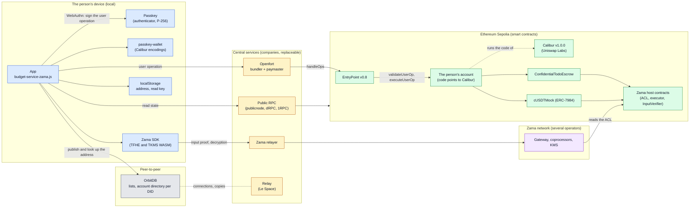
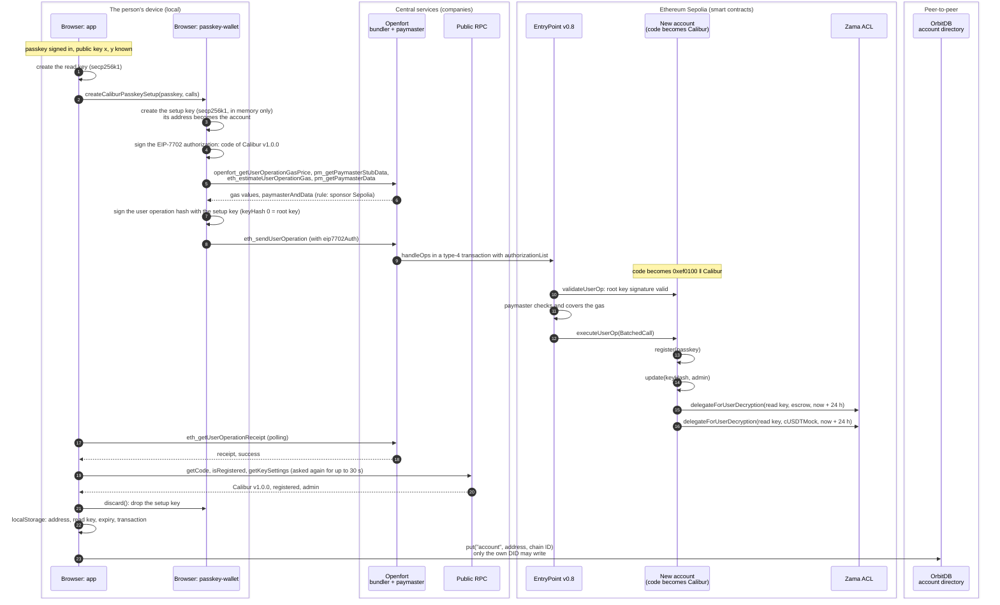
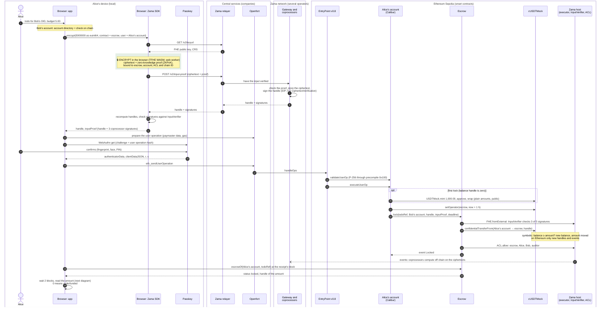
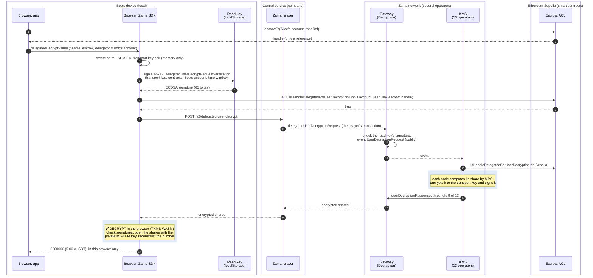
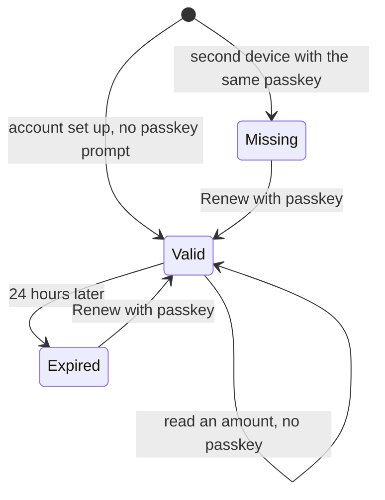
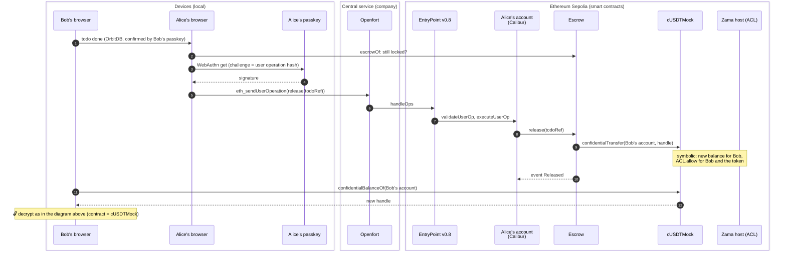

# One passkey as the account: Calibur, Openfort and Zama

This page explains how the `escrow01` app pays with a passkey on Sepolia: which account the passkey
controls (Calibur), who pays the gas (Openfort), where an amount is encrypted and where it is
decrypted (Zama), and how the app tells which account belongs to which DID. It describes the state on
2026-09-17 of branch `escrow01`, built with `VITE_BUDGET_SERVICE=zama`, and backs its statements
[at the end](#sources). What the escrow itself does is in [escrow.md](escrow.md), Zama's protocol in
detail in [zama-confidential-transactions.md](zama-confidential-transactions.md), risks and trust in
[security.md](security.md). German version: [passkey-account.de.md](passkey-account.de.md).

Status: on 2026-09-17 the whole flow ran on Sepolia in two browsers with virtual passkeys, from
setting up the accounts to Bob's balance ([measurements](#measured-on-2026-09-17)). Without the
settings under [Configuration](#configuration) the app keeps using the in-memory fake; the tests run
against it too.

| Piece                 | Version and address                                                                                                                              |
| --------------------- | ------------------------------------------------------------------------------------------------------------------------------------------------ |
| Account contract      | Calibur v1.0.0, a smart contract by Uniswap Labs (MIT license), `0x000000009B1D0aF20D8C6d0A44e162d11F9b8f00` (Sepolia and mainnet)               |
| ERC-4337              | EntryPoint v0.8, `0x4337084D9E255Ff0702461CF8895CE9E3b5Ff108`                                                                                    |
| Bundler and paymaster | Openfort, `https://api.openfort.io/rpc/11155111`; paymaster contract `0x8888fee873e7035789db91c16b5dddbad7214cda`                                |
| Wallet code           | `@le-space/passkey-wallet`, unpublished, a tarball in [`vendor/`](../vendor) (commit `cde6878`)                                                  |
| Passkey key           | `@le-space/orbitdb-identity-provider-webauthn-did` `0.5.5-p256.8366ed8`, a tarball in [`vendor/`](../vendor), with `getP256CredentialDescriptor` |
| Zama client           | `@zama-fhe/sdk` 3.6.0 on `@fhevm/sdk` 0.13.2                                                                                                     |

Every section has a simple explanation and a technical one.

- [Overview](#overview-simple)
- [Who runs what: central or decentralized](#who-runs-what-central-or-decentralized)
- [What Calibur is](#calibur-simple)
- [Setting up the account](#setup-simple)
- [Signing with the passkey](#signing-simple)
- [Locking a budget: where encryption happens](#locking-simple)
- [Reading an amount: where decryption happens](#reading-simple)
- [The read key](#read-key-simple)
- [Release and payout](#release-simple)
- [Which account belongs to which DID](#account-lookup-simple)
- [What is stored where](#what-is-stored-where)
- [Limits](#limits-simple)
- [Configuration](#configuration)
- [Measured on 2026-09-17](#measured-on-2026-09-17)
- [Open issues](#open-issues)

## Overview

### Overview: simple

In the app, one passkey does three things:

1. **It is the identity.** Its public key becomes the DID under which you write to OrbitDB and to which
   others delegate todos.
2. **It controls an account on Sepolia.** On first start the app sets up an account in the background
   whose admin key is the passkey. The account needs no ETH: Openfort pays the gas.
3. **It confirms every payment.** Locking and releasing ask the passkey exactly once each.

Reading amounts does not need the passkey. For that the browser holds a read key that may have this
account's amounts decrypted for 24 hours, but cannot move money ([The read key](#read-key-simple)).

### Overview: technical



Colors in the overview, boxes in the sequence diagrams: blue the person's device, yellow central
services run by companies, violet Zama's network with several operators, green smart contracts on
Ethereum Sepolia, gray peer-to-peer. Who runs what is in
[Who runs what](#who-runs-what-central-or-decentralized).

The keys involved:

| Key           | Kind                    | Where it lives                                                         | What it may do                                                   | For how long                                                  |
| ------------- | ----------------------- | ---------------------------------------------------------------------- | ---------------------------------------------------------------- | ------------------------------------------------------------- |
| Passkey       | P-256                   | in the authenticator (device or syncing password manager)              | admin of the account: every payment, adding and revoking keys    | until it is revoked in the account                            |
| Setup key     | secp256k1               | in memory only, during setup                                           | the account's root key, forever ([Limits](#limits-technical))    | the app discards it after setup                               |
| Read key      | secp256k1               | `localStorage` in plain text, under `simpleTodo.chainAccount.v1.<DID>` | Zama decryption of what the account may read in escrow and token | 24 hours (ACL delegation), then renewed with one passkey step |
| Transport key | ML-KEM-512              | the page's memory                                                      | opens the KMS's response shares                                  | while the page is open                                        |
| Openfort key  | publishable `pk_test_…` | in the shipped JavaScript                                              | have user operations sponsored under Openfort's rule             | until it is rotated                                           |

## Who runs what: central or decentralized

Three kinds of participants carry the flow:

- **On the person's own device** are the passkey, the app and the read key.
- **On the blockchain** are the contracts: account, escrow, token. Every movement there needs a
  matching signature; none of the services below can take money.
- **In between are services run by companies**, central today and replaceable: Openfort submits
  payments and pays the gas, Zama's relayer takes encryption and decryption requests, public RPC
  providers give read access to the chain, and Le Space runs the relay for the lists. If one of them
  fails, the money stays on the chain, but the app can no longer lock, release or read until the service
  is back or replaced.

Two caveats belong here. Sepolia is a testnet whose blocks come from a closed circle of client and
testing teams; on Ethereum mainnet that circle is open. And Zama's Protocol DAO can change the token and
Zama's rule contracts on the chain.

| Piece                                           | What it is                                                                                                                          | Who runs or controls it                                                                                | Kind                               |
| ----------------------------------------------- | ----------------------------------------------------------------------------------------------------------------------------------- | ------------------------------------------------------------------------------------------------------ | ---------------------------------- |
| Passkey                                         | key pair in the device's authenticator (WebAuthn)                                                                                   | the person; if it is synced, it is also stored encrypted with the password manager's provider          | local                              |
| App, wallet code, Zama SDK                      | JavaScript and WebAssembly in the browser                                                                                           | runs on the device; delivered by the website that hosts the app                                        | local                              |
| Read key                                        | secp256k1 key in the browser                                                                                                        | the person, through the browser profile ([The read key](#read-key-simple))                             | local                              |
| OrbitDB lists and account directory             | databases the browsers sync directly with each other                                                                                | the participating peers                                                                                | peer-to-peer                       |
| Relay                                           | `orbitdb-relay`: connects browsers and keeps copies of the lists                                                                    | Le Space                                                                                               | central, replaceable               |
| Public RPC                                      | read and send access to Sepolia                                                                                                     | providers such as publicnode, dRPC and 1RPC; replaceable through `VITE_SEPOLIA_RPC_URL`                | central, replaceable               |
| Openfort                                        | service that submits user operations, and a paymaster that pays the gas                                                             | Openfort, a company, under the rule in the Openfort project                                            | central                            |
| EntryPoint v0.8                                 | smart contract, reference implementation of ERC-4337 (eth-infinitism)                                                               | nobody; the contract has no upgrade mechanism                                                          | blockchain                         |
| Calibur v1.0.0                                  | smart contract by Uniswap Labs, MIT license ([What Calibur is](#calibur-simple))                                                    | nobody; not upgradeable, shared by all accounts                                                        | blockchain                         |
| The person's account                            | Ethereum address whose code points to Calibur                                                                                       | the passkey as admin; the discarded setup key technically remains root key                             | blockchain                         |
| ConfidentialTodoEscrow                          | this chapter's smart contract                                                                                                       | nobody; no owner, no upgrade, auditor fixed                                                            | blockchain                         |
| cUSDTMock, Zama host contracts (ACL and others) | smart contracts by Zama                                                                                                             | Zama's Protocol DAO can upgrade them and change their configuration                                    | blockchain, centrally controllable |
| Ethereum Sepolia                                | Ethereum's testnet                                                                                                                  | validators from client and testing teams, a closed circle                                              | blockchain, testnet                |
| Zama relayer                                    | HTTP service for encryption and decryption                                                                                          | Zama; according to Zama's documentation also self-hostable                                             | central                            |
| Gateway, coprocessors, KMS                      | Zama's protocol network: gateway chain (Arbitrum rollup), computers for encrypted values, key management by multi-party computation | on Sepolia 5 coprocessor operators and 13 KMS operators, 9 of whom work together for a user decryption | distributed, coordinated by Zama   |

## What Calibur is

### Calibur: simple

**What kind of thing Calibur is:** a smart contract, that is a program stored on Ethereum and run the
same way by every node. Uniswap Labs, the company behind the Uniswap exchange, wrote and published it;
"Calibur" is their name for this contract, derived from Excalibur. Calibur is not a company, not a
service and not a standard: Uniswap runs no server for it, and nobody needs an account with Uniswap.
The contract does implement standards, EIP-7702 and ERC-4337 above all. It sits at the same address on
Sepolia and on mainnet, and nobody can change it afterwards, Uniswap included; Uniswap can only
publish new versions at new addresses.

**What it does:** An ordinary Ethereum account belongs to exactly one private key. Whoever has it has
the account; it knows no second key and no passkey. Since EIP-7702 an account can declare: "the code
of this contract applies to me." The address stays the same, and from then on the account follows
Calibur's rules. It can then add more keys, passkeys among them, run several calls in one step and let
someone else pay its gas. Each account keeps its keys and its money in its own storage; the Calibur
contract itself holds neither.

### Calibur: technical

- **Classification.** Repository `Uniswap/calibur` of the GitHub organization Uniswap Labs, MIT
  license, described as a "non-upgradeable, singleton wallet contract" for EIP-7702. According to its
  README the contract implements ERC-4337 (user operations), ERC-7821 (batched calls), ERC-7201
  (namespaced storage), ERC-7739 (nested signatures) and ERC-7914 (ETH approvals). Which version an
  account follows is set by an EIP-7702 authorization that only the account's root key can sign; this
  app's accounts therefore stay on v1.0.0, because their setup key is discarded.
- **Delegation under EIP-7702.** A type-4 transaction carries an authorization signed by the account's
  key (chain ID, code address, nonce). Afterwards the account's code is the pointer
  `0xef0100 ‖ Calibur address`, and a call to the account runs Calibur's code in the account's storage.
  After setup on 2026-09-17, `eth_getCode` returned `0xef0100000000009b1d0af20d8c6d0a44e162d11f9b8f00`
  for both accounts. Calibur is not upgradeable; another rulebook would get the account only through a
  new authorization.
- **Keys.** `Key { KeyType keyType; bytes publicKey }`. A passkey is `keyType` `WebAuthnP256` (1) with
  `publicKey = abi.encode(uint256 x, uint256 y)`. Calibur stores it under
  `keyHash = keccak256(abi.encode(keyType, keccak256(publicKey)))` (`KeyLib.hash`).
- **Settings per key.** A `uint256`: an optional hook contract in the low 20 bytes, 5 bytes of expiry
  above that, the admin flag from bit 200. Only an admin key or the root key may call the account
  itself (`OnlyAdminCanSelfCall`), that is add, change or revoke keys. The app registers the passkey as
  admin, with no expiry and no hook.
- **Key management.** `register(Key)`, `update(keyHash, Settings)` and `revoke(keyHash)` are
  `onlyThis`: they run only as a call from the account to itself, that is inside a batch an authorized
  key signed.
- **Root key.** The account's own address always counts as a key (`KeyLib.isRootKey`, placeholder hash
  `bytes32(0)`); it can be neither registered nor revoked, see [Limits](#limits-technical).
- **ERC-4337.** Calibur is an account for EntryPoint v0.7 and v0.8. `validateUserOp` splits the
  signature into `(keyHash, signature, hookData)`, loads the key, checks the signature over the user
  operation hash and reports the key's expiry as `validUntil`. `executeUserOp` decodes a `BatchedCall`
  (calls and `revertOnFailure`) and runs each call as the account. The app sets `revertOnFailure`, so a
  failing call undoes the whole batch.
- **Other paths.** `execute(SignedBatchedCall, bytes)` accepts a signed batch from any sender, without
  a bundler; `isValidSignature` (ERC-1271) expects the ERC-7739 form for keys other than the root key.
  The app uses neither.
- **Versions and audits.** Uniswap calls the v1.0.0 tag of 2025-05-19 the frozen state after the audit
  fixes; the repository's README links audits by Cantina (04/2025) and OpenZeppelin (05/2025). On
  2026-07-02 v1.1.0 was released at `0x000000005c84F8Fd50b21CAC312528A64437030e`, on Sepolia too, and
  since then the README lists only that address. v1.1.0 hardens: a key that is not registered yields an
  invalid signature instead of a revert; only admin keys may call the EntryPoint (according to the
  comment on that change, a key without admin rights could previously withdraw the account's deposit
  there); `register` checks the public key's length and refuses the EntryPoint and SenderCreator as
  keys; `update` refuses reserved bits and hooks without code. `KeyLib.hash`, the admin flag and the
  ERC-7201 storage location are unchanged. The repository links no audit for v1.1.0. The app uses
  v1.0.0 ([Open issues](#open-issues)).

## Setting up the account

### Setup: simple

As soon as a passkey is signed in, the app sets up an account in the background without asking. For
that it creates a throwaway key that uses the new account exactly once: it switches the account to
Calibur, registers the passkey as admin, and lets the browser's read key decrypt amounts for 24 hours.
Then the app forgets the throwaway key. Openfort pays the gas. This takes about 20 seconds, after
which the address shows in the "Konto" (Account) tab. The app publishes it under the DID in OrbitDB so
others can give that account budgets.

### Setup: technical



1. **When.** [`+page.svelte`](../src/routes/+page.svelte) calls `prepareBudgetAccount` once per DID as
   soon as the passkey session and OrbitDB run. `ensureAccount` in
   [`budget-service-zama.js`](../src/lib/budget-service-zama.js) first takes an account this browser
   knows; otherwise it looks for 3 seconds for an account the same DID already published (a second
   device with the same synced passkey) and checks it on chain; only then does it set up a new one.
2. **The user operation.** Its sender is the setup key's address. It carries the authorization as
   `eip7702Auth`, its `initCode` starts with the marker `0x7702`, and the bundler puts the authorization
   into the `authorizationList` of a type-4 transaction. The signature is
   `abi.encode(bytes32(0), ECDSA signature, "")`: hash 0 stands for the root key, which Calibur
   recognizes by the account's address.
3. **The batch.** `register` and `update` with bit 200, then one
   `ACL.delegateForUserDecryption(read key, contract, expiry)` each for the escrow and for cUSDTMock.
   The expiry is the latest block's timestamp plus 24 hours.
4. **The check afterwards.** `createAccount` in [`sepolia-chain.js`](../src/lib/chain/sepolia-chain.js)
   requires `success` in the receipt and reads through a public RPC that the account points to Calibur
   v1.0.0 and has the passkey registered as admin. Public RPCs sit behind load balancers, and the node
   that answers can be a block behind; the app therefore asks again for up to 30 seconds. On
   2026-09-17 a run without this retry reported a correctly set up account as failed.
5. **Store and publish.** `discard()` drops the setup key. The record in `localStorage` holds address,
   read key, expiry, setup transaction and time; the account directory gets the address
   ([Account lookup](#account-lookup-technical)).
6. **A second device** with the same passkey finds the published account and takes it over, but has no
   read key. The app then asks for a new one, with one passkey step.

On 2026-09-17 Openfort bundled the setup of both accounts into one transaction
([`0xe66c…a165`](https://sepolia.etherscan.io/tx/0xe66c286f10f4715cc4eebfc0b3cc42700a402ec2718a84638e7707aaedd9a165)):
type 4, two authorizations, 799,333 gas, 13 logs, among them `Registered`, `KeySettingsUpdated` and
two `DelegatedForUserDecryption` per account.

## Signing with the passkey

### Signing: simple

Every payment is a "user operation": a package of calls the account is to run. The app computes the
package's fingerprint and has the passkey sign it; that is the one confirmation with fingerprint, face
or PIN. On chain, Calibur checks the signature against the public key registered in the account. If it
does not match, the account runs nothing.

### Signing: technical

1. **Hash.** For EntryPoint v0.8 the user operation hash is an EIP-712 hash: domain `ERC4337`,
   version `1`, chain ID and EntryPoint address, type `PackedUserOperation` with `sender`, `nonce`,
   `initCode`, `callData`, `accountGasLimits`, `preVerificationGas`, `gasFees` and `paymasterAndData`.
2. **WebAuthn.** `navigator.credentials.get` with the hash as challenge and
   `userVerification: 'required'`. While the passkey asks, the app shows "Confirm passkey…"
   (`withPasskeyPrompt` in [`delegated-write-auth.js`](../src/lib/delegated-write-auth.js)). The
   provider turns the DER signature into `r` and `s` with a low `s`.
3. **Signature for Calibur.** `abi.encode(keyHash, abi.encode(WebAuthnAuth), hookData)`, where
   `WebAuthnAuth` holds `authenticatorData`, `clientDataJSON`, the positions of `"challenge"` and
   `"type"` in it, and `r` and `s`.
4. **Check on chain** (`KeyLib.verify` → `WebAuthn.verify` from webauthn-sol): `s` at most n/2;
   `clientDataJSON` contains `"type":"webauthn.get"` and `"challenge":"<base64url of the hash>"`; the
   user presence (UP) flag is set; then `sha256(authenticatorData ‖ sha256(clientDataJSON))` and the
   P-256 check. Calibur passes `requireUV: false`: only the app requires that the user was verified.
   The chain checks neither origin nor `rpIdHash`.
5. **P-256.** webauthn-sol first calls the precompile at address `0x100` (RIP-7212, as EIP-7951 in
   Ethereum's Fusaka upgrade) and otherwise falls back to a Solidity implementation (FreshCryptoLib).
   On 2026-09-17 Sepolia answered a call to `0x100` with `1` for a valid signature and with an empty
   result for a tampered one, so the precompile is active there. The wallet package's tests measured,
   on a Sepolia fork, 81,000 gas for the check with the precompile and 370,000 without;
   `toCaliburPasskeyAccount` sets `verificationGasLimit` to at least 800,000.

## Locking a budget: where encryption happens

### Locking: simple

Alice enters 5.00. Her browser encrypts the number before it goes anywhere and attaches a proof that it
knows what it encrypted. Zama's coprocessors check the proof and confirm the encrypted input for
exactly this escrow and exactly Alice's account. Then Alice confirms once with her passkey, and her
account runs in one step: the first time, fetch 1,000.00 test cUSDT; let the escrow take money for an
hour; lock the budget. Ethereum computes only with references to encrypted values; the actual
encrypted arithmetic is done by Zama's coprocessors. Finally Alice's browser reads the locked amount
back. If 0 arrived, the balance was too small, and the app says so.

### Locking: technical



1. **Encryption** happens only in the browser: `encryptAmount` in `sepolia-chain.js` calls
   `sdk.encrypt({ values: [{ type: 'euint64', value }], contractAddress: escrow, userAddress: account })`
   ([`zama-client.js`](../src/lib/chain/zama-client.js)). The SDK loads key and CRS, builds the
   ciphertext with its proof in the TFHE WASM, and has the coprocessors check and sign it through
   `POST /v2/input-proof`. The individual steps are in
   [Encrypted input](zama-confidential-transactions.md#encrypted-input-technical). In the built app the
   SDK computes in a web worker of its own (`offloadEncrypt`); under Vite's dev server it computes on
   the page's thread, and in measurements on 2026-09-17 the page froze for 9 to 11 seconds meanwhile.
2. **Why the account is the user.** The escrow passes its own `msg.sender` to `FHE.fromExternal` as
   the user, and the `msg.sender` of `lock` is the Calibur account, since the call comes from
   `executeUserOp`. A proof made for another address fails with `InvalidSigner`.
3. **The calls** are put together by `lock` in `budget-service-zama.js`: on the first lock (the balance
   handle is still zero) `USDTMock.mint(account, 1,000,000,000)`, `approve` and `cUSDTMock.wrap`, then
   always `setOperator(escrow, now + 1 h)` and `lock(todoRef, Bob's account, handle, inputProof,
deadline)`. The deadline defaults to 30 days, at most 365. It is all one user operation with
   `revertOnFailure`: if the lock fails, there is no funding and no operator grant either.
4. **On chain** the lock follows [Lock](escrow.md#lock-technical). The starting funds are public (the
   amounts of `mint`, `approve` and `wrap` are plain in calldata and events); the locked amount is not.
   Since the wrap sits in the same user operation as the first lock, though, it is publicly visible
   that this lock is at most 1,000.00.
5. **Reading back.** The app reads `escrowOf` at the receipt's block, so that a lagging node does not
   report a missing escrow, requires the status locked, waits two blocks and decrypts the amount. A
   transfer from too small a balance does not revert but moves an encrypted 0
   ([Underfunded lock](escrow.md#underfunded-lock-technical)); the app then reports
   `insufficient-balance` with the lock's hash.

## Reading an amount: where decryption happens

### Reading: simple

The chain never holds a number, only a reference to an encrypted value. To see it, the browser asks
Zama's key holders. It creates a fresh transport key for that and signs the request with the read key.
Each of the 13 key holders checks on chain whether the account may read the amount and whether the read
key is enabled for it. Then it sends back its part of the answer, encrypted so that only the transport
key opens it. Only the browser puts the parts together into the number; neither the relayer nor any
single key holder sees it.

A locked amount may be read by the creator, the beneficiary and the auditor; a balance only by its
holder.

### Reading: technical



1. **The handle** comes from an `eth_call`: `escrowOf` for a locked amount, `confidentialBalanceOf` for
   a balance. A balance handle of all zeros was never written; the app then shows 0.00 without a
   request.
2. **The read key signs**, not the passkey: Zama v0.13 on Sepolia accepts only 65-byte ECDSA signatures
   for the decryption permit, and a Calibur account's signature would be an ERC-1271 proof
   ([Passkey wallet](security.md#passkey-wallet-technical)). So the account enabled the read key with
   `ACL.delegateForUserDecryption` per contract, for 24 hours at setup.
3. **Transport key.** The SDK creates the ML-KEM key pair in the TKMS WASM. The app gives the SDK
   `MemoryStorage`, so it stays in the page's memory.
4. **Relayer, gateway, KMS.** Before the request `@zama-fhe/sdk` checks that the delegation is still
   active. Then `POST /v2/delegated-user-decrypt`: the relayer calls `delegatedUserDecryptionRequest`
   on the gateway's `Decryption` contract, which checks the read key's EIP-712 signature, not the ACL,
   and emits `UserDecryptionRequest`. The KMS connectors take the delegator from the calldata and check
   `ACL.isHandleDelegatedForUserDecryption` on Sepolia. The nodes answer through
   `userDecryptionResponse` as for any user decryption, with shares bound to the ML-KEM public key by
   signcryption. Details and thresholds are in
   [User decryption](zama-confidential-transactions.md#user-decryption-technical) and
   [Relayer, Gateway and KMS](zama-confidential-transactions.md#relayer-gateway-and-kms-technical).
5. **What becomes public.** On Sepolia the `DelegatedForUserDecryption` event links account and read
   key. On the gateway chain `UserDecryptionRequest` names the handles, the read key's address and the
   transport key, and the request's calldata names the account too. The plain value exists nowhere but
   in the memory of the browser that decrypted it.
6. **When the read key has expired**, the app shows "Read access expired." and the button "Renew with
   passkey": one user operation with two new delegations to a new read key, one passkey step
   (`renewReadKey`). The key is new every time, because the ACL accepts the same delegation only once
   per block and an old key should not outlive its renewal.
7. **The auditor view** on Sepolia lists the escrow's `Locked` events, at most 50, for any identity.
   It decrypts amounts only when this session's account is the registered auditor, and shows "•••"
   otherwise. The registered auditor is a development key without a passkey, so the app always shows
   "•••" there.

## The read key

### Read key: simple

To show an amount, the browser asks Zama's key holders to decrypt it. They require a signed permission
for that. The account would have to sign, and the account belongs to the passkey. Zama's current
version, however, accepts only signatures of classic Ethereum keys, no passkey signatures. So the app
creates an additional key in the browser, the read key, and the account grants it a power of attorney.

Think of it as a time-limited power of attorney for account statements: whoever holds it sees the
amounts but cannot transfer, lock or release anything. Only the passkey can do that.

- **Granted** when the account is set up, without asking.
- **Reading** never asks the passkey. So Bob sees his amounts without touching his finger every time.
- **After 24 hours** the power of attorney expires. The app shows "Read access expired."; after "Renew
  with passkey" and one confirmation a new read key holds for another 24 hours. A second device that has
  no read key yet shows the same.

**Why 24 hours:** the read key sits unencrypted in the browser. Whoever gets at this browser profile,
through malware or an unlocked laptop, can read amounts until the power of attorney expires. A short
term limits that time, a long one saves confirmations. The 24 hours are an app setting for the demo,
not a Zama requirement, and can be changed.



### Read key: technical

- **Key.** secp256k1, created with viem's `generatePrivateKey` in `ensureAccount` (setup) and in
  `renewReadKey` (renewal), new each time. It is stored in plain text in the account record in
  `localStorage` under `simpleTodo.chainAccount.v1.<DID>`, as `session: { address, privateKey }` with
  `readKeyExpiresAt` in Unix seconds.
- **Power of attorney.** `ACL.delegateForUserDecryption(read key, contract, expiry)`, once each for the
  escrow and for cUSDTMock. At setup the call sits in the batch the setup key signs, without a passkey
  prompt; at renewal it is a user operation the passkey signs. The key is new each time, because the
  ACL accepts the same combination of delegator, delegate and contract only once per block and an old
  key should not outlive its renewal.
- **Expiry.** The latest block's timestamp plus `READ_KEY_TTL_SECONDS`, set to 24 hours in
  [`src/lib/chain/config.js`](../src/lib/chain/config.js). A changed value applies to new read keys;
  existing delegations keep their date. ACL v0.4.0 only requires a date in the future, so the term can
  be chosen freely.
- **Who enforces the end.** The app compares `readKeyExpiresAt` with the clock (`readKeyState`: `valid`,
  `expired`, `missing`) and then shows "Read access expired.". The expiry is enforced through the chain,
  though: the KMS connectors check `ACL.isHandleDelegatedForUserDecryption` on Sepolia, and
  `@zama-fhe/sdk` already checks before the request that the delegation is active. The signed permit
  has a time window of its own; the chain lets it read only while the delegation holds.
- **What it can do.** Sign EIP-712 permits of type `DelegatedUserDecryptRequestVerification` for
  handles the account may read in these two contracts, such as locked amounts where the account is
  creator, beneficiary or auditor, and its own balance. It is not registered in the Calibur account, so
  it cannot sign a user operation or move anything.
- **What becomes public.** The `DelegatedForUserDecryption` event on Sepolia links account and read key,
  expiry included; `UserDecryptionRequest` on the gateway chain names the read key's address with every
  read request.
- **Why not the passkey.** Zama v0.13 accepts only 65-byte ECDSA permits; a Calibur account's signature
  would be an ERC-1271 proof in ERC-7739 form ([Passkey wallet](security.md#passkey-wallet-technical)).
  v0.14 also checks permits through ERC-1271; whether a Calibur passkey signature passes there has not
  been checked.
- **What the app does not do.** It offers no revocation (`revokeDelegationForUserDecryption`, in the
  wallet package `getRevokeDelegationForUserDecryptionCalls`); the power of attorney ends only by expiry.
  The wallet package could seal the key with AES-GCM (`seal`, e.g. with a key derived from the passkey's
  PRF output); the app does not use that yet ([Open issues](#open-issues)).

## Release and payout

### Release: simple

Bob ticks the todo; his passkey confirms that for OrbitDB, not for the chain. Alice sees it and
releases: one passkey step, one user operation with a single call. The escrow moves the encrypted
amount to Bob's account. Bob then sees his balance, again decrypted in his own browser.

### Release: technical



`release` in `budget-service-zama.js` requires a locked escrow under Alice's account for this
`todoRef`, then sends the one call. What escrow and token do is in
[Release](escrow.md#release-technical). Bob's browser reads his balance as soon as the list reports the
payout, and once more 15 seconds later: right after the receipt a public node can still return the
old handle.

## Which account belongs to which DID

### Account lookup: simple

Alice delegates to Bob's DID, but the escrow pays an address. The address cannot be computed from the
DID, since Bob's account is the address of a throwaway key. So each app publishes its address in a
small OrbitDB database that only its own DID can write to. Alice's app reads Bob's address there and
also checks on chain that Bob's passkey is an admin of that account. Only if both hold does it lock;
otherwise it reports that the delegate has no account for budgets yet, before the passkey is asked.

### Account lookup: technical

- **The directory** ([`account-directory.js`](../src/lib/chain/account-directory.js)): a keyvalue
  database named `simple-todo-escrow01-account-v1` with `IPFSAccessController({ write: [did] })`. Its
  address follows from name and access rule, so anyone can open Bob's directory without knowing the
  address, and OrbitDB accepts only entries Bob's identity signed. The `account` entry is
  `{ address, chainId, publishedAt }`. Alice waits up to 20 seconds for replication.
- **The check on chain** (`isPasskeyAccount` in `sepolia-chain.js`): read the P-256 key from the DID
  ([`did-key.js`](../src/lib/chain/did-key.js); `did:key` with multicodec `0x1200`, written uncompressed
  by the identity provider, compressed ones read too), derive the `keyHash`, and require that the
  account points to Calibur v1.0.0 and has the key registered with admin rights.
- **Why both.** Registering a public key needs no private key. Mallory could register Bob's passkey in
  her own account, which she keeps controlling through its root key; the check on chain alone would
  accept her account. She cannot publish it under Bob's DID. The directory entry says "Bob names this
  address", the chain says "Bob's passkey is an admin there".

## What is stored where

| Data                                                               | Where                                            | Who can see it                       |
| ------------------------------------------------------------------ | ------------------------------------------------ | ------------------------------------ |
| the passkey's private key                                          | authenticator                                    | nobody                               |
| address, read key (private, plain text), expiry, setup transaction | the browser's `localStorage`                     | whoever gets at this browser profile |
| address per DID                                                    | OrbitDB account directory                        | anyone who opens the database        |
| budget status, `todoRef`, transaction hashes, no amount            | the todo's OrbitDB list                          | whoever can read the list            |
| handles of locked amounts and balances                             | storage of escrow and token on Sepolia           | everyone                             |
| ciphertexts                                                        | Zama's coprocessors, committed on the gateway    | the operators, encrypted only        |
| FHE decryption key                                                 | KMS, as shares on 13 nodes                       | no single node                       |
| link between account and read key                                  | `DelegatedForUserDecryption` event on Sepolia    | everyone                             |
| decryption requests                                                | gateway chain                                    | everyone                             |
| starting funds of 1,000.00                                         | calldata and events of `mint`, `approve`, `wrap` | everyone                             |
| plain value of an amount                                           | memory of the browser that decrypted it          | the person at that browser           |

## Limits

### Limits: simple

- The throwaway setup key technically stays a master key of the account forever. The app forgets it
  at once; that cannot be proven on chain.
- Losing the passkey loses the account. The app sets up no second key and no recovery.
- The chain does not check whether the passkey really asked for fingerprint or PIN; only the app
  requires it.
- The read key sits unencrypted in the browser. Whoever gets at the browser profile can read amounts
  for up to 24 hours, but move nothing.
- The Openfort key is in the app. Whoever reads it out can have any operation on Sepolia sponsored at
  the expense of this Openfort project.

### Limits: technical

- **Root key.** Calibur treats the account's address as a key that `revoke` does not remove, and the
  same private key could sign a new EIP-7702 authorization. `discard()` drops every reference;
  JavaScript cannot wipe memory, and a page compromised during setup could read it. Until the first
  lock the account holds nothing; the starting funds arrive only with a user operation the passkey
  signs. Details in [Passkey wallet](security.md#passkey-wallet-technical).
- **No recovery.** Apart from the discarded root key, the passkey is the only key. A synced passkey
  travels to further devices; a deleted one takes the account with it.
- **User verification.** `KeyLib.verify` passes `requireUV: false`; the app requests
  `userVerification: 'required'`.
- **Read key.** Plain text in `localStorage`, valid for up to 24 hours, publicly linked to the account.
  The wallet package can seal it with AES-GCM (`seal`, e.g. with a key derived from the passkey's PRF
  output); the app does not use that yet.
- **Openfort.** Rule `ply_1b76dd29-…` has a single condition: `sponsorEvmTransaction` on chain
  11155111, with no restriction to contracts or functions. The publishable key is in the shipped
  JavaScript. Running outside the testnet needs rules on escrow, token and ACL, rate limits, and a
  server-side paymaster call.
- **Public RPCs.** After any receipt a node can lag behind. The app asks again for up to 30 seconds
  after setup and reads the escrow at the receipt's block after a lock.
- **P-256 without the precompile** costs about 370,000 gas per signature; Sepolia has the precompile.
- **Calibur v1.0.0** rather than v1.1.0, see [What Calibur is](#calibur-technical).
- **Zama v0.14** also checks decryption permits through ERC-1271. Whether a Calibur passkey signature
  passes there and could replace the read key has not been checked.

## Configuration

`.env.local`, not in git; `VITE_*` is written into the page at build time:

```bash
VITE_BUDGET_SERVICE=zama
VITE_BUNDLER_URL=https://api.openfort.io/rpc/11155111
# a publishable key only; the app refuses sk_…
VITE_BUNDLER_AUTH_HEADER=Bearer pk_test_...
VITE_OPENFORT_POLICY_ID=pol_...
# optional, put in front of the public RPCs
VITE_SEPOLIA_RPC_URL=https://...
```

Without `VITE_BUNDLER_URL` or `VITE_BUNDLER_AUTH_HEADER` the app warns in the console and uses the
fake (`readChainEndpoints` in [`config.js`](../src/lib/chain/config.js)).

The rule and the sponsorship at Openfort, with the Openfort CLI signed in:

```bash
openfort policies create --scope project --description "escrow01: sponsor all transactions on Sepolia (test mode)" --rules '[{"action":"accept","operation":"sponsorEvmTransaction","criteria":[{"type":"evmNetwork","operator":"in","chainIds":[11155111]}]}]'
```

```bash
openfort sponsorship create --policy-id ply_... --name "escrow01 Sepolia" --strategy pay_for_user --chain-id 11155111
```

The `pol_…` ID from the second output goes into `VITE_OPENFORT_POLICY_ID`.

Further requirements in the repository:

- **Unpublished packages.** `vendor/le-space-orbitdb-identity-provider-webauthn-did-0.5.5-p256.8366ed8.tgz`
  and `vendor/le-space-passkey-wallet-0.0.0-cde6878.tgz` were packed with `git archive` from the
  commits named above and are `file:` dependencies in `package.json`, the provider also under
  `pnpm.overrides`. Once both are on npm, version numbers replace the tarballs.
- **Vite** needs `worker: { format: 'es' }` ([`vite.config.js`](../vite.config.js)): the provider's
  keystore worker imports modules.

## Measured on 2026-09-17

One run with two Chromium profiles, virtual passkeys, a local relay and the production build on
Sepolia. Durations count up to what the app shows: for the accounts from opening the "Konto" tab right
after start, otherwise from the click.

| Step                                     | Duration                        | Transaction                                                                                                                | Gas       | Logs |
| ---------------------------------------- | ------------------------------- | -------------------------------------------------------------------------------------------------------------------------- | --------- | ---- |
| Set up Alice's and Bob's accounts        | 17.0 s and 18.0 s               | [`0xe66c…a165`](https://sepolia.etherscan.io/tx/0xe66c286f10f4715cc4eebfc0b3cc42700a402ec2718a84638e7707aaedd9a165) (both) | 799,333   | 13   |
| Lock 5.00, with funding and reading back | 54 s                            | [`0x6696…111f`](https://sepolia.etherscan.io/tx/0x6696ea38abed7ca22f45f806acd46d3abd4dd7f14e7d09c3abd8a7a1926c111f)        | 1,164,214 | 42   |
| Bob sees "5,00 cUSDT · gesperrt"         | 4 s after Alice's display       | none                                                                                                                       |           |      |
| Release                                  | 24 s                            | [`0x58c3…d7e1`](https://sepolia.etherscan.io/tx/0x58c317864ed43f81b7ef2b4b46ba11e7829edd1b5e5224ab7dc2b28ed537d7e1)        | 550,093   | 19   |
| Bob's balance                            | 5.00 cUSDT, read in the browser | none                                                                                                                       |           |      |

The accounts were `0x2D37Ff492A2c7129fe58DF2d4a1CB6489Ba83068` (Alice) and
`0x03a4b77c6Ca98C2648D669F978700FfC9FFBB5Fb` (Bob). The lock's 42 logs: `Transfer` (2) and `Approval`
from USDTMock, `Wrap` and `OperatorSet` from cUSDTMock, `VerifyInput`, `TrivialEncrypt` (4), `FheAdd`
(3), `FheGe` (2), `FheIfThenElse` (4) and `FheSub` from the executor, 16 `Allowed` from the ACL, 2
`ConfidentialTransfer`, `Locked`, plus `BeforeExecution` and `UserOperationEvent` from the EntryPoint
and one log from the paymaster. The gas includes funding, operator grant, P-256 check and the work of
EntryPoint and paymaster; the lock alone cost 682,630 gas in the smoke test of 2026-09-16
([smoke-test.md](smoke-test.md)).

## Open issues

1. **Calibur v1.1.0.** Uniswap lists only v1.1.0; switching needs the wallet package's encodings tested
   against v1.1.0 (Foundry harness and fork test), and existing accounts need a new authorization that
   only their root key can sign. New accounts on v1.1.0 would be the simpler path.
2. **Openfort rule**: restrict it to the demo's contracts and cap the budget.
3. **Read key**: seal it instead of storing it in plain text.
4. **Recovery**: a second admin key or a hook, before real money is involved.
5. **Publish the packages** and replace the tarballs.
6. **Zama v0.14**: wait for it and check whether the passkey itself can permit decryptions.
7. **Auditor**: still a development key, see [security.md](security.md#open-issues).

## Sources

Repository, branch `escrow01`:

- [`src/lib/budget-service-zama.js`](../src/lib/budget-service-zama.js): `ensureAccount`, `accountOf`,
  `lock`, `release`, `decryptAmount`, `balance`, `renewReadKey`.
- [`src/lib/chain/sepolia-chain.js`](../src/lib/chain/sepolia-chain.js): `settle`, `readEscrow`,
  `isPasskeyAccount`, `createAccount`, `sendWithPasskey`, `encryptAmount`, `decrypt`, `calls`.
- [`src/lib/chain/zama-client.js`](../src/lib/chain/zama-client.js),
  [`src/lib/chain/clients.js`](../src/lib/chain/clients.js),
  [`src/lib/chain/config.js`](../src/lib/chain/config.js),
  [`src/lib/chain/account-directory.js`](../src/lib/chain/account-directory.js),
  [`src/lib/chain/account-store.js`](../src/lib/chain/account-store.js),
  [`src/lib/chain/did-key.js`](../src/lib/chain/did-key.js).
- Read key: [`src/lib/chain/config.js`](../src/lib/chain/config.js) (`READ_KEY_TTL_SECONDS` 35),
  [`src/lib/budget-service-zama.js`](../src/lib/budget-service-zama.js) (`readKeyState`, `ensureAccount`,
  `renewReadKey`), [`src/lib/BudgetNotices.svelte`](../src/lib/BudgetNotices.svelte) (notice "Read
  access expired.", `expired` 39).
- Tests: [`src/lib/budget-service-zama.spec.js`](../src/lib/budget-service-zama.spec.js),
  [`src/lib/chain/did-key.spec.js`](../src/lib/chain/did-key.spec.js).

`@le-space/passkey-wallet`, commit `cde6878` (tarball in `vendor/`): `README.md` (design, root key, gas
measurements), `src/setup.js` (`createCaliburPasskeySetup`, `getCaliburKeyState`, `revertOnFailure`
438), `src/calibur.js` (`toWebAuthnP256Key`, `getKeyHash`, `encodeExecuteUserOpCallData`),
`src/account.js` (`DEFAULT_VERIFICATION_GAS_LIMIT` 79). Provider `8366ed8`:
`src/standalone/webauthn/p256-wallet.js` (`getP256CredentialDescriptor` 299-345, low `s` 375,
`userVerification` 343 and 477).

Calibur v1.0.0 (<https://github.com/Uniswap/calibur/tree/v1.0.0>, commit `35d8091`): `src/Calibur.sol`
(`execute` 66-80, `executeUserOp` 91-100, `validateUserOp` 108-129, `isValidSignature` 132,
`_processBatch` 177, `_process` 187, `OnlyAdminCanSelfCall` 196), `src/KeyManagement.sol` (`register`
21, `update` 32, `revoke` 40, `getKey` 59-63), `src/libraries/KeyLib.sol` (`ROOT_KEY_HASH` 26, `hash`
30, `isRootKey` 35-42, `verify` 58-77, `requireUV: false` 73), `src/libraries/SettingsLib.sol`
(`isAdmin` 26, `expiration` 34, `hook` 42), `src/CaliburEntry.sol` (ERC-7201 storage location 42-44).
webauthn-sol at the pinned commit `619f20a`: `src/WebAuthn.sol` (`_VERIFIER = address(0x100)` 52,
`verify` 105-163). Repository state on 2026-09-17: README (v1.1.0 addresses, audits), releases v1.0.0
("Frozen commit post audit fixes") and v1.1.0, comparison
<https://github.com/Uniswap/calibur/compare/v1.0.0...v1.1.0> (`src/Calibur.sol`,
`src/KeyManagement.sol`, `src/libraries/KeyLib.sol`, `src/libraries/SettingsLib.sol`).

Classification, read on 2026-09-17: GitHub organization `Uniswap` (name "Uniswap Labs") and repository
`Uniswap/calibur` (license MIT, description "a non-upgradeable, singleton wallet contract that can be set
on an EIP-7702 delegation transaction"; README with the origin of the name and the list of implemented
standards); SPDX identifier MIT in `src/Calibur.sol` of v1.0.0; `eth-infinitism/account-abstraction`,
`contracts/core/EntryPoint.sol` 28 (no proxy, no owner); ethereum.org, Networks
(<https://ethereum.org/en/developers/docs/networks/>): Sepolia uses "a permissioned validator set
controlled by client & testing teams". Zama's operators, gateway and relayer:
[zama-confidential-transactions.md](zama-confidential-transactions.md#components-technical).

viem: `account-abstraction/utils/userOperation/getUserOperationTypedData.js` (EIP-712 hash for v0.8),
`getInitCode.js` (marker `0x7702`).

`@fhevm/sdk` 0.13.2 under `@zama-fhe/sdk` 3.6.0: `DelegatedUserDecryptRequestVerification`,
`v2/delegated-user-decrypt`. `@zama-fhe/sdk` 3.6.0 (sources in its source maps):
`src/services/delegation-service.ts` (at least one hour when creating 80-84, `assertDelegationActive`
283-307), `src/services/decryption-service.ts` (`delegatedDecryptValues` 147-171). zama-ai/fhevm
v0.13.5: `gateway-contracts/contracts/Decryption.sol` (`delegatedUserDecryptionRequest` 531-628,
signature check 576, `UserDecryptionRequest` 621, `userDecryptionResponse` 635),
`kms-connector/crates/kms-worker/src/core/event_processor/decryption.rs` (delegator from the calldata
127-131, `isHandleDelegatedForUserDecryption` 191-201). Zama's protocol with sources:
[zama-confidential-transactions.md](zama-confidential-transactions.md#sources).

EIPs: [EIP-7702](https://eips.ethereum.org/EIPS/eip-7702), [ERC-4337](https://eips.ethereum.org/EIPS/eip-4337),
[EIP-7951](https://eips.ethereum.org/EIPS/eip-7951), [ERC-7201](https://eips.ethereum.org/EIPS/eip-7201),
[ERC-7739](https://eips.ethereum.org/EIPS/eip-7739).

Openfort, read through the CLI on 2026-09-17: rule `ply_1b76dd29-2f48-4835-ad5f-4cd8aa2db3d8`
(`sponsorEvmTransaction`, `evmNetwork in [11155111]`), sponsorship
`pol_54e798c9-a37b-4808-8fbd-c6d980abb408`.

Chain, read on 2026-09-17: the three transactions above with logs and `authorizationList`,
`UserOperationEvent` (paymaster `0x8888fee873e7035789db91c16b5dddbad7214cda`), `eth_getCode` of both
accounts and of both Calibur addresses on Sepolia and mainnet, `eth_call` to `0x100` with a valid and a
tampered P-256 signature.
