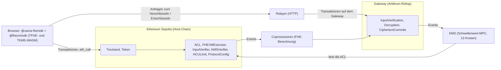

# Vertrauliche Transaktionen im Protokoll von Zama

Diese Seite erklärt die Teile des Protokolls von Zama, die die Treuhand von `escrow01` nutzt: wie
ein Betrag im Browser verschlüsselt wird, wie ein Vertrag auf Ethereum damit rechnet, ohne ihn zu
sehen, wer ihn entschlüsseln darf und wie die Entschlüsselung funktioniert. Sie beschreibt, was am
2026-09-16 auf Sepolia läuft, und nennt den Code und die Dokumentation, anhand derer sie geprüft
wurde. Was die Treuhand selbst tut, steht in [escrow.de.md](escrow.de.md); Risiken und Vertrauen
stehen in [security.de.md](security.de.md); ein echter Lauf ist in
[smoke-test.de.md](smoke-test.de.md) nachverfolgt.

Versionen, auf die sich diese Seite bezieht:

| Komponente                                        | Version                                                                                                                                                  |
| ------------------------------------------------- | -------------------------------------------------------------------------------------------------------------------------------------------------------- |
| Protokoll auf Sepolia und im Ethereum-Mainnet     | Host-Verträge v0.13: ACL v0.4.0, FHEVMExecutor v0.4.0, KMSVerifier v0.3.0, InputVerifier v0.2.0, HCULimit v0.3.0, ProtocolConfig v0.1.0 (`getVersion()`) |
| Vom Treuhand-Vertrag genutzte Solidity-Bibliothek | `@fhevm/solidity` 0.11.1 (warum nicht 0.13.3, erklärt [contracts/README.md](../contracts/README.md#toolchain))                                           |
| Vom Smoke-Test genutztes Client-SDK               | `@zama-fhe/sdk` 3.6.0 auf `@fhevm/sdk` 0.13.2                                                                                                            |
| Relayer                                           | `https://relayer.testnet.zama.org`                                                                                                                       |

Jeder Abschnitt hat eine einfache und eine technische Erklärung.

- [Die Komponenten](#komponenten-einfach)
- [FHE und TFHE](#fhe-einfach)
- [Handles](#handles-einfach)
- [Symbolische Ausführung und Coprozessoren](#symbolische-ausführung-einfach)
- [Verschlüsselte Eingabe und ihr Proof](#verschlüsselte-eingabe-einfach)
- [Zugriffskontrolle (ACL)](#acl-einfach)
- [Nutzer-Entschlüsselung](#nutzer-entschlüsselung-einfach)
- [Delegierte Nutzer-Entschlüsselung](#delegierte-nutzer-entschlüsselung-einfach)
- [Öffentliche Entschlüsselung](#öffentliche-entschlüsselung-einfach)
- [Relayer, Gateway und KMS](#relayer-gateway-und-kms-einfach)
- [HCU-Limits](#hcu-einfach)
- [Protokoll v0.13 und v0.14](#protokollversionen-einfach)
- [Vertrauensannahmen](#vertrauen-einfach)
- [Die Sepolia-Vorfälle im September 2026](#vorfälle-einfach)

## Komponenten

### Komponenten: einfach

Eine gewöhnliche Blockchain kann keine Zahlen geheim halten: Jeder Knoten muss jede Berechnung
prüfen können. Zama teilt die Arbeit auf. Die Blockchain hält fest, welche Berechnung auf welchen
verschlüsselten Werten stattfinden soll und wer sie verwenden darf. Separate Server, die
Coprozessoren, erledigen die verschlüsselte Arithmetik. Eine Gruppe unabhängiger Schlüsselverwalter,
das KMS, kann entschlüsseln, aber nur für jemanden, der laut Chain dazu berechtigt ist. Ein
Webdienst, der Relayer, übermittelt Anfragen zwischen dem Browser und diesen Servern.

### Komponenten: technisch

| Komponente                | Rolle                                                                                                             | Auf Sepolia                                                                                                                                         |
| ------------------------- | ----------------------------------------------------------------------------------------------------------------- | --------------------------------------------------------------------------------------------------------------------------------------------------- |
| FHEVM-Solidity-Bibliothek | `FHE.*`-Funktionen und verschlüsselte Typen (`euint64`, `ebool`, ...), die die Host-Verträge aufrufen             | in den Treuhand-Vertrag und den Token einkompiliert                                                                                                 |
| ACL                       | für jedes Handle, wer es verwenden oder entschlüsseln darf                                                        | `0xf0Ffdc93b7E186bC2f8CB3dAA75D86d1930A433D`                                                                                                        |
| FHEVMExecutor             | macht aus jeder FHE-Operation ein Ergebnis-Handle und ein Event                                                   | `0x92C920834Ec8941d2C77D188936E1f7A6f49c127`                                                                                                        |
| InputVerifier             | prüft die Coprozessor-Signaturen auf verschlüsselten Eingaben                                                     | `0xBBC1fFCdc7C316aAAd72E807D9b0272BE8F84DA0`; 3 von 5 Signierern                                                                                    |
| KMSVerifier               | prüft KMS-Signaturen auf Ergebnissen öffentlicher Entschlüsselung                                                 | `0xbE0E383937d564D7FF0BC3b46c51f0bF8d5C311A`; 7 von 13 Signierern                                                                                   |
| HCULimit                  | begrenzt die FHE-Arbeit pro Transaktion                                                                           | `0xa10998783c8CF88D886Bc30307e631D6686F0A22`                                                                                                        |
| ProtocolConfig            | enthält die KMS-Signierermenge und die Schwellenwerte                                                             | `0x51f9AFBc89Ea792e1a21a12AB802ab58D4dbee83`, v0.1.0                                                                                                |
| Coprozessoren             | prüfen Input-Proofs, berechnen FHE-Operationen mit TFHE-rs, speichern Chiffrate und committen sie auf dem Gateway | Zamas Sepolia-Seite führt fünf Coprozessor-Betreiber auf                                                                                            |
| Gateway                   | ein Rollup, das Eingaben validiert und die Entschlüsselung orchestriert                                           | Gateway-Chain-ID 10901; `InputVerification` `0x483b9dE06E4E4C7D35CCf5837A1668487406D955`, `Decryption` `0x5D8BD78e2ea6bbE41f26dFe9fdaEAa349e077478` |
| KMS                       | erzeugt die FHE-Schlüssel und entschlüsselt per Schwellenwert-MPC                                                 | 13 in ProtocolConfig registrierte Signierer; Zamas Sepolia-Seite führt 13 KMS-Betreiber auf                                                         |
| Relayer                   | HTTP-Frontend zum Gateway für Browser und Server                                                                  | `https://relayer.testnet.zama.org`, kein API-Schlüssel im Testnet                                                                                   |

Zamas Übersichtsseiten beschreiben eine Kopie der ACL auf dem Gateway. Im Quellcode von v0.13.5
existiert diese Kopie nicht mehr (`MultichainACL.sol` wurde in v0.12.0 entfernt): Der KMS-Connector
liest die ACL auf der Host-Chain selbst. Zamas eigenes Change Log bestätigt das: v0.12 hat die
MultichainACL-Verträge entfernt, und die ACL-Prüfungen für Entschlüsselungen laufen über Relayer und
KMS-Connector auf der Host-Chain. Diese Seite folgt dem Quellcode.

Der Treuhand-Vertrag findet die Host-Verträge über `ZamaEthereumConfig`, das `block.chainid` auf
deren Adressen abbildet (11155111 für Sepolia, 1 für Ethereum, 31337 für einen lokalen
Hardhat-Knoten) und auf Sepolia `confidentialProtocolId()` 10001 meldet.

## FHE und TFHE

### FHE: einfach

Vollhomomorphe Verschlüsselung erlaubt einem Rechner, verschlüsselte Zahlen zu addieren, zu
subtrahieren, zu vergleichen und zwischen ihnen auszuwählen, ohne sie zu entschlüsseln. Das Ergebnis
ist wieder verschlüsselt, und nur ein Schlüsselverwalter kann es lesen.

### FHE: technisch

Das Protokoll von Zama verwendet TFHE über die Bibliothek TFHE-rs. Das KMS erzeugt ein globales
FHE-Schlüsselpaar; der öffentliche Schlüssel wird veröffentlicht, der private Schlüssel existiert
nur als Anteile, die die KMS-Knoten halten. Clients verschlüsseln mit dem öffentlichen Schlüssel (im
Browser über das TFHE-WASM-Modul in `@fhevm/sdk`). Coprozessoren rechnen auf Chiffraten. Zu den
unterstützten verschlüsselten Typen gehören `ebool`, `euint8` bis `euint256` und `eaddress`; der
Treuhand-Vertrag verwendet `euint64`. Zu den Operationen gehören `add`, `sub`, `mul`, Vergleiche wie
`ge` sowie `select`. Ein Vertrag kann nicht anhand einer verschlüsselten Bedingung verzweigen;
`FHE.select(condition, a, b)` berechnet beide Seiten und behält eine, ohne preiszugeben, welche.
Deshalb revertiert ein vertraulicher Transfer von einem zu niedrigen Guthaben nicht, sondern bewegt
eine verschlüsselte 0.

## Handles

### Handles: einfach

Die Chain speichert nie eine verschlüsselte Zahl selbst. Sie speichert einen 32 Byte langen Verweis
darauf, das Handle. Das Chiffrat hinter einem Handle verwahren die Coprozessoren. Handles kann jeder
sehen; einen Wert kann niemand daraus lesen.

### Handles: technisch

Ein Handle ist ein `bytes32`. Die Host-Verträge auf Sepolia (FHEVMExecutor, Quellcode von v0.13.5) und
`@fhevm/sdk` 0.13.2 stimmen in diesem Aufbau überein:

| Bytes | Inhalt                                                                                                          |
| ----- | --------------------------------------------------------------------------------------------------------------- |
| 0-20  | die ersten 21 Bytes eines keccak-256-Hashes                                                                     |
| 21    | Index des Werts innerhalb einer verschlüsselten Eingabe oder `0xff` für ein on-chain berechnetes Handle         |
| 22-29 | Chain-ID, 8 Bytes Big-Endian                                                                                    |
| 30    | FHE-Typ: 0 `ebool`, 2 `euint8`, 3 `euint16`, 4 `euint32`, 5 `euint64`, 6 `euint128`, 7 `eaddress`, 8 `euint256` |
| 31    | Handle-Version, derzeit 0                                                                                       |

Die beiden Handles des Smoke-Test-Laufs vom 2026-09-16 lassen sich so dekodieren:

| Handle                                                                                    | Byte 21                                         | Bytes 22-29                   | Byte 30         | Byte 31 |
| ----------------------------------------------------------------------------------------- | ----------------------------------------------- | ----------------------------- | --------------- | ------- |
| Eingabe `0x4a47ae4fd5dd21a7962881ccabba2bc1be379cace6000000000000aa36a70500`              | `00`: erster Wert einer verschlüsselten Eingabe | `0000000000aa36a7` = 11155111 | `05`: `euint64` | `00`    |
| gespeicherter Betrag `0x506d80703a79c87b91a050038fb7baf8bb1e70c1e4ff0000000000aa36a70500` | `ff`: berechnet                                 | `0000000000aa36a7`            | `05`            | `00`    |

Vergleichsergebnisse im selben Lauf enden auf `...aa36a70000`: Typ 0, `ebool`.

Wie die 21 Hash-Bytes entstehen:

- Input-Handle, vom Client berechnet:
  `keccak256("ZK-w_hdl" ‖ blobHash ‖ index ‖ ACL address ‖ chainId)` mit
  `blobHash = keccak256("ZK-w_rct" ‖ ciphertextWithZkProof)`. Vertrag und Nutzer stehen nicht in
  diesem Hash; sie werden über den Proof gebunden (nächste Abschnitte).
- Berechnetes Handle, vom FHEVMExecutor erzeugt:
  `keccak256(abi.encodePacked(COMPUTATION_DOMAIN_SEPARATOR, operator, operands, ACL address,
block.chainid, blockhash(block.number - 1), block.timestamp))`, wobei eine binäre Operation
  zusätzlich ihr Skalar-Flag einbezieht und `trivialEncrypt` statt der Operanden-Handles den
  Klartextwert und den Typ hasht.

Folgen:

- Ein berechnetes Handle ist eine Funktion öffentlicher Daten. Dieselbe Operation auf denselben
  Operanden im selben Block ergibt dasselbe Handle: Bei der ersten Sperre des Smoke-Test-Laufs
  liefern beide Events `TrivialEncrypt(0)` das Handle
  `0x8aff21692e3a10a65d8a31c7b594fd738f9558f4f1ff0000000000aa36a70500`.
- Ein Handle sagt nichts über den Wert aus. Zamas Dokumentation fordert Verträge auf, Handles als
  opak zu behandeln: Gleiche Handles implizieren gleiche Werte, verschiedene Handles implizieren
  aber keine verschiedenen Werte; derselbe Wert kann ein anderes Handle erhalten, etwa in einem
  anderen Block.

## Symbolische Ausführung und Coprozessoren

### Symbolische Ausführung: einfach

Wenn die Treuhand „Guthaben minus Betrag“ anfordert, führt die Ethereum-Transaktion die
verschlüsselte Arithmetik nicht aus. Sie prüft, ob die Treuhand beide Werte verwenden darf, erfindet
einen Verweis für das Ergebnis und kündigt die Operation an. Die Coprozessoren sehen die Ankündigung
und führen die eigentliche Berechnung off-chain aus.

### Symbolische Ausführung: technisch

Jede `FHE.*`-Operation in einem Vertrag ruft den FHEVMExecutor auf. Bei einer binären Operation geht
der Executor so vor:

1. Er verlangt `ACL.isAllowed(operand, msg.sender)` für jeden verschlüsselten Operanden, sonst
   `ACLNotAllowed`;
2. er berechnet das Ergebnis-Handle wie oben;
3. er gewährt dem aufrufenden Vertrag eine transiente ACL-Berechtigung auf das Ergebnis;
4. er verbucht die HCU der Operation in HCULimit (siehe [HCU-Limits](#hcu-technisch));
5. er emittiert ein Event wie `FheSub(caller, lhs, rhs, scalarByte, result)`.

Zamas Coprozessoren lauschen auf der Host-Chain auf diese Events, laden die Chiffrate der Operanden,
rechnen mit TFHE-rs und speichern das Ergebnis unter dem Ergebnis-Handle. Laut Zamas Dokumentation
committen sie Digests der Chiffrate auf dem Gateway, und die Ergebnisse sind gültig, solange mehr
als die Hälfte von ihnen ehrlich ist. Der Vertrag `Decryption` des Gateways nimmt eine öffentliche
Entschlüsselung erst an, wenn für jedes Handle Chiffratmaterial committet wurde
(`CiphertextCommits`).

Bei der Sperre im Smoke-Test-Lauf berechnete der Token in dieser Reihenfolge: `FheGe`, `FheSub`,
`FheIfThenElse` (neues Guthaben des Erstellers), `TrivialEncrypt(0)`, `FheIfThenElse` (`transferred`),
`TrivialEncrypt(0)` und `FheAdd` (neues Guthaben des Treuhand-Vertrags). All das ist in den Logs der
Transaktion lesbar, mit jedem Operanden-Handle; nichts davon verrät einen Wert.

## Verschlüsselte Eingabe und ihr Proof

### Verschlüsselte Eingabe: einfach

Der Browser verschlüsselt den Betrag und hängt einen Proof dafür an, dass er weiß, was er
verschlüsselt hat. Zamas Coprozessoren prüfen den Proof und signieren das Ergebnis für einen Vertrag
und einen Nutzer. Der Vertrag nimmt den verschlüsselten Betrag nur mit diesen Signaturen an, sodass
eine Kopie der Eingabe für jeden anderen nutzlos ist.

### Verschlüsselte Eingabe: technisch

Was `sdk.encrypt({ values, contractAddress, userAddress })` in `@fhevm/sdk` 0.13.2 tut:

1. `GET {relayer}/v2/keyurl` liefert, wo der öffentliche FHE-Schlüssel und der CRS herunterzuladen
   sind; das SDK lädt den CRS für 2048 Bits.
2. Im TFHE-WASM baut es eine kompakte Chiffratliste und darüber einen Zero-Knowledge-Proof of
   Knowledge (ZKPoK) (`build_with_proof_packed`). Die Metadaten des Proofs sind Vertragsadresse,
   Nutzeradresse, ACL-Adresse und Chain-ID (20 + 20 + 20 + 32 Bytes); dadurch ist der Proof an sie
   gebunden.
3. `POST {relayer}/v2/input-proof` mit `ciphertextWithInputVerification`, `contractAddress`,
   `contractChainId`, `extraData` (`0x00`) und `userAddress`. Der Relayer antwortet mit einer
   Job-ID; das SDK pollt, bis das Ergebnis bereitsteht.
4. Auf dem Gateway prüfen die Coprozessoren den Proof und signieren pro Handle-Liste den
   EIP-712-Struct `CiphertextVerification(bytes32[] ctHandles, address userAddress, address
contractAddress, uint256 contractChainId, bytes extraData)` in der Domain `InputVerification`,
   Version `1`.
5. Das SDK berechnet die Handles aus seinem eigenen Chiffrat neu und verwirft die Antwort, wenn die
   Handles des Relayers abweichen. Es prüft die Signaturen gegen die Signierermenge und den
   Schwellenwert, die es aus dem InputVerifier auf der Host-Chain liest.
6. Es erstellt `inputProof` = Anzahl der Handles (1 Byte) ‖ Anzahl der Signaturen (1 Byte) ‖ Handles
   (je 32 Bytes) ‖ Signaturen (je 65 Bytes) ‖ extraData.

Der Proof des Smoke-Test-Laufs ist 230 Bytes lang: 1 + 1 + 32 + 3 × 65 + 1, also ein Handle, drei
Coprozessor-Signaturen und `extraData` `0x00`. Ein Probelauf am selben Tag gab dieselbe Größe aus.

On-chain ruft `FHE.fromExternal(handle, inputProof)` im Treuhand-Vertrag
`FHEVMExecutor.verifyInput(handle, msg.sender, inputProof, type)` auf. Der Executor übergibt
`{ userAddress: <argument>, contractAddress: msg.sender }` an `InputVerifier.verifyInput`; damit ist
der Vertrag immer der Aufrufer des Executors, und der Nutzer ist die Adresse, die der Vertrag angibt
(der Treuhand-Vertrag gibt sein eigenes `msg.sender` an). Der InputVerifier parst den Proof, baut
den EIP-712-Struct mit diesen beiden Adressen und `block.chainid` neu auf, stellt jeden
Signierer per ECDSA wieder her (Vertragssignaturen werden nicht unterstützt) und verlangt den
Schwellenwert an verschiedenen registrierten Coprozessor-Signierern: auf Sepolia 3 von 5, im
Ethereum-Mainnet 1 von 1 (`getThreshold()`, `getCoprocessorSigners()` am 2026-09-16). Bei einem
Proof, der für einen anderen Vertrag oder Nutzer erstellt wurde, ergibt die Wiederherstellung eine
Adresse, die kein Signierer ist, und der Aufruf revertiert mit `InvalidSigner(address)`. Der
InputVerifier prüft außerdem Chain-ID, Index und Version des Handles. Ein geprüfter Proof wird im
transienten Speicher unter (Vertrag, Nutzer, Proof) zwischengespeichert, sodass weitere Handles aus
demselben Proof in derselben Transaktion die Signaturprüfung überspringen. Danach gibt der Executor
dem Vertrag eine transiente Berechtigung auf das Handle und emittiert
`VerifyInput(caller, inputHandle, userAddress, inputProof, inputType, result)`; dieses Event
veröffentlicht den gesamten Proof in den Logs. Die Prüfung von Eingaben kostet keine HCU.

Mit leerem `inputProof` überspringt `fromExternal` die Prüfung und akzeptiert das Handle nur, wenn
`ACL.isAllowed(handle, msg.sender)` gilt.

## Zugriffskontrolle (ACL)

### ACL: einfach

Jeder verschlüsselte Wert hat eine Liste, wer ihn verwenden darf. Nur wer auf der Liste steht, kann
mit ihm rechnen, ihn weitergeben oder das KMS bitten, ihn für sich zu entschlüsseln. Die Liste ist
öffentlich.

### ACL: technisch

Die ACL auf Sepolia ist `0xf0Ffdc93b7E186bC2f8CB3dAA75D86d1930A433D`, Version 0.4.0.

| Funktion (Name in der Bibliothek)                                      | Wirkung                                                                                                                                                                               |
| ---------------------------------------------------------------------- | ------------------------------------------------------------------------------------------------------------------------------------------------------------------------------------- |
| `allow(handle, account)` (`FHE.allow`)                                 | dauerhafte Berechtigung; emittiert `Allowed(caller, account, handle)`. Der Aufrufer muss selbst für das Handle berechtigt sein.                                                       |
| `FHE.allowThis(handle)`                                                | `allow(handle, address(this))`                                                                                                                                                        |
| `allowTransient(handle, account)` (`FHE.allowTransient`)               | Berechtigung für den Rest der Transaktion, gehalten im transienten Speicher nach EIP-1153; kein Event                                                                                 |
| `allowForDecryption(handles)` (`FHE.makePubliclyDecryptable`)          | jeder darf den Klartextwert anfordern, dauerhaft; emittiert `AllowedForDecryption(caller, handlesList)`                                                                               |
| `isAllowed(handle, account)`                                           | dauerhafte oder transiente Berechtigung                                                                                                                                               |
| `persistAllowed(handle, account)`                                      | nur dauerhafte Berechtigung; das SDK prüft sie vor einer Nutzer-Entschlüsselung                                                                                                       |
| `cleanTransientStorage()`                                              | löscht transiente Berechtigungen, für gebündelte Aufrufe wie bei ERC-4337                                                                                                             |
| `delegateForUserDecryption(delegate, contractAddress, expirationDate)` | erlaubt `delegate` die Nutzer-Entschlüsselung der Handles des Aufrufers im Kontext von `contractAddress` bis `expirationDate`                                                         |
| `isAccountDenied(account)`                                             | Blockliste, die der Owner der ACL führt; ein Aufrufer auf der Blockliste kann keine Berechtigungen vergeben (geprüft wird der Aufrufer, nicht das Konto, das die Berechtigung erhält) |

Details aus dem Quellcode der ACL v0.4.0 (fhevm v0.13.5):

- `allow`, `allowTransient` und `allowForDecryption` revertieren, solange die ACL pausiert ist, bei
  einem Aufrufer auf der Blockliste und bei einem Aufrufer, der selbst nicht für das Handle
  berechtigt ist. Bei `allowTransient` ist der FHEVMExecutor von den letzten beiden Prüfungen
  ausgenommen.
- `allowForDecryption` lässt sich nicht rückgängig machen; der Vertrag hat keine Funktion, die es
  aufhebt.
- `cleanTransientStorage()` kann jeder aufrufen, und es löscht jede transiente Berechtigung der
  Transaktion.
- `delegateForUserDecryption`: Der Delegierende ist `msg.sender`; Delegierender, Delegierter und
  `contractAddress` müssen verschieden sein; der Delegierte kann nicht die Wildcard-Adresse
  `0xFFfFfFffFFfffFFfFFfFFFFFffFFFffffFfFFFfF` sein, `contractAddress` dagegen schon, was für jeden
  Vertrag delegiert; das Ablaufdatum muss nur in der Zukunft liegen (und vom bereits gesetzten
  abweichen), eine Mindestdauer gibt es nicht. Jede Kombination (Delegierender, Delegierter, Vertrag)
  kann einmal pro Block delegiert oder widerrufen werden. Der Hardhat-Mock dieses Repositorys
  (Host-Verträge 0.10.0) verlangt noch eine Stunde und kennt keine Wildcard; auch `@zama-fhe/sdk` lehnt
  weniger als eine Stunde ab.
- `isHandleDelegatedForUserDecryption(delegator, delegate, contract, handle)` ist wahr, wenn der
  Delegierende und der Vertrag beide dauerhaft für das Handle berechtigt sind und eine Delegation für
  diesen Vertrag oder für die Wildcard aktiv ist.
- Die ACL ist ein UUPS-Proxy. Ihr Owner kann sie upgraden und die Blockliste verwalten; Mitglieder
  des PauserSet können sie pausieren, nur der Owner kann die Pause aufheben. Die übrigen
  Host-Verträge nehmen Upgrades und Konfigurationsänderungen vom Owner der ACL an. Auf Sepolia ist
  dieser Owner `0x08e8a84c3c8c7cba165B1adcf67Ae4639eF84f52`, den Zamas Adressseite „Protocol DAO“
  nennt.

In v0.13 prüft der KMS-Connector Berechtigungen, indem er die ACL der Host-Chain liest:
`isAllowed(handle, user)` und `isAllowed(handle, contract)` für eine Nutzer-Entschlüsselung,
`isHandleDelegatedForUserDecryption` für eine delegierte, `isAllowedForDecryption` für eine
öffentliche. `@zama-fhe/sdk` wiederholt eine delegierte Entschlüsselung nach einer neuen Delegation
etwa 30 Sekunden lang; seine Dokumentation spricht von einer Propagation innerhalb von etwa 10
Blöcken.

Die Sperre im Smoke-Test-Lauf emittierte 11 Events `Allowed`: sieben vom Token (seine neuen Guthaben
und `transferred`, für die Inhaber und sich selbst) und vier vom Treuhand-Vertrag, alle vier für den
gespeicherten Betrag `0x506d…0500`: Treuhand-Vertrag, Ersteller, Begünstigter und Prüfstelle (der
Ersteller erscheint zweimal, weil er zugleich die Prüfstelle ist). Am 2026-09-16 ist
`persistAllowed(0x506d…0500, account)` wahr für den Ersteller, den Begünstigten, den
Treuhand-Vertrag und cUSDTMock und falsch für eine zufällige Adresse. Das Input-Handle `0x4a47…0500`
hat für niemanden eine dauerhafte Berechtigung; es existierte nur als transiente Berechtigung
während der Sperre.

## Nutzer-Entschlüsselung

### Nutzer-Entschlüsselung: einfach

Um einen Betrag zu lesen, erzeugt der Browser ein temporäres Schlüsselpaar und lässt den Nutzer eine
kurze Erlaubniserklärung signieren. Der Relayer gibt die Anfrage an Zamas Schlüsselverwalter weiter.
Jeder prüft, ob der Nutzer berechtigt ist, und gibt seinen Teil der Antwort zurück, so
verschlüsselt, dass nur dessen temporärer Schlüssel ihn öffnen kann. Der Browser des Nutzers öffnet
die Teile und setzt sie zu der Zahl zusammen. Kein einzelner Schlüsselverwalter und auch nicht der
Relayer sieht die Zahl.

### Nutzer-Entschlüsselung: technisch

Was `sdk.decryption.decryptValues([{ encryptedValue: handle, contractAddress }])` mit `@fhevm/sdk`
0.13.2 tut:

1. **Handle.** Die Anwendung liest es per `eth_call`, zum Beispiel `escrowOf(creator, todoRef)` oder
   `confidentialBalanceOf(holder)`. Das Handle aus lauter Nullen (nie geschrieben) wird ohne Anfrage
   zu 0 entschlüsselt.
2. **Transport-Schlüsselpaar.** Ein ML-KEM-512-Schlüsselpaar, erzeugt im TKMS-WASM
   (`ml_kem_pke_keygen`). `@zama-fhe/sdk` speichert es und verwendet es wieder; der Smoke-Test hält
   es für einen Lauf im Arbeitsspeicher.
3. **Permit (signierte Entschlüsselungserlaubnis).** Eine EIP-712-Signatur der Wallet des Nutzers
   über `UserDecryptRequestVerification(bytes publicKey, address[] contractAddresses, uint256
startTimestamp, uint256 durationDays, bytes extraData)`. Domain: Name `Decryption`, Version `1`,
   `chainId` der Host-Chain (11155111), `verifyingContract` der Vertrag `Decryption` des Gateways
   `0x5D8BD78e2ea6bbE41f26dFe9fdaEAa349e077478`. Höchstens 10 Verträge und 365 Tage; `@zama-fhe/sdk`
   verwendet standardmäßig 30 Tage. `extraData` ist `0x01`, gefolgt von der 32 Byte langen
   KMS-Kontext-ID. Das SDK akzeptiert nur ECDSA-Signaturen mit 65 Bytes.
4. **Prüfungen vor jeder Anfrage.** Das Permit ist nicht abgelaufen; der Nutzer ist nicht der Vertrag;
   `ACL.persistAllowed(handle, user)` und `ACL.persistAllowed(handle, contract)` sind beide wahr,
   andernfalls wirft das SDK einen Fehler, bevor es den Relayer kontaktiert
   („User ... is not authorized to decrypt handle“,
   „Dapp contract ... is not authorized to user decrypt handle“). Die KMS-Signierermenge für den
   Kontext des Permits liest es aus dem KMSVerifier.
5. **Anfrage.** `POST {relayer}/v2/user-decrypt` mit den Paaren aus Handle und Vertrag, dem
   Gültigkeitsfenster, der Chain-ID, den Vertragsadressen, der Nutzeradresse, der Signatur,
   `extraData` und dem öffentlichen Schlüssel. Der Relayer gibt eine Job-ID zurück; das SDK pollt.
6. **Gateway.** Der Relayer sendet `userDecryptionRequest` in einer eigenen Transaktion an den
   Vertrag `Decryption` des Gateways (er ist `msg.sender` und zahlt die Protokollgebühr). Der
   Vertrag prüft: 1 bis 10 Vertragsadressen, der Nutzer ist keine davon, jedes Handle gehört zur
   Host-Chain und zu einem aufgeführten Vertrag, insgesamt höchstens 2048 Bits, `durationDays`
   zwischen 1 und 365, ein Gültigkeitsfenster, das begonnen und nicht geendet hat, und eine
   ECDSA-Signatur von `userAddress` (andernfalls `InvalidUserSignature`). Er fixiert den in
   `extraData` genannten KMS-Kontext und emittiert `UserDecryptionRequest`. Die ACL prüft er nicht.
7. **KMS.** Der Connector jedes KMS-Knotens sieht das Event und prüft `ACL.isAllowed(handle, user)`
   und `ACL.isAllowed(handle, contract)` auf der Host-Chain. Jeder Knoten reicht
   `userDecryptionResponse` ein, mit seinem Anteil, der per Signcryption an den öffentlichen
   ML-KEM-Schlüssel des Nutzers verschlüsselt und als `UserDecryptResponseVerification(bytes
publicKey, bytes32[] ctHandles, bytes userDecryptedShare, bytes extraData)` in der Domain
   `Decryption` mit der Chain-ID des Gateways signiert ist. Das Gateway emittiert jeden Anteil als Event
   `UserDecryptionResponse` und, sobald der Schwellenwert für die Nutzer-Entschlüsselung erreicht ist,
   `UserDecryptionResponseThresholdReached`; das Gateway liest diesen Schwellenwert aus seiner
   eigenen Konfiguration, ProtocolConfig auf Sepolia verzeichnet 9 von 13. Der Relayer sammelt die
   Anteile und gibt sie an den Client zurück.
8. **Rekonstruktion im Browser.** Das SDK prüft jede Antwortsignatur gegen die KMS-Signierer und
   ruft `process_user_decryption_resp_from_js` im TKMS-WASM auf, das die Anteile mit dem privaten
   ML-KEM-Schlüssel entschlüsselt und den Wert rekonstruiert. Ohne expliziten Schwellenwert nimmt
   das WASM `(n - 1) / 3` für `n` Signierer, 4 für 13, was dem MPC-Schwellenwert von 4 in
   ProtocolConfig entspricht, und verlangt mindestens Schwellenwert + 1 übereinstimmende Antworten.

Im Smoke-Test-Lauf vom 2026-09-16 dauerte das 2,8 s für den Ersteller und 2,3 s für den Begünstigten,
jeweils mit eigenem Permit, und lieferte beide Male 1,0 cUSDTMock.

## Delegierte Nutzer-Entschlüsselung

### Delegierte Nutzer-Entschlüsselung: einfach

Ein Konto kann einen anderen Schlüssel eine Zeit lang seine verschlüsselten Werte lesen lassen, ohne
seinen eigenen Schlüssel herauszugeben. Auf diesem Weg liest ein Passkey-Konto in dieser App Beträge.

### Delegierte Nutzer-Entschlüsselung: technisch

Der Delegierende ruft in einer Transaktion
`ACL.delegateForUserDecryption(delegate, contractAddress, expirationDate)` auf; Delegationen gelten
pro Vertrag. Der Delegierte signiert dann ein Permit vom Typ
`DelegatedUserDecryptRequestVerification`, das nach `contractAddresses` ein
`address delegatorAddress` ergänzt, und das SDK sendet es an
`POST {relayer}/v2/delegated-user-decrypt`. Vor der Anfrage prüft `@fhevm/sdk`
`ACL.isHandleDelegatedForUserDecryption(delegator, delegate, contract, handle)`, und `@zama-fhe/sdk`
liest `getUserDecryptionDelegationExpirationDate` und bricht bei einer abgelaufenen Delegation ab.
Eine neue Delegation, die weniger als eine Stunde in der Zukunft abläuft, legt `@zama-fhe/sdk` nicht
an.

Hinter dem Relayer nimmt der Vertrag `Decryption` des Gateways die Anfrage mit
`delegatedUserDecryptionRequest` an: Er prüft die Verträge, das Gültigkeitsfenster, dass der
Delegierende keiner der Verträge ist, und die EIP-712-Signatur des Delegierten, und emittiert dasselbe
`UserDecryptionRequest` wie bei einer Nutzer-Entschlüsselung, mit der Adresse des Delegierten. Die
KMS-Connectoren lesen den Delegierenden aus der Calldata und prüfen
`isHandleDelegatedForUserDecryption` auf der Host-Chain; die Antworten laufen über
`userDecryptionResponse`.

Die App liest Beträge so: Das Konto eines Passkeys, das Uniswaps Smart Contract Calibur folgt,
delegiert an einen Sitzungsschlüssel im Browser, einmal pro Vertrag, für 24 Stunden
([passkey-account.de.md](passkey-account.de.md#lesen-technisch)).

## Öffentliche Entschlüsselung

### Öffentliche Entschlüsselung: einfach

Ein Vertrag kann einen Wert für öffentlich erklären. Von da an kann jeder das KMS nach dem
Klartextwert fragen und erhält ihn zusammen mit Signaturen, die ihn belegen und die ein Vertrag
prüfen kann.

### Öffentliche Entschlüsselung: technisch

`FHE.makePubliclyDecryptable(handle)` ruft `ACL.allowForDecryption` auf und emittiert
`AllowedForDecryption`. Das SDK prüft `ACL.isAllowedForDecryption(handle)` und sendet dann
`POST {relayer}/v2/public-decrypt` mit den Handles und dem aktuellen KMS-Kontext als `extraData`.
Die Antwort enthält die ABI-kodierten Klartextwerte und KMS-Signaturen über
`PublicDecryptVerification(bytes32[] ctHandles, bytes decryptedResult, bytes extraData)`; das SDK
verlangt mindestens den Schwellenwert des KMSVerifier an verschiedenen bekannten Signierern. Der
`decryptionProof`, den es zurückgibt, ist Anzahl der Signaturen (1 Byte) ‖ Signaturen ‖ extraData;
ein Vertrag prüft ihn mit `FHE.checkSignatures`, zum Beispiel in `finalizeUnwrap` des
Wrapper-Vertrags. On-chain ruft `FHE.checkSignatures` die Funktion
`KMSVerifier.verifyDecryptionEIP712KMSSignatures` auf, die jeden Signierer per ECDSA
wiederherstellt und den Schwellenwert für öffentliche Entschlüsselung an verschiedenen
Signierern aus dem KMS-Kontext in ProtocolConfig verlangt: 7 von 13 auf Sepolia und im
Ethereum-Mainnet am 2026-09-16. Die EIP-712-Domain ist `Decryption`, Version `1`, mit der Chain-ID
des Gateways und seinem Vertrag `Decryption`. Der Verifier hält keinen Zustand; der Schutz vor einem
erneut eingespielten Ergebnis ist Aufgabe des aufrufenden Vertrags.

Hinter dem Relayer empfängt der Vertrag `Decryption` des Gateways `publicDecryptionRequest`,
verlangt für jedes Handle committetes Chiffratmaterial und überlässt die Berechtigungsprüfung den
KMS-Connectoren, die `ACL.isAllowedForDecryption(handle)` auf der Host-Chain lesen.

Der Probelauf des Smoke-Tests nutzt diesen Weg für den neuesten Betrag, den cUSDTMock für ein
Entpacken veröffentlicht hat; am 2026-09-16 dauerte das 2,3 bis 2,4 s.

## Relayer, Gateway und KMS

### Relayer, Gateway und KMS: einfach

Der Relayer ist die Tür: ein Webdienst, der Anfragen zum Verschlüsseln und Entschlüsseln annimmt.
Das Gateway ist die Schaltzentrale dahinter, eine separate Blockchain, die Anfragen prüft und
koordiniert. Das KMS ist der Tresor: 13 unabhängige Betreiber, die gemeinsam den
Entschlüsselungsschlüssel halten und zum Entschlüsseln zusammenwirken müssen.

### Relayer, Gateway und KMS: technisch

**Relayer.** Eine HTTP-API (`/v2/keyurl`, `/v2/input-proof`, `/v2/user-decrypt`,
`/v2/delegated-user-decrypt`, `/v2/public-decrypt`). Anfragen sind asynchrone Jobs: Der POST gibt
eine Job-ID zurück, und das SDK pollt `GET {url}/{jobId}`, beachtet dabei `Retry-After` (mindestens
1 s, standardmäßig 2,5 s), standardmäßig höchstens eine Stunde lang. Auf Sepolia braucht der Relayer
keinen API-Schlüssel. Zamas gehosteter Mainnet-Relayer braucht einen, gesendet als `x-api-key`, und
rechnet Transaktionsgebühren monatlich ab; Zama dokumentiert außerdem den Betrieb eines selbst
gehosteten Relayers, der seine eigene Gateway-Wallet finanziert. Der Relayer sieht Metadaten der
Anfragen (Handles, Adressen, den öffentlichen Transport-Schlüssel). Bei der Nutzer-Entschlüsselung
reicht er nur Anteile weiter, die für den Schlüssel des Nutzers verschlüsselt sind; bei der
öffentlichen Entschlüsselung gibt er den Klartextwert zurück, der zu diesem Zeitpunkt ohnehin
öffentlich ist.

**Gateway.** Laut Zamas Dokumentation ein Arbitrum-Rollup, das Eingaben validiert, die
Entschlüsselung orchestriert und weder Schlüssel noch Klartexte hält (die ACL-Kopie, die dieselben
Seiten erwähnen, fehlt im Quellcode von v0.13.5, siehe [Komponenten](#komponenten-technisch)). Sein
Vertrag `Decryption` hält jede Entschlüsselungsanfrage und jede KMS-Antwort als Event fest. Zama
veröffentlicht einen Block-Explorer und einen RPC-Endpunkt für das Gateway (Testnet:
`https://explorer.testnet.zama.org`), diese Events sind also öffentlich. Chain-ID des
Testnet-Gateways: 10901; das Mainnet-Preset des SDK verwendet 261131.

**KMS.** Laut Zamas Dokumentation ein Netz aus 13 MPC-Knoten, die von verschiedenen Organisationen
betrieben werden. Es erzeugt die FHE-Schlüssel, hält den privaten Schlüssel nur als
Schwellenwert-Anteile, führt die Schwellenwert-Entschlüsselung aus und signiert jedes Ergebnis. Die
Dokumentation nennt „z. B. 9 von 13“ als Zahl der Parteien, die an einer Entschlüsselung teilnehmen
müssen, beschreibt das Protokoll als robust, solange höchstens ein Drittel der Knoten bösartig ist,
und gibt an, dass die Knoten standardmäßig in AWS Nitro Enclaves laufen. Zamas FHEVM-Whitepaper
(Version 3.1 vom 30. Juni 2025) nennt die Schranke für Kollusion: Das KMS bleibt sicher, solange
weniger als n/3 Parteien kolludieren; bei n = 13 toleriert es Kollusionen von bis zu 4 Knoten. Eine
Nutzer-Entschlüsselung wartet auf 2t + 1 = 9 Anteile. On-chain registriert
ProtocolConfig auf Sepolia und im Ethereum-Mainnet 13 KMS-Signierer mit einem Schwellenwert von
9 für die Nutzer-Entschlüsselung, einem Schwellenwert von 7 für die öffentliche Entschlüsselung,
einem Schwellenwert von 7 für die Schlüsselerzeugung und einem MPC-Schwellenwert von 4. Zamas
Adressseite für Sepolia führt in ihrer Tabelle zum Operator-Staking 13 KMS-Betreiber auf: Zama,
Dfns, Figment, Fireblocks, InfStones, Unit410, LayerZero, Ledger, Omakase, Stake Capital,
OpenZeppelin, Etherscan und Conduit.

## HCU-Limits

### HCU: einfach

Verschlüsselte Arithmetik ist für die Coprozessoren teuer. Deshalb darf jede Transaktion nur eine
begrenzte Menge davon anfordern, gemessen in homomorphen Komplexitätseinheiten.

### HCU: technisch

HCULimit berechnet jeder FHE-Operation eine feste Anzahl an HCU. Es führt eine laufende Summe pro
Transaktion im transienten Speicher und, pro Ergebnis-Handle, eine Tiefe (der Preis der Operation
plus die größte Tiefe ihrer Operanden). Eine Transaktion revertiert mit
`HCUTransactionLimitExceeded` oder `HCUTransactionDepthLimitExceeded`, wenn einer der beiden Werte
sein Limit überschreitet. Die Limits sind Speicherwerte, die der Owner der ACL ändern kann; auf
Sepolia und im Ethereum-Mainnet lagen sie am 2026-09-16 bei 20.000.000 HCU pro Transaktion und
5.000.000 an Tiefe, den Werten, die Zamas HCU-Seite nennt (dort für „the current devnet“).
HCULimit v0.3.0 hat außerdem eine Obergrenze pro Block für Aufrufer, die nicht auf der Whitelist
stehen, in beiden Netzen auf 281.474.976.710.655 gesetzt (2^48 - 1, der größte `uint48`), sodass sie
heute nichts begrenzt.

Ein vertraulicher Transfer in ERC-7984 von OpenZeppelin verbraucht auf `euint64` mit den von Zama
dokumentierten Preisen: `ge` 152.000, `sub` 162.000, `select` 55.000, `trivialEncrypt` 32 (die
verschlüsselte 0), `select` 55.000 und `add` 162.000, also 586.032 HCU, dazu ein weiteres
`trivialEncrypt` von 32, wenn das Guthaben des Empfängers noch nicht initialisiert ist: 586.064 HCU,
wie bei der ersten Sperre des Treuhand-Vertrags und bei einer Freigabe an einen neuen Begünstigten.
Die längste sequenzielle Kette ist `ge`, `select`, `add`: 369.000 HCU an Tiefe. `lock` und `release`
des Treuhand-Vertrags führen jeweils einen solchen Transfer aus; das Prüfen der Eingabe und das
Setzen von ACL-Berechtigungen sind keine FHE-Operationen und kosten keine HCU.

## Protokollversionen

### Protokollversionen: einfach

Auf Sepolia und im Ethereum-Mainnet läuft Version 0.13 des Protokolls von Zama. Version 0.14 ist
veröffentlicht, aber auf keinem der beiden Netze deployt. Sie ändert, wie Entschlüsselungserlaubnisse
signiert werden, und ergänzt die Unterstützung von Signaturen aus Smart-Contract-Wallets wie einem
Passkey-Konto.

### Protokollversionen: technisch

`getVersion()` liefert auf Sepolia und im Ethereum-Mainnet am 2026-09-16 denselben Satz: ACL v0.4.0,
FHEVMExecutor v0.4.0, KMSVerifier v0.3.0, InputVerifier v0.2.0, HCULimit v0.3.0 und ProtocolConfig
v0.1.0. In zama-ai/fhevm tragen diese Dateien von v0.13.0 bis v0.13.5 genau diese Versionen; v0.14.0
hebt ACL und FHEVMExecutor auf v0.5.0, KMSVerifier und HCULimit auf v0.4.0 und ProtocolConfig auf
v0.2.0. Die Implementierungen hinter den Sepolia-Proxys sind auf Sourcify, Blockscout und Etherscan
verifiziert, die des Mainnets auf Sourcify. In beiden Netzen stimmt der verifizierte Quellcode aller
sechs mit dem Tag v0.13.5 überein, bis auf Leerzeilen sowie Kommentare und Namen im InputVerifier.
Auch Zamas Change Log führt FHEVM v0.13 für Testnet und Mainnet.

Die beiden Netze unterscheiden sich in der Konfiguration. Der InputVerifier auf Sepolia akzeptiert
Eingaben mit Signaturen von 3 von 5 Coprozessor-Signierern, der im Mainnet mit Signaturen von
1 von 1. Die KMS-Seite ist auf beiden gleich konfiguriert: 13 Signierer, Schwellenwert für
öffentliche Entschlüsselung 7, Schwellenwert für Nutzer-Entschlüsselung 9, Schwellenwert für
Schlüsselerzeugung 7, MPC-Schwellenwert 4 (Getter von ProtocolConfig und KMSVerifier).

`@fhevm/sdk` 0.13.2 spricht die API von v0.13. Sein Quellcode hält fest, dass eine Chain mit neuerem
Protokoll die API von v0.13 weiterhin akzeptiert und dass das SDK die mit v0.14 eingeführten
V2-Entschlüsselungs-Permits nicht erzeugt. Einen ACL-Vertrag der Version 0.5.x ordnet es dem Protokoll
0.14.0 zu.

Zama hat fhevm v0.14.0 am 2026-08-14 und v0.14.1 am 2026-09-01 veröffentlicht. Die Release Notes von
v0.14.0 nennen unter anderem:

- vereinheitlichte EIP-712-Nutzer-Entschlüsselung: eigene und delegierte Entschlüsselung teilen sich
  ein Anfragemodell, mit Eigentümerschaft pro Handle, `durationSeconds` statt `durationDays`, nach
  Protokollversion versionierten Permits, **ERC-1271-Signaturen von Smart Accounts** und Validierung
  der Kontext-ID;
- den Lebenszyklus von KMS-Kontext und Epoche für Upgrades und Schlüsselrotation, mit
  KMS-Schwellenwerten pro Kontext;
- vertrauliches Bridging von Handles auf Basis von LayerZero;
- neue Reinitializer-Versionen für Host-Verträge, darunter FHEVMExecutor und HCULimit.

Der ungenutzte V2-Permit-Typ in `@fhevm/sdk` 0.13.2 ist `(address userAddress, bytes publicKey,
address[] allowedContracts, uint256 startTimestamp, uint256 durationSeconds, bytes extraData)`.

Bei der neuen, vereinheitlichten Anfrage von v0.14.0 prüft das Gateway die Signatur des Nutzers
nicht mehr selbst; das übernimmt der KMS-Connector: `ecrecover` bei einer 65 Byte langen Signatur,
andernfalls `isValidSignature` nach ERC-1271 auf dem Konto mit einer konfigurierbaren Gas-Obergrenze
(standardmäßig 100.000). Die älteren Anfragefunktionen, die es in v0.14.0 weiterhin gibt, behalten die
ECDSA-Prüfung im Gateway (Pull Requests [#2624](https://github.com/zama-ai/fhevm/pull/2624),
[#2329](https://github.com/zama-ai/fhevm/pull/2329),
[#2393](https://github.com/zama-ai/fhevm/pull/2393)). v0.14 ist weder auf Sepolia noch im Mainnet
deployt: Neben den Versionsnummern oben revertiert die ACL-Funktion
`decryptionSignatureInvalidatedBefore` aus v0.14 auf beiden laufenden ACLs.

Die Linie v0.13 wird parallel weitergeführt: v0.13.4 (2026-09-04) enthält
„feat(relayer): return all user-decrypt shares“
([#3481](https://github.com/zama-ai/fhevm/pull/3481)), und v0.13.5 folgte am 2026-09-14. Laut #3481
gab der Relayer früher genau die Schwellenwert-Anzahl an Anteilen zurück, sodass ein einziger
ungültiger Anteil eine Nutzer-Entschlüsselung scheitern ließ; jetzt wartet er nach dem Schwellenwert
eine konfigurierbare Zeit lang auf eine konfigurierbare Anzahl zusätzlicher Anteile und gibt alle
zurück, die er hat. Die Beispielkonfigurationen im Pull Request verwenden einen Schwellenwert von 9,
zwei zusätzliche Anteile und 5 Sekunden. Welches Release und welche Einstellungen der Relayer auf
Sepolia verwendet, lässt sich nicht von der Chain ablesen.

Für dieses Kapitel bedeutet v0.13, dass ein Passkey-Smart-Account ein Entschlüsselungs-Permit nicht
selbst signieren kann; die App nutzt als Ausweg einen delegierten ECDSA-Sitzungsschlüssel (siehe
[security.de.md](security.de.md#passkey-wallet)). Der Umstieg auf v0.14 steht auf der
Redeploy-Checkliste in [contracts/README.md](../contracts/README.md#redeploy-checklist).

## Vertrauensannahmen

### Vertrauen: einfach

Die Beträge sind vor der Öffentlichkeit geschützt, solange Zamas Schlüsselverwalter sich nicht über
ihren Schwellenwert hinaus absprechen; Zamas Whitepaper toleriert Absprachen von bis zu 4 der 13. Das
Lesen der Beträge hängt davon ab, dass Zamas Relayer, Gateway und Schlüsselverwalter online sind.

### Vertrauen: technisch

| Partei                                     | Vertrauen für                                         | Bei Ausfall oder Fehlverhalten                                                                                                                                                                                                                                                                                                                                                                                                  |
| ------------------------------------------ | ----------------------------------------------------- | ------------------------------------------------------------------------------------------------------------------------------------------------------------------------------------------------------------------------------------------------------------------------------------------------------------------------------------------------------------------------------------------------------------------------------- |
| KMS-Betreiber                              | Vertraulichkeit jedes Werts; korrekte Entschlüsselung | der private Schlüssel existiert nur als Schwellenwert-Anteile in ihrer Hand; Zamas Whitepaper toleriert Kollusionen von bis zu 4 der 13, 5 oder mehr kolludierende Betreiber liegen außerhalb dieser Zusage und könnten jedes Chiffrat entschlüsseln; Zamas Dokumentation beschreibt das Protokoll als robust, solange höchstens ein Drittel der Knoten bösartig ist. Sind zu viele Knoten offline, stoppt die Entschlüsselung. |
| Coprozessoren                              | korrekte Berechnung; Annahme nur gültiger Eingaben    | laut Zamas Dokumentation sind Ergebnisse gültig, solange mehr als die Hälfte ehrlich ist; eine unehrliche Mehrheit könnte ungültige Eingaben signieren oder falsche Ergebnisse berechnen                                                                                                                                                                                                                                        |
| Gateway                                    | Verfügbarkeit, Reihenfolge der Anfragen               | Zama beschreibt es als vertrauensminimiert; hält es an, stoppen Eingaben und Entschlüsselungen                                                                                                                                                                                                                                                                                                                                  |
| Relayer                                    | Verfügbarkeit                                         | ausgefallen: keine Verschlüsselung und keine Entschlüsselung über ihn; den Klartext einer Nutzer-Entschlüsselung sieht er nie                                                                                                                                                                                                                                                                                                   |
| Owner der ACL (Protocol DAO) und PauserSet | die Regeln selbst                                     | der Owner kann jeden Host-Vertrag upgraden sowie Signierermengen und Schwellenwerte von Coprozessoren und KMS, HCU-Limits und die Blockliste ändern; ein Pauser kann die ACL pausieren, was auch FHE-Operationen stoppt, weil jede Operation eine transiente Berechtigung schreibt                                                                                                                                              |
| Client-Code (SDK, WASM)                    | Schlüsselerzeugung, Proofs, Rekonstruktion            | läuft im Browser des Nutzers; eine kompromittierte Seite könnte entschlüsselte Werte und den Transport-Schlüssel lesen                                                                                                                                                                                                                                                                                                          |
| Wallet-Schlüssel des Nutzers               | Signieren von Permits und Transaktionen               | wer ihn besitzt, kann alles entschlüsseln, was dieser Schlüssel entschlüsseln darf                                                                                                                                                                                                                                                                                                                                              |

Die Schranke für Kollusion stammt aus Zamas FHEVM-Whitepaper (Version 3.1, 30. Juni 2025, verlinkt
auf docs.zama.org), nicht von den Seiten auf docs.zama.org selbst: Das KMS bleibt sicher, solange
weniger als n/3 Parteien kolludieren, bei n = 13 also Kollusionen von bis zu 4 Knoten. Die Chain passt
zu t = 4: ProtocolConfig verzeichnet einen MPC-Schwellenwert von 4 und einen Schwellenwert für die
Nutzer-Entschlüsselung von 9 = 2t + 1, und die Rekonstruktionsfehler vom September 2026 zeigen
`n=13, deg=4`. Das Whitepaper ist älter als Protokoll v0.13; dass die heutigen Schlüsselanteile
t = 4 verwenden, passt zu diesen Werten, lässt sich aber nicht von der Chain ablesen.

## Die Sepolia-Vorfälle im September 2026

### Vorfälle: einfach

Zweimal Anfang September 2026 schlug das Lesen von Beträgen auf Sepolia eine Zeit lang fehl, obwohl
auf der Chain alles korrekt war. Beim ersten Mal verwies Zama darauf, dass ein Teil seines Relayers
veraltete Chain-Daten las. Beim zweiten Mal passten die von den Schlüsselverwaltern zurückgegebenen
Teile im Browser nicht zusammen.

### Vorfälle: technisch

**Neue Handles ließen sich nicht entschlüsseln (gemeldet am 2026-09-01).** In
[community.zama.org/t/4643](https://community.zama.org/t/sepolia-handles-created-after-2026-08-31-will-not-decrypt-while-older-handles-on-the-same-contract-still-do/4643)
meldete ein Entwickler, dass Handles, die seit etwa 2026-08-31 erzeugt wurden, mit
`Relayer API error [internal_server_error]: Transaction simulation failed: Execution reverted: execution reverted`
fehlschlugen (HTTP 500 von `/v2/user-decrypt`), während ältere Handles auf demselben Vertrag
entschlüsselt wurden, sowohl bei Nutzer- als auch bei öffentlicher Entschlüsselung und mit beiden
SDKs. Laut einer späteren Bearbeitung des Meldenden ließen sich neue Handles am Abend des 2026-09-01
wieder entschlüsseln, ohne Änderungen auf seiner Seite. Am 2026-09-02 antwortete ein Mitglied der
Zama-Team-Gruppe des Forums, es habe sich um ein vorübergehendes Sepolia-Problem gehandelt, und die
erste Untersuchung habe auf veraltete RPC-Daten hingedeutet, die ein Teil der Relayer-Infrastruktur
verwendet habe.

**Rekonstruktion der Anteile schlug fehl (2026-09-03).**
Im selben Thread (Beitrag vom 2026-09-03) und in
[community.zama.org/t/4653](https://community.zama.org/t/sepolia-user-decrypt-fails-in-kms-share-reconstruction-9-13-gao-decoding-failure/4653)
(gepostet am 2026-09-11, beobachtet am 2026-09-03T02:28:43Z) schlug die Nutzer-Entschlüsselung auf
Sepolia im Browser fehl mit `Gao decoding failure: Allowed at most 0 errors but xgcd factor degree
indicates 1. n=13, deg=4, #shares=9, block_shares=9, recovery_errors=0`, ausgelöst in
`user_decryption_wasm.rs` und `threshold-algebra/src/poly.rs`. Die ACL und die Handles waren
on-chain korrekt. Der Meldende in 4653 liest daraus neun von 13 erhaltene Anteile mit einem
inkonsistenten Anteil und ohne verbleibendes Budget zur Fehlerkorrektur. Thread 4653 hatte bis zum
2026-09-16 keine Antwort. Zamas Pull Request #3481, am 2026-09-04 gemergt und in v0.13.4 veröffentlicht, beschreibt
einen Fehler dieser Art: Bis dahin gab der Relayer genau die Schwellenwert-Anzahl an Anteilen zurück
(der Schwellenwert für die Nutzer-Entschlüsselung in ProtocolConfig ist 9), sodass ein einziger
ungültiger Anteil die Entschlüsselung scheitern ließ, zum Beispiel während einer KMS-Migration. Der
Pull Request erwähnt die Sepolia-Meldungen nicht, und ob der Relayer auf Sepolia die Änderung
verwendet, ist von außen nicht sichtbar.

Der Smoke-Test-Lauf vom 2026-09-16 entschlüsselte als Ersteller und als Begünstigter beim ersten
Versuch. Was der Smoke-Test gegen solche Fehler unternimmt (Bestätigungen, Wiederholungen), steht in
[smoke-test.de.md](smoke-test.de.md).

## Quellen

Repository (Branch `escrow01`):

- [`contracts/src/ConfidentialTodoEscrow.sol`](../contracts/src/ConfidentialTodoEscrow.sol) Zeilen
  100-136 (`lock`), [`contracts/scripts/smoke-sepolia.ts`](../contracts/scripts/smoke-sepolia.ts)
  Zeilen 472-526 (SDK-Einrichtung, Verschlüsseln, Nutzer-Entschlüsselung) und 714-736 (öffentliche
  Entschlüsselung), [`contracts/README.md`](../contracts/README.md) („Who can decrypt“, „Toolchain“).

`@fhevm/solidity` 0.11.1 (`contracts/node_modules/@fhevm/solidity`):

- `config/ZamaConfig.sol`: Adressen und Protokoll-IDs.
- `lib/FHE.sol`: `fromExternal` (`euint64`) 8598-8609, `allow`/`allowThis`/`allowTransient`/
  `makePubliclyDecryptable` 9081-9122, `isUserDecryptable` 9336-9341, `cleanTransientStorage`
  8799-8802.
- `lib/Impl.sol`: `verify` 670-674, ACL-Aufrufe 716-797.

`@fhevm/sdk` 0.13.2 (`contracts/node_modules/@fhevm/sdk`):

- `core/handle/FhevmHandle.ts` 46-53, 130-131; `core/handle/FheType.ts` 54-64.
- `core/coprocessor/ZkProof-p.ts` 40-41, 370-378, 445-491; `core/coprocessor/ZkProofBuilder-p.ts`
  42-43, 208-217; `core/coprocessor/encrypt.ts` 35; `core/coprocessor/InputProof-p.ts` 211-213;
  `core/coprocessor/coprocessorEip712Types.ts` 28-33; `core/coprocessor/fetchVerifiedInputProof.ts`
  67-73; `core/modules/encrypt/module/api-p.ts` 252-288;
  `core/modules/relayer/module/fetchCoprocessorSignatures.ts` 20-34;
  `core/modules/relayer/module/fetchFheEncryptionKeySource.ts` 41, 99.
- `core/modules/decrypt/module/api-p.ts` 236-242, 418-431; `wasm/tkms/v0.13.20-0/kms_lib.d.ts`
  185-189, 432-446; `core/kms/kmsUserDecryptEip712V1Types.ts` 15-26;
  `core/kms/kmsDelegatedUserDecryptEip712V1Types.ts` 18-25; `core/kms/createKmsEip712Domain.ts`
  36-42; `core/kms/SignedDecryptionPermitV1-p.ts` 26-29, 172-178;
  `core/kms/fetchKmsSigncryptedSharesV1-p.ts` 120-192; `core/kms/KmsSigncryptedShares-p.ts` 30-38;
  `core/host-contracts/checkPersistAllowed.ts` 96-113; `core/kms/kmsExtraData-p.ts` 11;
  `core/utils-p/decrypt/verifyKmsUserDecryptEip712V1.ts` 36-42;
  `core/utils-p/runtime/recoverSigners.ts` 23.
- `core/host-contracts/isHandleDelegatedForUserDecryption-p.ts` 68;
  `core/modules/relayer/module/fetchDelegatedUserDecryptV1.ts` 42-51.
- `core/kms/publicDecrypt.ts` 43-80; `core/kms/kmsPublicDecryptEip712Types.ts` 17-20;
  `core/kms/verifyKmsPublicDecryptEip712-p.ts` 61-75; `core/kms/PublicDecryptionProof-p.ts` 146.
- `core/modules/relayer/module/RelayerAsyncRequest.ts` 160-171, 527-530, 1311-1314.
- `core/runtime/sdkProtocolApiVersion.ts` 12-20; `core/runtime/ProtocolVersionResolver-p.ts`
  107-112; `core/kms/kmsUserDecryptEip712V2Types.ts` 18-25;
  `core/host-contracts/readKmsSignersContext-p.ts` 95-103.
- `core/chains/definitions/sepolia.ts` 9-27, `core/chains/definitions/mainnet.ts` 8-26.

`@zama-fhe/sdk` 3.6.0 (Quellen eingebettet in `dist/esm/*.js.map`): `src/chains/configs.ts` 38-49
(Sepolia-Preset), `src/credentials/credential-service.ts` 47-48 (Standardwerte von 30 Tagen),
`src/services/decryption-service.ts` 40-42 (Wiederholung während der Propagation einer Delegation)
und 366-367 (Handle aus lauter Nullen), `src/services/delegation-service.ts` 80-83 (Mindestens eine
Stunde), `src/contracts/acl.ts` 70, `src/config/resolve.ts` 11-15 und
`src/storage/indexeddb-storage.ts` 5-11 (Speicherung des Schlüsselpaars).

zama-ai/fhevm im Git-Tag v0.13.5 (`https://github.com/zama-ai/fhevm/blob/v0.13.5/<path>`):

- `host-contracts/contracts/FHEVMExecutor.sol`: `fheAdd` 188-198, `trivialEncrypt` 772-798,
  `verifyInput` 809-824, Handle-Format 874-899, `_binaryOp` 939-973, `_authorizeUpgrade` 1180.
- `host-contracts/contracts/InputVerifier.sol`: `CiphertextVerification` 83-101, `defineNewContext`
  und `setThreshold` 174-214, `cleanTransientStorage` 220-235, `verifyInput` 244-330, `getThreshold`
  349-352, Proof-Cache 391-412, Signaturprüfungen 447-479, Wiederherstellung nur per ECDSA 517-525.
- `host-contracts/contracts/ACL.sol`: Wildcard 170, `allow` 206-216, `allowForDecryption` 224-243,
  `allowTransient` 253-272, `delegateForUserDecryption` 283-334, `revokeDelegationForUserDecryption`
  342-371, `pause` 378-383, `isAllowed` 452-454, `isHandleDelegatedForUserDecryption` 478-491,
  `persistAllowed` 499-502, `blockAccount`/`unblockAccount` 518-538, `cleanTransientStorage` 552-567,
  `_authorizeUpgrade` 591.
- `host-contracts/contracts/KMSVerifier.sol`: EIP-712-Domain 116-121,
  `verifyDecryptionEIP712KMSSignatures` 141-185, Signierer und Schwellenwert 192-203,
  extraData-Versionen 300-323.
- `host-contracts/contracts/HCULimit.sol`: Speicher 94-107, Preise für `euint64` (`add` 195, `sub`
  249, `ge` 979, `trivialEncrypt` 1363, `select` 1404), Setter 1607-1647, Limit-Prüfungen 1652-1750,
  Getter 1884-1916.
- `host-contracts/contracts/ProtocolConfig.sol`: KMS-Signierer und Schwellenwerte 209-306.
- `host-contracts/contracts/ACLEvents.sol`, `host-contracts/contracts/FHEEvents.sol`:
  Event-Signaturen.
- `gateway-contracts/contracts/Decryption.sol`: Limits 127-137, Anfrage zur öffentlichen
  Entschlüsselung 311-361, `userDecryptionRequest` 441-526, `delegatedUserDecryptionRequest`
  531-628, Antwort zur Nutzer-Entschlüsselung 635-709, „ACL checks are performed by the KMS“ 724, Handle-Prüfungen 1123-1164,
  Gültigkeitsprüfungen 1170-1192.
- `kms-connector/crates/kms-worker/src/core/event_processor/decryption.rs`: Delegierender aus der
  Calldata 127-131, ACL-Lesezugriffe 80-113 (öffentlich), 191-219 (delegiert), 221-248 (Nutzer).
- `@zama-fhe/sdk` 3.6.0, Quelltext in den Source Maps: `src/services/delegation-service.ts`
  (mindestens eine Stunde beim Anlegen 80-84, `assertDelegationActive` 283-307).

Pull Requests in zama-ai/fhevm: [#3481](https://github.com/zama-ai/fhevm/pull/3481) (Relayer gibt alle
Anteile der Nutzer-Entschlüsselung zurück), [#2624](https://github.com/zama-ai/fhevm/pull/2624),
[#2329](https://github.com/zama-ai/fhevm/pull/2329) und [#2393](https://github.com/zama-ai/fhevm/pull/2393)
(vereinheitlichte Nutzer-Entschlüsselung, ERC-1271), [#2072](https://github.com/zama-ai/fhevm/pull/2072)
(MultichainACL entfernt, in den Release Notes von v0.12.0 aufgeführt). Versionen in v0.14.0:
`host-contracts/contracts/ACL.sol`, `FHEVMExecutor.sol`, `KMSVerifier.sol`, `HCULimit.sol`,
`ProtocolConfig.sol` im Git-Tag v0.14.0. Signaturprüfung in v0.14.0:
`gateway-contracts/contracts/Decryption.sol` (ältere Anfragen 464 und 556, vereinheitlichte Anfrage
658), `shared/user-decryption-signature/src/lib.rs`,
`kms-connector/crates/kms-worker/src/core/config.rs` 82-85 und 218-220 (Gas-Obergrenze).

Zamas FHEVM-Whitepaper, Version 3.1 vom 30. Juni 2025
(<https://github.com/zama-ai/fhevm/blob/main/fhevm-whitepaper.pdf>, verlinkt im Litepaper auf
docs.zama.org): Vertrauenstabelle S. 6, Kollusionsschranke des KMS (n = 13, t = 4) S. 12,
2t + 1 Anteile für die Nutzer-Entschlüsselung S. 19.

Chain, gelesen am 2026-09-16 über `https://ethereum-sepolia-rpc.publicnode.com` und
`https://ethereum-rpc.publicnode.com` sowie auf Etherscan:

- Sperre: <https://sepolia.etherscan.io/tx/0x04259275f7a6b3a669e196ae6f16bfc9679bee932a3114fdc2507417cc116065>
- `getVersion()` von ACL, FHEVMExecutor, InputVerifier, KMSVerifier, HCULimit und ProtocolConfig in
  beiden Netzen; `InputVerifier.getThreshold()`/`getCoprocessorSigners()`;
  `KMSVerifier.getThreshold()`/ `getKmsSigners()`; Schwellenwerte in ProtocolConfig; Limits in
  HCULimit; `ACL.owner()`; `persistAllowed` und `isAllowedForDecryption` der ACL auf dem
  gespeicherten Betrag; `decryptionSignatureInvalidatedBefore` (revertiert).
- Verifizierung der Implementierung der Sepolia-ACL, zum Beispiel:
  <https://sourcify.dev/server/v2/contract/11155111/0xF4f793e6a2eF47DE60A94c0bC412292da5F7aB98>,
  <https://sepolia.etherscan.io/address/0xF4f793e6a2eF47DE60A94c0bC412292da5F7aB98#code>; die
  EIP-1967-Implementierungs-Slots aller sechs Proxys in beiden Netzen und ihre Sourcify-Quellen im
  Vergleich mit dem Tag v0.13.5 (ProtocolConfig im Mainnet `0xd8236b57394f90726b26ab25d38ceac776e1a7c4`,
  die Adresse, die in den KMSVerifier des Mainnets einkompiliert ist).
- Owner mit dem Namen „Protocol DAO“: <https://docs.zama.org/protocol/protocol-apps/addresses/testnet/sepolia>,
  <https://docs.zama.org/protocol/protocol-apps/addresses/mainnet/ethereum>

Dokumentation von Zama (docs.zama.org, gelesen am 2026-09-16):

- Protokollübersicht und Komponenten: <https://docs.zama.org/protocol/protocol/overview>,
  <https://docs.zama.org/protocol/protocol/overview/library>,
  <https://docs.zama.org/protocol/protocol/overview/hostchain>,
  <https://docs.zama.org/protocol/protocol/overview/coprocessor>,
  <https://docs.zama.org/protocol/protocol/overview/gateway>,
  <https://docs.zama.org/protocol/protocol/overview/kms>
- Handles: <https://docs.zama.org/protocol/solidity-guides/smart-contract/handles>
- Verschlüsselte Eingaben: <https://docs.zama.org/protocol/solidity-guides/smart-contract/inputs>
- ACL und Delegation: <https://docs.zama.org/protocol/solidity-guides/smart-contract/acl>,
  <https://docs.zama.org/protocol/solidity-guides/smart-contract/acl/delegation>
- Öffentliche Entschlüsselung: <https://docs.zama.org/protocol/solidity-guides/smart-contract/oracle>
- HCU: <https://docs.zama.org/protocol/solidity-guides/development-guide/hcu>
- Vertragsadressen: <https://docs.zama.org/protocol/solidity-guides/smart-contract/configure/contract_addresses>,
  <https://docs.zama.org/protocol/protocol-apps/addresses/testnet/sepolia>
- Chains, Gateway-Explorer und Chain-IDs: <https://docs.zama.org/protocol/protocol-apps/chains>
- Change Log (v0.13 auf Testnet und Mainnet, MultichainACL in v0.12 entfernt, ACL-Prüfungen auf der
  Host-Chain): <https://docs.zama.org/protocol/changelog/zama-protocol-change-log>
- SDK: <https://docs.zama.org/protocol/sdk/concepts/security-model>,
  <https://docs.zama.org/protocol/sdk/concepts/permit-model>,
  <https://docs.zama.org/protocol/sdk/guides/delegated-decryption>,
  <https://docs.zama.org/protocol/sdk/guides/relayer-api-keys>,
  <https://docs.zama.org/protocol/sdk/guides/configuration>

Releases von zama-ai/fhevm: <https://github.com/zama-ai/fhevm/releases/tag/v0.14.0>,
<https://github.com/zama-ai/fhevm/releases/tag/v0.14.1>,
<https://github.com/zama-ai/fhevm/releases/tag/v0.13.4>,
<https://github.com/zama-ai/fhevm/releases/tag/v0.13.5>

Forenthreads:

- <https://community.zama.org/t/sepolia-handles-created-after-2026-08-31-will-not-decrypt-while-older-handles-on-the-same-contract-still-do/4643>
- <https://community.zama.org/t/sepolia-user-decrypt-fails-in-kms-share-reconstruction-9-13-gao-decoding-failure/4653>
