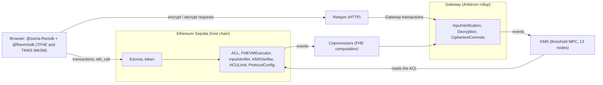

# Confidential transactions on Zama's protocol

This page explains the parts of Zama's protocol that the escrow of `escrow01` uses: how an amount is
encrypted in the browser, how a contract on Ethereum computes with it without seeing it, who may
decrypt it, and how decryption works. It describes what runs on Sepolia on 2026-09-16 and cites the
code and documentation it was checked against. What the escrow itself does is in
[escrow.md](escrow.md); risks and trust are in [security.md](security.md); a real run is traced in
[smoke-test.md](smoke-test.md).

Versions this page refers to:

| Component                                    | Version                                                                                                                                                   |
| -------------------------------------------- | --------------------------------------------------------------------------------------------------------------------------------------------------------- |
| Protocol on Sepolia, and on Ethereum mainnet | v0.13 host contracts: ACL v0.4.0, FHEVMExecutor v0.4.0, KMSVerifier v0.3.0, InputVerifier v0.2.0, HCULimit v0.3.0, ProtocolConfig v0.1.0 (`getVersion()`) |
| Solidity library used by the escrow          | `@fhevm/solidity` 0.11.1 (see [contracts/README.md](../contracts/README.md#toolchain) for why not 0.13.3)                                                 |
| Client SDK used by the smoke test            | `@zama-fhe/sdk` 3.6.0 on `@fhevm/sdk` 0.13.2                                                                                                              |
| Relayer                                      | `https://relayer.testnet.zama.org`                                                                                                                        |

Every section has a simple explanation and a technical one.

- [The components](#components-simple)
- [FHE and TFHE](#fhe-simple)
- [Handles](#handles-simple)
- [Symbolic execution and coprocessors](#symbolic-execution-simple)
- [Encrypted input and its proof](#encrypted-input-simple)
- [Access control (ACL)](#acl-simple)
- [User decryption](#user-decryption-simple)
- [Delegated user decryption](#delegated-user-decryption-simple)
- [Public decryption](#public-decryption-simple)
- [Relayer, Gateway and KMS](#relayer-gateway-and-kms-simple)
- [HCU limits](#hcu-simple)
- [Protocol v0.13 and v0.14](#protocol-versions-simple)
- [Trust assumptions](#trust-simple)
- [The September 2026 Sepolia incidents](#incidents-simple)

## Components

### Components: simple

A normal blockchain cannot keep numbers secret: every node must be able to check every computation.
Zama splits the work. The blockchain records which calculation should happen on which encrypted
values and who may use them. Separate servers, the coprocessors, do the encrypted arithmetic. A
group of independent key holders, the KMS, can decrypt, but only for someone the chain says is
allowed. A web service, the relayer, carries requests between the browser and these servers.

### Components: technical

| Component              | Role                                                                                                       | On Sepolia                                                                                                                                          |
| ---------------------- | ---------------------------------------------------------------------------------------------------------- | --------------------------------------------------------------------------------------------------------------------------------------------------- |
| FHEVM Solidity library | `FHE.*` functions and encrypted types (`euint64`, `ebool`, ...) that call the host contracts               | compiled into the escrow and the token                                                                                                              |
| ACL                    | who may use or decrypt each handle                                                                         | `0xf0Ffdc93b7E186bC2f8CB3dAA75D86d1930A433D`                                                                                                        |
| FHEVMExecutor          | turns each FHE operation into a result handle and an event                                                 | `0x92C920834Ec8941d2C77D188936E1f7A6f49c127`                                                                                                        |
| InputVerifier          | checks the coprocessor signatures on encrypted inputs                                                      | `0xBBC1fFCdc7C316aAAd72E807D9b0272BE8F84DA0`; 3 of 5 signers                                                                                        |
| KMSVerifier            | checks KMS signatures on public decryption results                                                         | `0xbE0E383937d564D7FF0BC3b46c51f0bF8d5C311A`; 7 of 13 signers                                                                                       |
| HCULimit               | limits the FHE work per transaction                                                                        | `0xa10998783c8CF88D886Bc30307e631D6686F0A22`                                                                                                        |
| ProtocolConfig         | holds the KMS signer set and thresholds                                                                    | `0x51f9AFBc89Ea792e1a21a12AB802ab58D4dbee83`, v0.1.0                                                                                                |
| Coprocessors           | verify input proofs, compute FHE operations with TFHE-rs, store ciphertexts and commit them to the Gateway | Zama's Sepolia page lists five coprocessor operators                                                                                                |
| Gateway                | a rollup that validates inputs and orchestrates decryption                                                 | Gateway chain id 10901; `InputVerification` `0x483b9dE06E4E4C7D35CCf5837A1668487406D955`, `Decryption` `0x5D8BD78e2ea6bbE41f26dFe9fdaEAa349e077478` |
| KMS                    | generates the FHE keys and decrypts by threshold MPC                                                       | 13 signers registered in ProtocolConfig; Zama's Sepolia page lists 13 KMS operators                                                                 |
| Relayer                | HTTP front end to the Gateway for browsers and servers                                                     | `https://relayer.testnet.zama.org`, no API key on testnet                                                                                           |

Zama's overview pages describe a copy of the ACL on the Gateway. In the v0.13.5 source that copy no
longer exists (`MultichainACL.sol` was removed in v0.12.0): the KMS connector reads the ACL on the
host chain itself. Zama's own Change Log agrees: v0.12 removed the MultichainACL contracts, and
decryption ACL checks run on the host chain through the relayer and the KMS connector. This page
follows the source.

The escrow finds the host contracts through `ZamaEthereumConfig`, which maps `block.chainid` to their
addresses (11155111 for Sepolia, 1 for Ethereum, 31337 for a local Hardhat node) and reports
`confidentialProtocolId()` 10001 on Sepolia.

## FHE and TFHE

### FHE: simple

Fully homomorphic encryption lets a computer add, subtract, compare and choose between encrypted
numbers without decrypting them. The result is again encrypted, and only a key holder can read it.

### FHE: technical

Zama's protocol uses TFHE through the TFHE-rs library. The KMS generates one global FHE key pair; the
public key is published, the private key exists only as shares held by the KMS nodes. Clients encrypt
with the public key (in the browser, through the TFHE WASM module in `@fhevm/sdk`). Coprocessors
compute on ciphertexts. Supported encrypted types include `ebool`, `euint8` to `euint256` and
`eaddress`; the escrow uses `euint64`. Operations include `add`, `sub`, `mul`, comparisons such as
`ge`, and `select`. A contract cannot branch on an encrypted condition; `FHE.select(condition, a, b)`
computes both sides and keeps one, without revealing which. That is why a confidential transfer from
a balance that is too low does not revert but moves an encrypted 0.

## Handles

### Handles: simple

The chain never stores an encrypted number itself. It stores a 32-byte reference to it, the handle.
The ciphertext behind a handle is kept by the coprocessors. Everyone can see handles; nobody can read
a value from one.

### Handles: technical

A handle is a `bytes32`. The host contracts on Sepolia (FHEVMExecutor, v0.13.5 source) and
`@fhevm/sdk` 0.13.2 agree on this layout:

| Bytes | Content                                                                                                          |
| ----- | ---------------------------------------------------------------------------------------------------------------- |
| 0-20  | first 21 bytes of a keccak-256 hash                                                                              |
| 21    | index of the value within an encrypted input, or `0xff` for a handle computed on chain                           |
| 22-29 | chain id, 8 bytes big-endian                                                                                     |
| 30    | FHE type: 0 `ebool`, 2 `euint8`, 3 `euint16`, 4 `euint32`, 5 `euint64`, 6 `euint128`, 7 `eaddress`, 8 `euint256` |
| 31    | handle version, currently 0                                                                                      |

The two handles of the smoke run on 2026-09-16 decode as follows:

| Handle                                                                             | Byte 21                                 | Bytes 22-29                   | Byte 30         | Byte 31 |
| ---------------------------------------------------------------------------------- | --------------------------------------- | ----------------------------- | --------------- | ------- |
| input `0x4a47ae4fd5dd21a7962881ccabba2bc1be379cace6000000000000aa36a70500`         | `00`: first value of an encrypted input | `0000000000aa36a7` = 11155111 | `05`: `euint64` | `00`    |
| stored amount `0x506d80703a79c87b91a050038fb7baf8bb1e70c1e4ff0000000000aa36a70500` | `ff`: computed                          | `0000000000aa36a7`            | `05`            | `00`    |

Comparison results in the same run end in `...aa36a70000`: type 0, `ebool`.

How the 21 hash bytes are made:

- Input handle, computed by the client: `keccak256("ZK-w_hdl" ‖ blobHash ‖ index ‖ ACL address ‖
chainId)` with `blobHash = keccak256("ZK-w_rct" ‖ ciphertextWithZkProof)`. Contract and user are not
  in this hash; they are bound through the proof (next sections).
- Computed handle, made by FHEVMExecutor: `keccak256(abi.encodePacked(COMPUTATION_DOMAIN_SEPARATOR,
operator, operands, ACL address, block.chainid, blockhash(block.number - 1), block.timestamp))`,
  where a binary operation also includes its scalar flag and `trivialEncrypt` hashes the clear value
  and the type instead of operand handles.

Consequences:

- A computed handle is a function of public data. The same operation on the same operands in the
  same block gives the same handle: in the first lock of the smoke run, both `TrivialEncrypt(0)`
  events return `0x8aff21692e3a10a65d8a31c7b594fd738f9558f4f1ff0000000000aa36a70500`.
- A handle says nothing about the value. Zama's documentation asks contracts to treat handles as
  opaque: equal handles imply equal values, but different handles do not imply different values; the
  same value can get another handle, for example in another block.

## Symbolic execution and coprocessors

### Symbolic execution: simple

When the escrow asks for "balance minus amount", the Ethereum transaction does not do the encrypted
arithmetic. It checks that the escrow may use both values, invents a reference for the result and
announces the operation. The coprocessors see the announcement and do the real computation off-chain.

### Symbolic execution: technical

Each `FHE.*` operation in a contract calls the FHEVMExecutor. For a binary operation, the executor:

1. requires `ACL.isAllowed(operand, msg.sender)` for every encrypted operand, else `ACLNotAllowed`;
2. computes the result handle as above;
3. grants the calling contract a transient ACL allowance on the result;
4. charges the operation's HCU in HCULimit (see [HCU limits](#hcu-technical));
5. emits an event such as `FheSub(caller, lhs, rhs, scalarByte, result)`.

Zama's coprocessors listen to these events on the host chain, load the operand ciphertexts, compute
with TFHE-rs and store the result under the result handle. According to Zama's documentation they
commit ciphertext digests to the Gateway, and results are valid as long as more than half of them
are honest. The Gateway's `Decryption` contract only accepts a public decryption once ciphertext
material for every handle has been committed (`CiphertextCommits`).

In the lock of the smoke run the token computed, in this order: `FheGe`, `FheSub`, `FheIfThenElse`
(creator's new balance), `TrivialEncrypt(0)`, `FheIfThenElse` (`transferred`), `TrivialEncrypt(0)` and
`FheAdd` (escrow's new balance). All of it is readable in the transaction's logs, with every operand
handle; none of it reveals a value.

## Encrypted input and its proof

### Encrypted input: simple

The browser encrypts the amount and attaches a proof that it knows what it encrypted. Zama's
coprocessors check the proof and sign the result for one contract and one user. The contract accepts
the encrypted amount only with those signatures, so a copy of the input is useless to anyone else.

### Encrypted input: technical

What `sdk.encrypt({ values, contractAddress, userAddress })` does in `@fhevm/sdk` 0.13.2:

1. `GET {relayer}/v2/keyurl` returns where to download the FHE public key and the CRS; the SDK loads
   the CRS for 2048 bits.
2. In the TFHE WASM, it builds a compact ciphertext list and a zero-knowledge proof of knowledge over
   it (`build_with_proof_packed`). The proof's metadata is contract address, user address, ACL address
   and chain id (20 + 20 + 20 + 32 bytes), so the proof is bound to them.
3. `POST {relayer}/v2/input-proof` with `ciphertextWithInputVerification`, `contractAddress`,
   `contractChainId`, `extraData` (`0x00`) and `userAddress`. The relayer answers with a job id; the
   SDK polls until the result is ready.
4. On the Gateway, the coprocessors verify the proof and sign, per handle list, the EIP-712 struct
   `CiphertextVerification(bytes32[] ctHandles, address userAddress, address contractAddress,
uint256 contractChainId, bytes extraData)` in the domain `InputVerification`, version `1`.
5. The SDK recomputes the handles from its own ciphertext and rejects the answer if the relayer's
   handles differ. It checks the signatures against the signer set and threshold it reads from the
   InputVerifier on the host chain.
6. It assembles `inputProof` = number of handles (1 byte) ‖ number of signatures (1 byte) ‖ handles
   (32 bytes each) ‖ signatures (65 bytes each) ‖ extraData.

The smoke run's proof is 230 bytes: 1 + 1 + 32 + 3 × 65 + 1, that is one handle, three coprocessor
signatures and `extraData` `0x00`. A dry run on the same day printed the same size.

On chain, `FHE.fromExternal(handle, inputProof)` in the escrow calls
`FHEVMExecutor.verifyInput(handle, msg.sender, inputProof, type)`. The executor passes
`{ userAddress: <argument>, contractAddress: msg.sender }` to `InputVerifier.verifyInput`, so the
contract is always the caller of the executor and the user is the address the contract supplies
(the escrow supplies its own `msg.sender`). The InputVerifier parses the proof, rebuilds the EIP-712
struct with these two addresses and `block.chainid`, recovers each signer with ECDSA (contract
signatures are not supported) and requires the threshold of distinct registered coprocessor
signers: on Sepolia 3 of 5, on Ethereum mainnet 1 of 1 (`getThreshold()`, `getCoprocessorSigners()`
on 2026-09-16). A proof made for another contract or user recovers a non-signer and reverts with
`InvalidSigner(address)`. It also checks the handle's chain id, index and version. A verified proof is
cached in transient storage under (contract, user, proof), so further handles from the same proof in
the same transaction skip the signature check. The executor then gives the contract a transient
allowance on the handle and emits `VerifyInput(caller, inputHandle, userAddress, inputProof,
inputType, result)`, which publishes the whole proof in the logs. Input verification costs no HCU.

With an empty `inputProof`, `fromExternal` skips verification and accepts the handle only if
`ACL.isAllowed(handle, msg.sender)`.

## Access control (ACL)

### ACL: simple

Every encrypted value has a list of who may use it. Only those on the list can compute with it, pass
it on or ask the KMS to decrypt it for them. The list is public.

### ACL: technical

The ACL on Sepolia is `0xf0Ffdc93b7E186bC2f8CB3dAA75D86d1930A433D`, version 0.4.0.

| Function (library name)                                                | Effect                                                                                                                                              |
| ---------------------------------------------------------------------- | --------------------------------------------------------------------------------------------------------------------------------------------------- |
| `allow(handle, account)` (`FHE.allow`)                                 | persistent permission; emits `Allowed(caller, account, handle)`. The caller must itself be allowed on the handle.                                   |
| `FHE.allowThis(handle)`                                                | `allow(handle, address(this))`                                                                                                                      |
| `allowTransient(handle, account)` (`FHE.allowTransient`)               | permission for the rest of the transaction, kept in EIP-1153 transient storage; no event                                                            |
| `allowForDecryption(handles)` (`FHE.makePubliclyDecryptable`)          | anyone may request the clear value, permanently; emits `AllowedForDecryption(caller, handlesList)`                                                  |
| `isAllowed(handle, account)`                                           | persistent or transient permission                                                                                                                  |
| `persistAllowed(handle, account)`                                      | persistent permission only; the SDK checks it before a user decryption                                                                              |
| `cleanTransientStorage()`                                              | clears transient permissions, for bundled calls such as ERC-4337                                                                                    |
| `delegateForUserDecryption(delegate, contractAddress, expirationDate)` | lets `delegate` user-decrypt the caller's handles in the context of `contractAddress` until `expirationDate`                                        |
| `isAccountDenied(account)`                                             | deny list kept by the ACL owner; a denied caller cannot grant permissions (the check is on the caller, not on the account receiving the permission) |

Details from the ACL v0.4.0 source (fhevm v0.13.5):

- `allow`, `allowTransient` and `allowForDecryption` revert while the ACL is paused, for a caller on
  the deny list, and for a caller not itself allowed on the handle. The FHEVMExecutor is exempt from
  the last two checks for `allowTransient`.
- `allowForDecryption` cannot be undone; the contract has no function that clears it.
- `cleanTransientStorage()` can be called by anyone and clears every transient permission of the
  transaction.
- `delegateForUserDecryption`: the delegator is `msg.sender`; delegator, delegate and
  `contractAddress` must differ; the delegate cannot be the wildcard address
  `0xFFfFfFffFFfffFFfFFfFFFFFffFFFffffFfFFFfF`, but `contractAddress` can, which delegates for every
  contract; the expiration date only has to lie in the future (and differ from the one already set),
  with no minimum duration. Each (delegator, delegate, contract) can be delegated or revoked once per
  block. The Hardhat mock of this repository (host contracts 0.10.0) still demands one hour and has no
  wildcard; `@zama-fhe/sdk` also refuses less than one hour.
- `isHandleDelegatedForUserDecryption(delegator, delegate, contract, handle)` is true when the
  delegator and the contract are both persistently allowed on the handle and a delegation for that
  contract or for the wildcard is active.
- The ACL is a UUPS proxy. Its owner can upgrade it and manage the deny list; members of the PauserSet
  can pause it, only the owner can unpause. The other host contracts accept upgrades and configuration
  changes from the ACL's owner. On Sepolia that owner is `0x08e8a84c3c8c7cba165B1adcf67Ae4639eF84f52`,
  which Zama's address page names "Protocol DAO".

In v0.13 the KMS connector checks permissions by reading the host chain's ACL: `isAllowed(handle,
user)` and `isAllowed(handle, contract)` for a user decryption, `isHandleDelegatedForUserDecryption`
for a delegated one, `isAllowedForDecryption` for a public one. `@zama-fhe/sdk` retries a delegated
decryption for about 30 seconds after a new delegation; its documentation speaks of propagation
within about 10 blocks.

The lock of the smoke run emitted 11 `Allowed` events: seven from the token (its new balances and
`transferred`, for the holders and itself) and four from the escrow, all four for the stored amount
`0x506d…0500`: escrow, creator, beneficiary and auditor (the creator appears twice because it is also
the auditor). On 2026-09-16, `persistAllowed(0x506d…0500, account)` is true for the creator,
the beneficiary, the escrow and cUSDTMock, and false for a random address. The input handle
`0x4a47…0500` has no persistent permission for anyone; it only lived as a transient permission during
the lock.

## User decryption

### User decryption: simple

To read an amount, the browser creates a temporary key pair and asks you to sign a short permission
statement. The relayer passes the request to Zama's key holders. Each checks that you are allowed and
returns its piece of the answer, encrypted so that only your temporary key can open it. Your browser
opens the pieces and combines them into the number. No single key holder, and not the relayer, sees
the number.

### User decryption: technical

What `sdk.decryption.decryptValues([{ encryptedValue: handle, contractAddress }])` does with
`@fhevm/sdk` 0.13.2:

1. **Handle.** The application reads it with `eth_call`, for example `escrowOf(creator, todoRef)` or
   `confidentialBalanceOf(holder)`. The all-zero handle (never written) decrypts to 0 without a
   request.
2. **Transport key pair.** An ML-KEM-512 key pair generated in the TKMS WASM
   (`ml_kem_pke_keygen`). `@zama-fhe/sdk` stores it and reuses it; the smoke test keeps it in memory
   for one run.
3. **Permit.** An EIP-712 signature by the user's wallet over
   `UserDecryptRequestVerification(bytes publicKey, address[] contractAddresses, uint256
startTimestamp, uint256 durationDays, bytes extraData)`. Domain: name `Decryption`, version `1`,
   `chainId` of the host chain (11155111), `verifyingContract` the Gateway's `Decryption` contract
   `0x5D8BD78e2ea6bbE41f26dFe9fdaEAa349e077478`. At most 10 contracts and 365 days; `@zama-fhe/sdk`
   uses 30 days by default. `extraData` is `0x01` followed by the 32-byte KMS context id. The SDK
   accepts only 65-byte ECDSA signatures.
4. **Checks before any request.** The permit is not expired; the user is not the contract;
   `ACL.persistAllowed(handle, user)` and `ACL.persistAllowed(handle, contract)` are both true,
   otherwise the SDK throws before contacting the relayer ("User ... is not authorized to decrypt
   handle", "Dapp contract ... is not authorized to user decrypt handle"). It reads the KMS signer set
   for the permit's context from the KMSVerifier.
5. **Request.** `POST {relayer}/v2/user-decrypt` with the handle/contract pairs, the validity window,
   the chain id, the contract addresses, the user address, the signature, `extraData` and the public
   key. The relayer returns a job id; the SDK polls.
6. **Gateway.** The relayer sends `userDecryptionRequest` to the Gateway's `Decryption` contract in
   its own transaction (it is `msg.sender` and pays the protocol fee). The contract checks: 1 to 10
   contract addresses, the user is not one of them, each handle belongs to the host chain and to a
   listed contract, at most 2048 bits in total, `durationDays` between 1 and 365, a validity window
   that has started and not ended, and an ECDSA signature by `userAddress` (`InvalidUserSignature`
   otherwise). It pins the KMS context named in `extraData` and emits `UserDecryptionRequest`. It does
   not check the ACL.
7. **KMS.** Each KMS node's connector sees the event and checks `ACL.isAllowed(handle, user)` and
   `ACL.isAllowed(handle, contract)` on the host chain. Each node submits `userDecryptionResponse` with
   its share signcrypted to the user's ML-KEM public key and signed as
   `UserDecryptResponseVerification(bytes publicKey, bytes32[] ctHandles, bytes userDecryptedShare,
bytes extraData)` in the `Decryption` domain with the Gateway's chain id. The Gateway emits every
   share as a `UserDecryptionResponse` event, and `UserDecryptionResponseThresholdReached` once the
   user decryption threshold is met; the Gateway reads it from its own configuration, and Sepolia's
   ProtocolConfig records 9 of 13. The relayer collects the shares and returns them to the client.
8. **Reconstruction in the browser.** The SDK verifies each response signature against the KMS
   signers and calls `process_user_decryption_resp_from_js` in the TKMS WASM, which decrypts the
   shares with the ML-KEM private key and reconstructs the value. Without an explicit threshold the
   WASM takes `(n - 1) / 3` for `n` signers, 4 for 13, which equals the MPC threshold of 4 in
   ProtocolConfig, and requires at least threshold + 1 matching responses.

In the smoke run of 2026-09-16 this took 2.8 s for the creator and 2.3 s for the beneficiary, each
with its own permit, and returned 1.0 cUSDTMock both times.

## Delegated user decryption

### Delegated user decryption: simple

An account can let another key read its encrypted values for a while, without handing over its own
key. This is how a passkey account is meant to read amounts in this app.

### Delegated user decryption: technical

The delegator calls `ACL.delegateForUserDecryption(delegate, contractAddress, expirationDate)` in a
transaction; delegations are per contract. The delegate then signs a permit of type
`DelegatedUserDecryptRequestVerification`, which adds `address delegatorAddress` after
`contractAddresses`, and the SDK sends it to `POST {relayer}/v2/delegated-user-decrypt`. Before the
request, `@fhevm/sdk` checks `ACL.isHandleDelegatedForUserDecryption(delegator, delegate, contract,
handle)` and `@zama-fhe/sdk` reads `getUserDecryptionDelegationExpirationDate`. `@zama-fhe/sdk`
refuses expiration dates less than one hour ahead. The app's design (a session key delegated per
contract, see [contracts/README.md](../contracts/README.md#who-can-decrypt)) is not implemented yet.

## Public decryption

### Public decryption: simple

A contract can declare a value public. From then on anyone can ask the KMS for the clear value and
gets it together with signatures that prove it, which a contract can check.

### Public decryption: technical

`FHE.makePubliclyDecryptable(handle)` calls `ACL.allowForDecryption` and emits
`AllowedForDecryption`. The SDK checks `ACL.isAllowedForDecryption(handle)`, then sends
`POST {relayer}/v2/public-decrypt` with the handles and the current KMS context as `extraData`. The
answer holds the ABI-encoded clear values and KMS signatures over
`PublicDecryptVerification(bytes32[] ctHandles, bytes decryptedResult, bytes extraData)`; the SDK
requires at least the KMSVerifier's threshold of distinct known signers. The `decryptionProof` it
returns is the number of signatures (1 byte) ‖ signatures ‖ extraData, which a contract verifies with
`FHE.checkSignatures`, for example in the wrapper's `finalizeUnwrap`. On chain, `FHE.checkSignatures`
calls `KMSVerifier.verifyDecryptionEIP712KMSSignatures`, which recovers each signer with ECDSA and
requires the public decryption threshold of distinct signers from the KMS context in ProtocolConfig:
7 of 13 on Sepolia and on Ethereum mainnet on 2026-09-16. The EIP-712 domain is `Decryption`, version
`1`, with the Gateway's chain id and its `Decryption` contract. The verifier keeps no state; protecting
against a replayed result is the calling contract's job.

Behind the relayer, the Gateway's `Decryption` contract receives `publicDecryptionRequest`, requires
committed ciphertext material for every handle, and leaves the permission check to the KMS
connectors, which read `ACL.isAllowedForDecryption(handle)` on the host chain.

The dry run of the smoke test uses this path on the newest amount cUSDTMock published for an unwrap;
it took 2.3 to 2.4 s on 2026-09-16.

## Relayer, Gateway and KMS

### Relayer, Gateway and KMS: simple

The relayer is the door: a web service that takes encryption and decryption requests. The Gateway
is the switchboard behind it, a separate blockchain that checks requests and coordinates. The KMS
is the vault: 13 independent operators who together hold the decryption key and must cooperate to
decrypt.

### Relayer, Gateway and KMS: technical

**Relayer.** An HTTP API (`/v2/keyurl`, `/v2/input-proof`, `/v2/user-decrypt`,
`/v2/delegated-user-decrypt`, `/v2/public-decrypt`). Requests are asynchronous jobs: the POST returns
a job id and the SDK polls `GET {url}/{jobId}`, honouring `Retry-After` (at least 1 s, 2.5 s by
default), for at most one hour by default. On Sepolia the relayer needs no API key. Zama's hosted
mainnet relayer needs one, sent as `x-api-key`, and bills transaction fees monthly; Zama also documents
running a self-hosted relayer that funds its own Gateway wallet. The relayer sees request metadata
(handles, addresses, the transport public key). In user decryption it only passes on shares encrypted
to the user's key; in public decryption it returns the clear value, which is public by then anyway.

**Gateway.** According to Zama's documentation an Arbitrum rollup that validates inputs, orchestrates
decryption and does not hold keys or plaintexts (the ACL copy the same pages mention is gone in the
v0.13.5 source, see [Components](#components-technical)). Its `Decryption` contract records every
decryption request and every KMS response as events. Zama publishes a block explorer and an RPC
endpoint for the Gateway (testnet: `https://explorer.testnet.zama.org`), so these events are public.
Testnet Gateway chain id 10901; the SDK's mainnet preset uses 261131.

**KMS.** According to Zama's documentation a network of 13 MPC nodes operated by different
organizations. It generates the FHE keys, keeps the private key only as threshold shares, runs
threshold decryption and signs every result. The documentation gives "e.g., 9 out of 13" as the number
of parties that must take part in decryption, describes the protocol as robust while at most one
third of the nodes are malicious, and states that nodes run by default inside AWS Nitro Enclaves.
Zama's FHEVM whitepaper (version 3.1 of 30 June 2025) gives the collusion bound: the KMS stays secure
as long as fewer than n/3 parties collude, so with n = 13 it tolerates collusions of up to 4 nodes;
a user decryption waits for 2t + 1 = 9 shares. On chain, ProtocolConfig on Sepolia and on Ethereum
mainnet registers 13 KMS signers with a user decryption threshold of 9, a public decryption threshold
of 7, a key generation threshold of 7 and an MPC threshold of 4. Zama's Sepolia address page lists 13
KMS operators in its operator staking table: Zama, Dfns, Figment, Fireblocks, InfStones, Unit410,
LayerZero, Ledger, Omakase, Stake Capital, OpenZeppelin, Etherscan and Conduit.

## HCU limits

### HCU: simple

Encrypted arithmetic is expensive for the coprocessors. So each transaction may only ask for a
limited amount of it, measured in homomorphic complexity units.

### HCU: technical

HCULimit charges each FHE operation a fixed number of HCU. It keeps a running total per transaction in
transient storage and, per result handle, a depth (the operation's price plus the largest depth of its
operands). A transaction reverts with `HCUTransactionLimitExceeded` or
`HCUTransactionDepthLimitExceeded` when either exceeds its limit. The limits are storage values the
ACL owner can change; on Sepolia and on Ethereum mainnet on 2026-09-16 they were 20,000,000 HCU per
transaction and 5,000,000 of depth, the values Zama's HCU page gives (there for "the current
devnet"). HCULimit v0.3.0 also has a per-block cap for non-whitelisted callers, set on both networks
to 281,474,976,710,655 (2^48 - 1, the largest `uint48`), so it does not limit anything today.

A confidential transfer in OpenZeppelin's ERC-7984 uses, on `euint64` with Zama's documented prices:
`ge` 152,000, `sub` 162,000, `select` 55,000, `trivialEncrypt` 32 (the encrypted 0), `select` 55,000
and `add` 162,000, that is 586,032 HCU, plus another `trivialEncrypt` of 32 when the recipient's
balance is still uninitialized: 586,064 HCU, as in the escrow's first lock and in a release to a new
beneficiary. The longest sequential chain is `ge`, `select`, `add`: 369,000 HCU of depth. The escrow's
`lock` and `release` each perform one such transfer; verifying the input and setting ACL permissions
are not FHE operations and cost no HCU.

## Protocol versions

### Protocol versions: simple

Sepolia and Ethereum mainnet run version 0.13 of Zama's protocol. Version 0.14 is released but not
deployed on either. It changes how decryption permissions are signed and adds support for signatures
from smart-contract wallets, such as a passkey account.

### Protocol versions: technical

`getVersion()` on Sepolia and on Ethereum mainnet returns the same set on 2026-09-16: ACL v0.4.0,
FHEVMExecutor v0.4.0, KMSVerifier v0.3.0, InputVerifier v0.2.0, HCULimit v0.3.0 and ProtocolConfig
v0.1.0. In zama-ai/fhevm these files carry exactly these versions from v0.13.0 to v0.13.5; v0.14.0
raises ACL and FHEVMExecutor to v0.5.0, KMSVerifier and HCULimit to v0.4.0 and ProtocolConfig to
v0.2.0. The implementations behind the Sepolia proxies are verified on Sourcify, Blockscout and
Etherscan, and the mainnet implementations on Sourcify. On both networks the verified source of all
six equals the v0.13.5 tag except for blank lines, and for comments and names in InputVerifier.
Zama's Change Log also lists FHEVM v0.13 for testnet and mainnet.

The two networks differ in configuration. Sepolia's InputVerifier accepts inputs signed by 3 of 5
coprocessor signers; mainnet's by 1 of 1. The KMS side is configured alike on both: 13 signers, public
decryption threshold 7, user decryption threshold 9, key generation threshold 7, MPC threshold 4
(ProtocolConfig and KMSVerifier getters).

`@fhevm/sdk` 0.13.2 speaks the v0.13 API. Its source states that a chain on a newer protocol keeps
accepting the v0.13 API and that the SDK does not emit the V2 decryption permits introduced with
v0.14. It maps an ACL contract of version 0.5.x to protocol 0.14.0.

Zama released fhevm v0.14.0 on 2026-08-14 and v0.14.1 on 2026-09-01. The v0.14.0 release notes list,
among others:

- unified EIP-712 user decryption: self and delegated decryption share one request model, with
  per-handle ownership, `durationSeconds` instead of `durationDays`, protocol-versioned permits,
  **ERC-1271 smart-account signatures** and context-id validation;
- the KMS context and epoch lifecycle for upgrades and key rotation, with per-context KMS thresholds;
- LayerZero-based confidential bridging of handles;
- new reinitializer versions for host contracts including FHEVMExecutor and HCULimit.

The unused V2 permit type in `@fhevm/sdk` 0.13.2 is `(address userAddress, bytes publicKey,
address[] allowedContracts, uint256 startTimestamp, uint256 durationSeconds, bytes extraData)`.

For the new unified request of v0.14.0 the Gateway no longer checks the user's signature itself;
the KMS connector does: `ecrecover` for a 65-byte signature, otherwise the account's ERC-1271
`isValidSignature` with a configurable gas limit (100,000 by default). The older request functions,
still present in v0.14.0, keep the Gateway's ECDSA check (pull requests
[#2624](https://github.com/zama-ai/fhevm/pull/2624),
[#2329](https://github.com/zama-ai/fhevm/pull/2329),
[#2393](https://github.com/zama-ai/fhevm/pull/2393)). v0.14 is not deployed on Sepolia or mainnet:
besides the version numbers above, the v0.14 ACL function `decryptionSignatureInvalidatedBefore`
reverts on both live ACLs.

The v0.13 line continues alongside: v0.13.4 (2026-09-04) includes "feat(relayer): return all
user-decrypt shares" ([#3481](https://github.com/zama-ai/fhevm/pull/3481)) and v0.13.5 followed on
2026-09-14. According to #3481, the relayer used to return exactly the threshold number of shares, so
a single invalid share made a user decryption fail; it now waits, after the threshold, for a
configurable number of extra shares for a configurable time and returns all it has. The example
configurations in the pull request use a threshold of 9, two extra shares and 5 seconds. Which
release and which settings Sepolia's relayer runs cannot be read from the chain.

For this chapter, v0.13 means a passkey smart account cannot sign a decryption permit itself; the
planned workaround is a delegated ECDSA session key (see [security.md](security.md#passkey-wallet)).
Moving to v0.14 is on the redeploy checklist in [contracts/README.md](../contracts/README.md#redeploy-checklist).

## Trust assumptions

### Trust: simple

The amounts are safe from the public as long as Zama's key holders do not collude beyond their
threshold; Zama's whitepaper tolerates collusions of up to 4 of the 13. Reading them depends on
Zama's relayer, Gateway and key holders being online.

### Trust: technical

| Party                                  | Trusted for                                        | If it fails or misbehaves                                                                                                                                                                                                                                                                                                                                                   |
| -------------------------------------- | -------------------------------------------------- | --------------------------------------------------------------------------------------------------------------------------------------------------------------------------------------------------------------------------------------------------------------------------------------------------------------------------------------------------------------------------- |
| KMS operators                          | confidentiality of every value; correct decryption | the private key exists only as threshold shares held by them; Zama's whitepaper tolerates collusions of up to 4 of the 13, so 5 or more colluding operators are outside that guarantee and could decrypt any ciphertext; Zama's documentation describes the protocol as robust while at most one third of the nodes are malicious. Too many nodes offline stops decryption. |
| Coprocessors                           | correct computation; accepting only valid inputs   | per Zama's documentation results are valid while more than half are honest; a dishonest majority could sign invalid inputs or compute wrong results                                                                                                                                                                                                                         |
| Gateway                                | availability, ordering of requests                 | Zama describes it as trust-minimized; if it halts, inputs and decryptions stop                                                                                                                                                                                                                                                                                              |
| Relayer                                | availability                                       | down: no encryption and no decryption through it; it never sees the plaintext of a user decryption                                                                                                                                                                                                                                                                          |
| ACL owner (Protocol DAO) and PauserSet | the rules themselves                               | the owner can upgrade every host contract, change coprocessor and KMS signer sets and thresholds, HCU limits and the deny list; a pauser can pause the ACL, which also stops FHE operations because every operation writes a transient permission                                                                                                                           |
| Client code (SDK, WASM)                | key generation, proofs, reconstruction             | runs in the user's browser; a compromised page could read decrypted values and the transport key                                                                                                                                                                                                                                                                            |
| User's wallet key                      | signing permits and transactions                   | whoever holds it can decrypt everything that key may decrypt                                                                                                                                                                                                                                                                                                                |

The collusion bound comes from Zama's FHEVM whitepaper (version 3.1, 30 June 2025, linked from
docs.zama.org), not from the docs.zama.org pages themselves: the KMS stays secure as long as fewer
than n/3 parties collude, which for n = 13 means collusions of up to 4 nodes. The chain fits t = 4:
ProtocolConfig records an MPC threshold of 4 and a user decryption threshold of 9 = 2t + 1, and the
reconstruction errors of September 2026 show `n=13, deg=4`. The whitepaper predates protocol v0.13;
that today's key shares use t = 4 is consistent with these values but cannot be read from the chain.

## The September 2026 Sepolia incidents

### Incidents: simple

Twice in early September 2026, reading amounts on Sepolia failed for a while although everything on
the chain was correct. The first time, Zama pointed to part of its relayer reading outdated chain
data. The second time, the pieces returned by the key holders did not fit together in the browser.

### Incidents: technical

**New handles would not decrypt (reported 2026-09-01).** In
[community.zama.org/t/4643](https://community.zama.org/t/sepolia-handles-created-after-2026-08-31-will-not-decrypt-while-older-handles-on-the-same-contract-still-do/4643)
a developer reported that handles created since about 2026-08-31 failed with
`Relayer API error [internal_server_error]: Transaction simulation failed: Execution reverted: execution reverted`
(HTTP 500 from `/v2/user-decrypt`), while older handles on the same contract decrypted, in both user
and public decryption and with both SDKs. The reporter's later edit says new handles decrypted again
on the evening of 2026-09-01 without changes on their side. On 2026-09-02 a member of the forum's
Zama team group replied that it was a transient Sepolia issue and that the initial investigation
pointed to stale RPC data used by part of the relayer infrastructure.

**Share reconstruction failed (2026-09-03).** In the same thread (post of 2026-09-03) and in
[community.zama.org/t/4653](https://community.zama.org/t/sepolia-user-decrypt-fails-in-kms-share-reconstruction-9-13-gao-decoding-failure/4653)
(posted 2026-09-11, observed 2026-09-03T02:28:43Z) user decryption on Sepolia failed in the browser
with
`Gao decoding failure: Allowed at most 0 errors but xgcd factor degree indicates 1. n=13, deg=4, #shares=9, block_shares=9, recovery_errors=0`,
raised from `user_decryption_wasm.rs` and `threshold-algebra/src/poly.rs`. The ACL and the handles
were correct on chain. The reporter of 4653 reads it as nine shares received out of 13 with one
inconsistent share and no error-correction budget left.
Thread 4653 had no reply as of 2026-09-16. Zama's pull request #3481, merged on 2026-09-04 and
released in v0.13.4, describes a failure of this kind: until then the relayer returned exactly the
threshold of shares (ProtocolConfig's user decryption threshold is 9), so a single invalid share made
the decryption fail, for example during a KMS migration. The pull request does not mention the
Sepolia reports, and whether Sepolia's relayer runs the change is not visible from outside.

The smoke run of 2026-09-16 decrypted as creator and as beneficiary on the first attempt. What the
smoke test does against such failures (confirmations, retries) is in [smoke-test.md](smoke-test.md).

## Sources

Repository (branch `escrow01`):

- [`contracts/src/ConfidentialTodoEscrow.sol`](../contracts/src/ConfidentialTodoEscrow.sol) lines
  100-136 (`lock`), [`contracts/scripts/smoke-sepolia.ts`](../contracts/scripts/smoke-sepolia.ts)
  lines 472-526 (SDK set-up, encrypt, user decryption) and 714-736 (public decryption),
  [`contracts/README.md`](../contracts/README.md) ("Who can decrypt", "Toolchain").

`@fhevm/solidity` 0.11.1 (`contracts/node_modules/@fhevm/solidity`):

- `config/ZamaConfig.sol`: addresses and protocol ids.
- `lib/FHE.sol`: `fromExternal` (`euint64`) 8598-8609, `allow`/`allowThis`/`allowTransient`/
  `makePubliclyDecryptable` 9081-9122, `isUserDecryptable` 9336-9341, `cleanTransientStorage`
  8799-8802.
- `lib/Impl.sol`: `verify` 670-674, ACL calls 716-797.

`@fhevm/sdk` 0.13.2 (`contracts/node_modules/@fhevm/sdk`):

- `core/handle/FhevmHandle.ts` 46-53, 130-131; `core/handle/FheType.ts` 54-64.
- `core/coprocessor/ZkProof-p.ts` 40-41, 370-378, 445-491; `core/coprocessor/ZkProofBuilder-p.ts`
  42-43, 208-217; `core/coprocessor/encrypt.ts` 35; `core/coprocessor/InputProof-p.ts` 211-213;
  `core/coprocessor/coprocessorEip712Types.ts` 28-33; `core/coprocessor/fetchVerifiedInputProof.ts`
  67-73; `core/modules/encrypt/module/api-p.ts` 252-288;
  `core/modules/relayer/module/fetchCoprocessorSignatures.ts` 20-34;
  `core/modules/relayer/module/fetchFheEncryptionKeySource.ts` 41, 99.
- `core/modules/decrypt/module/api-p.ts` 236-242, 418-431; `wasm/tkms/v0.13.20-0/kms_lib.d.ts`
  185-189, 432-446; `core/kms/kmsUserDecryptEip712V1Types.ts` 15-26;
  `core/kms/kmsDelegatedUserDecryptEip712V1Types.ts` 18-25; `core/kms/createKmsEip712Domain.ts`
  36-42; `core/kms/SignedDecryptionPermitV1-p.ts` 26-29, 172-178;
  `core/kms/fetchKmsSigncryptedSharesV1-p.ts` 120-192; `core/kms/KmsSigncryptedShares-p.ts` 30-38;
  `core/host-contracts/checkPersistAllowed.ts` 96-113; `core/kms/kmsExtraData-p.ts` 11;
  `core/utils-p/decrypt/verifyKmsUserDecryptEip712V1.ts` 36-42;
  `core/utils-p/runtime/recoverSigners.ts` 23.
- `core/host-contracts/isHandleDelegatedForUserDecryption-p.ts` 68;
  `core/modules/relayer/module/fetchDelegatedUserDecryptV1.ts` 42-51.
- `core/kms/publicDecrypt.ts` 43-80; `core/kms/kmsPublicDecryptEip712Types.ts` 17-20;
  `core/kms/verifyKmsPublicDecryptEip712-p.ts` 61-75; `core/kms/PublicDecryptionProof-p.ts` 146.
- `core/modules/relayer/module/RelayerAsyncRequest.ts` 160-171, 527-530, 1311-1314.
- `core/runtime/sdkProtocolApiVersion.ts` 12-20; `core/runtime/ProtocolVersionResolver-p.ts`
  107-112; `core/kms/kmsUserDecryptEip712V2Types.ts` 18-25;
  `core/host-contracts/readKmsSignersContext-p.ts` 95-103.
- `core/chains/definitions/sepolia.ts` 9-27, `core/chains/definitions/mainnet.ts` 8-26.

`@zama-fhe/sdk` 3.6.0 (sources embedded in `dist/esm/*.js.map`): `src/chains/configs.ts` 38-49
(Sepolia preset), `src/credentials/credential-service.ts` 47-48 (30-day defaults),
`src/services/decryption-service.ts` 40-42 (delegation propagation retry) and 366-367 (all-zero
handle), `src/services/delegation-service.ts` 80-83 (one-hour minimum), `src/contracts/acl.ts` 70,
`src/config/resolve.ts` 11-15 and `src/storage/indexeddb-storage.ts` 5-11 (key pair storage).

zama-ai/fhevm at tag v0.13.5 (`https://github.com/zama-ai/fhevm/blob/v0.13.5/<path>`):

- `host-contracts/contracts/FHEVMExecutor.sol`: `fheAdd` 188-198, `trivialEncrypt` 772-798,
  `verifyInput` 809-824, handle format 874-899, `_binaryOp` 939-973, `_authorizeUpgrade` 1180.
- `host-contracts/contracts/InputVerifier.sol`: `CiphertextVerification` 83-101, `defineNewContext` and
  `setThreshold` 174-214, `cleanTransientStorage` 220-235, `verifyInput` 244-330, `getThreshold`
  349-352, proof cache 391-412, signature checks 447-479, ECDSA-only recovery 517-525.
- `host-contracts/contracts/ACL.sol`: wildcard 170, `allow` 206-216, `allowForDecryption` 224-243,
  `allowTransient` 253-272, `delegateForUserDecryption` 283-334, `revokeDelegationForUserDecryption`
  342-371, `pause` 378-383, `isAllowed` 452-454, `isHandleDelegatedForUserDecryption` 478-491,
  `persistAllowed` 499-502, `blockAccount`/`unblockAccount` 518-538, `cleanTransientStorage` 552-567,
  `_authorizeUpgrade` 591.
- `host-contracts/contracts/KMSVerifier.sol`: EIP-712 domain 116-121,
  `verifyDecryptionEIP712KMSSignatures` 141-185, signers and threshold 192-203, extraData versions
  300-323.
- `host-contracts/contracts/HCULimit.sol`: storage 94-107, `euint64` prices (`add` 195, `sub` 249,
  `ge` 979, `trivialEncrypt` 1363, `select` 1404), setters 1607-1647, limit checks 1652-1750, getters
  1884-1916.
- `host-contracts/contracts/ProtocolConfig.sol`: KMS signers and thresholds 209-306.
- `host-contracts/contracts/ACLEvents.sol`, `host-contracts/contracts/FHEEvents.sol`: event
  signatures.
- `gateway-contracts/contracts/Decryption.sol`: limits 127-137, public decryption request 311-361,
  `userDecryptionRequest` 441-526, user decryption response 635-709, "ACL checks are performed by the
  KMS" 724, handle checks 1123-1164, validity checks 1170-1192.
- `kms-connector/crates/kms-worker/src/core/event_processor/decryption.rs`: ACL reads 80-113
  (public), 191-219 (delegated), 221-248 (user).

zama-ai/fhevm pull requests: [#3481](https://github.com/zama-ai/fhevm/pull/3481) (relayer returns all
user-decrypt shares), [#2624](https://github.com/zama-ai/fhevm/pull/2624),
[#2329](https://github.com/zama-ai/fhevm/pull/2329) and [#2393](https://github.com/zama-ai/fhevm/pull/2393)
(unified user decryption, ERC-1271), [#2072](https://github.com/zama-ai/fhevm/pull/2072) (MultichainACL
removed, listed in the v0.12.0 release notes). v0.14.0 versions: `host-contracts/contracts/ACL.sol`,
`FHEVMExecutor.sol`, `KMSVerifier.sol`, `HCULimit.sol`, `ProtocolConfig.sol` at tag v0.14.0. v0.14.0
signature checks: `gateway-contracts/contracts/Decryption.sol` (older requests 464 and 556, unified
request 658), `shared/user-decryption-signature/src/lib.rs`,
`kms-connector/crates/kms-worker/src/core/config.rs` 82-85 and 218-220 (gas limit).

Zama's FHEVM whitepaper, version 3.1 of 30 June 2025
(<https://github.com/zama-ai/fhevm/blob/main/fhevm-whitepaper.pdf>, linked from the litepaper on
docs.zama.org): trust table p. 6, KMS collusion bound (n = 13, t = 4) p. 12, 2t + 1 shares for user
decryption p. 19.

Chain, read on 2026-09-16 through `https://ethereum-sepolia-rpc.publicnode.com` and
`https://ethereum-rpc.publicnode.com`, and on Etherscan:

- Lock: <https://sepolia.etherscan.io/tx/0x04259275f7a6b3a669e196ae6f16bfc9679bee932a3114fdc2507417cc116065>
- `getVersion()` of ACL, FHEVMExecutor, InputVerifier, KMSVerifier, HCULimit and ProtocolConfig on both
  networks; `InputVerifier.getThreshold()`/`getCoprocessorSigners()`; `KMSVerifier.getThreshold()`/
  `getKmsSigners()`; ProtocolConfig thresholds; HCULimit limits; `ACL.owner()`; ACL `persistAllowed`
  and `isAllowedForDecryption` on the stored amount; `decryptionSignatureInvalidatedBefore` (reverts).
- Implementation verification of the Sepolia ACL, for example:
  <https://sourcify.dev/server/v2/contract/11155111/0xF4f793e6a2eF47DE60A94c0bC412292da5F7aB98>,
  <https://sepolia.etherscan.io/address/0xF4f793e6a2eF47DE60A94c0bC412292da5F7aB98#code>; the
  EIP-1967 implementation slots of all six proxies on both networks, and their Sourcify sources
  compared with tag v0.13.5 (mainnet ProtocolConfig `0xd8236b57394f90726b26ab25d38ceac776e1a7c4`,
  the address compiled into mainnet's KMSVerifier).
- Owners named "Protocol DAO": <https://docs.zama.org/protocol/protocol-apps/addresses/testnet/sepolia>,
  <https://docs.zama.org/protocol/protocol-apps/addresses/mainnet/ethereum>

Zama documentation (docs.zama.org, read 2026-09-16):

- Protocol overview and components: <https://docs.zama.org/protocol/protocol/overview>,
  <https://docs.zama.org/protocol/protocol/overview/library>,
  <https://docs.zama.org/protocol/protocol/overview/hostchain>,
  <https://docs.zama.org/protocol/protocol/overview/coprocessor>,
  <https://docs.zama.org/protocol/protocol/overview/gateway>,
  <https://docs.zama.org/protocol/protocol/overview/kms>
- Handles: <https://docs.zama.org/protocol/solidity-guides/smart-contract/handles>
- Encrypted inputs: <https://docs.zama.org/protocol/solidity-guides/smart-contract/inputs>
- ACL and delegation: <https://docs.zama.org/protocol/solidity-guides/smart-contract/acl>,
  <https://docs.zama.org/protocol/solidity-guides/smart-contract/acl/delegation>
- Public decryption: <https://docs.zama.org/protocol/solidity-guides/smart-contract/oracle>
- HCU: <https://docs.zama.org/protocol/solidity-guides/development-guide/hcu>
- Contract addresses: <https://docs.zama.org/protocol/solidity-guides/smart-contract/configure/contract_addresses>,
  <https://docs.zama.org/protocol/protocol-apps/addresses/testnet/sepolia>
- Chains, Gateway explorers and chain ids: <https://docs.zama.org/protocol/protocol-apps/chains>
- Change Log (v0.13 on testnet and mainnet, MultichainACL removed in v0.12, host-chain ACL checks):
  <https://docs.zama.org/protocol/changelog/zama-protocol-change-log>
- SDK: <https://docs.zama.org/protocol/sdk/concepts/security-model>,
  <https://docs.zama.org/protocol/sdk/concepts/permit-model>,
  <https://docs.zama.org/protocol/sdk/guides/delegated-decryption>,
  <https://docs.zama.org/protocol/sdk/guides/relayer-api-keys>,
  <https://docs.zama.org/protocol/sdk/guides/configuration>

zama-ai/fhevm releases: <https://github.com/zama-ai/fhevm/releases/tag/v0.14.0>,
<https://github.com/zama-ai/fhevm/releases/tag/v0.14.1>,
<https://github.com/zama-ai/fhevm/releases/tag/v0.13.4>,
<https://github.com/zama-ai/fhevm/releases/tag/v0.13.5>

Forum threads:

- <https://community.zama.org/t/sepolia-handles-created-after-2026-08-31-will-not-decrypt-while-older-handles-on-the-same-contract-still-do/4643>
- <https://community.zama.org/t/sepolia-user-decrypt-fails-in-kms-share-reconstruction-9-13-gao-decoding-failure/4653>
